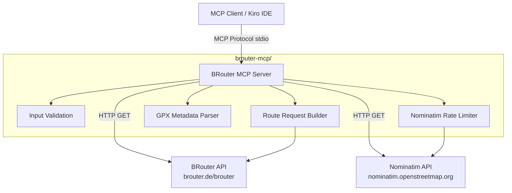

# Design Document: BRouter MCP Server

## Overview

The BRouter MCP Server is a Python MCP server built with FastMCP that wraps the public BRouter cycling routing API and Nominatim geocoding API. It exposes two tools — `calculate_route` and `search_location` — as drop-in replacements for the OpenRouteService MCP routing tools currently used in this project.

The server addresses reliability issues with OpenRouteService (404 errors on waypoint snapping, poor rural geocoding) by leveraging BRouter's more forgiving waypoint handling and cycling-optimized routing. BRouter is specialized for cycling, follows long-distance cycle routes, includes elevation awareness, and requires no API key.

**Key design decisions:**

- Single-file server (`server.py`) using FastMCP's `@mcp.tool` decorator pattern — keeps the codebase simple and easy to maintain
- `httpx` for async HTTP calls to both BRouter and Nominatim APIs — async is the natural fit for FastMCP tools and allows proper rate limiting
- XML parsing via Python's built-in `xml.etree.ElementTree` for GPX metadata extraction — no external XML dependency needed
- `asyncio.Semaphore` + timestamp tracking for Nominatim rate limiting (1 req/sec) — lightweight, no extra dependencies
- Longitude-first `[lon, lat]` coordinate convention throughout, matching the project's existing convention

## Architecture



The server runs as a single Python process communicating over stdio with the MCP client. It uses async HTTP to call external APIs and returns structured text responses.

**Transport:** stdio (standard for local MCP servers in Kiro)

**Startup:** `uv run python server.py` or `uvx` from the `brouter-mcp/` directory

## Components and Interfaces

### 1. FastMCP Server Entry Point (`server.py`)

The main module that creates the `FastMCP` instance and registers both tools.

```python
from fastmcp import FastMCP

mcp = FastMCP("BRouter Cycling Router")
```

### 2. Tool: `calculate_route`

Calculates a cycling route through waypoints via the BRouter API.

**Parameters:**
| Parameter | Type | Required | Default | Description |
|---|---|---|---|---|
| `waypoints` | `list[list[float]]` | Yes | — | List of `[lon, lat]` coordinate pairs (minimum 2) |
| `profile` | `str` | No | `"trekking"` | Cycling profile name |
| `format` | `str` | No | `"gpx"` | Output format: `"gpx"` or `"geojson"` |
| `alternativeidx` | `int` | No | `0` | Alternative route index (0–3) |
| `nogos` | `list[dict]` | No | `None` | No-go areas: `[{"lon": float, "lat": float, "radius": float}]` |
| `track_name` | `str` | No | `None` | Name to insert into GPX `<trk><name>` element |

**Returns:** Structured text containing:

- Route metadata (distance, elevation gain, estimated duration)
- Full GPX or GeoJSON content

**Validation:**

- At least 2 waypoints required
- Each coordinate: longitude ∈ [-180, 180], latitude ∈ [-90, 90]
- Profile must be in the allowed set
- Alternative index must be 0–3

**BRouter API call:**

```
GET https://brouter.de/brouter?lonlats={lon1},{lat1}|{lon2},{lat2}&profile={profile}&format={format}&alternativeidx={idx}&nogos={lon},{lat},{radius}|...
```

### 3. Tool: `search_location`

Geocodes a place name to coordinates via the Nominatim API.

**Parameters:**
| Parameter | Type | Required | Default | Description |
|---|---|---|---|---|
| `query` | `str` | Yes | — | Search query string |
| `country_code` | `str` | No | `"de"` | ISO 3166-1 alpha-2 country code |
| `limit` | `int` | No | `5` | Maximum number of results (1–40) |

**Returns:** Structured text with results, each containing:

- Place name
- Coordinates as `[longitude, latitude]`
- Display address

**Nominatim API call:**

```
GET https://nominatim.openstreetmap.org/search?q={query}&format=jsonv2&countrycodes={country_code}&limit={limit}
```

**Headers:** `User-Agent: brouter-mcp/1.0 (cycling tour planner)`

### 4. Input Validation Module

Validates all tool inputs before making API calls.

```python
VALID_PROFILES = {
    "trekking", "fastbike", "trekking-ignore-cr", "safety",
    "shortest", "trekking-steep", "trekking-noferries", "trekking-nosteps"
}

VALID_FORMATS = {"gpx", "geojson"}

def validate_waypoints(waypoints: list[list[float]]) -> None: ...
def validate_profile(profile: str) -> None: ...
def validate_alternativeidx(idx: int) -> None: ...
def validate_coordinates(lon: float, lat: float) -> None: ...
```

### 5. Route Request Builder

Constructs the BRouter API URL from validated parameters.

```python
def build_brouter_url(
    waypoints: list[list[float]],
    profile: str,
    format: str,
    alternativeidx: int,
    nogos: list[dict] | None,
) -> str: ...
```

Formats waypoints as `lon,lat|lon,lat|...`, appends query parameters, and optionally includes `nogos`.

### 6. GPX Metadata Parser

Extracts track metadata from BRouter's GPX comment header.

BRouter embeds metadata in a GPX comment like:

```
creator="BRouter-1.7.0" ... track-length = "42350" filtered ascend = "312" plain-ascend = "287"
```

```python
def parse_gpx_metadata(gpx_content: str) -> dict:
    """Extract track-length, filtered ascend from GPX content."""
    ...

def calculate_duration(distance_m: float, profile: str) -> str:
    """Estimate cycling duration based on profile average speed."""
    ...

def insert_track_name(gpx_content: str, name: str) -> str:
    """Insert or replace <name> element inside <trk>."""
    ...
```

**Average speeds for duration estimation:**
| Profile | Speed |
|---|---|
| `trekking` | 15 km/h |
| `fastbike` | 20 km/h |
| All others | 12 km/h |

### 7. Nominatim Rate Limiter

Ensures compliance with Nominatim's 1 request/second policy.

```python
class NominatimRateLimiter:
    """Async rate limiter that enforces minimum 1 second between requests."""

    async def acquire(self) -> None:
        """Wait until at least 1 second has passed since the last request."""
        ...
```

Uses `asyncio.Lock` and timestamp tracking. Before each Nominatim request, `acquire()` checks elapsed time and sleeps if needed.

### 8. HTTP Client

A shared `httpx.AsyncClient` instance with:

- 60-second timeout for BRouter requests
- 10-second timeout for Nominatim requests
- `User-Agent` header for Nominatim compliance

```python
async def call_brouter(url: str) -> str: ...
async def call_nominatim(params: dict) -> list[dict]: ...
```

## Data Models

### Route Request (internal)

```python
@dataclass
class RouteRequest:
    waypoints: list[list[float]]      # [[lon, lat], [lon, lat], ...]
    profile: str = "trekking"
    format: str = "gpx"
    alternativeidx: int = 0
    nogos: list[NoGoArea] | None = None
    track_name: str | None = None
```

### No-Go Area

```python
@dataclass
class NoGoArea:
    lon: float
    lat: float
    radius: float = 20.0  # meters, default per requirement
```

### Route Metadata (extracted from GPX)

```python
@dataclass
class RouteMetadata:
    distance_m: float          # track-length in meters
    elevation_gain_m: float    # filtered ascend in meters
    estimated_duration: str    # formatted as "Xh Ym"
```

### Geocoding Result

```python
@dataclass
class GeocodingResult:
    name: str                  # place name
    coordinates: list[float]   # [longitude, latitude]
    display_address: str       # full display address from Nominatim
```

### Tool Response Format

The `calculate_route` tool returns a single text block:

```
## Route Summary
- Distance: 42.4 km
- Elevation gain: 312 m
- Estimated duration: 2h 50m
- Profile: trekking
- Format: gpx

## GPX Data
<?xml version="1.0" ...?>
<gpx ...>
...
</gpx>
```

The `search_location` tool returns:

```
## Search Results for "Potsdam Hauptbahnhof"

1. Potsdam Hauptbahnhof
   Coordinates: [13.0665, 52.3913]
   Address: Potsdam Hauptbahnhof, Babelsberger Straße, Potsdam, Brandenburg, Deutschland

2. ...
```

When no results are found:

```
No locations found for "nonexistent place". Try a different search term or check the spelling.
```

## Correctness Properties

_A property is a characteristic or behavior that should hold true across all valid executions of a system — essentially, a formal statement about what the system should do. Properties serve as the bridge between human-readable specifications and machine-verifiable correctness guarantees._

### Property 1: URL construction preserves all route parameters

_For any_ valid list of 2+ waypoint coordinate pairs, any valid profile, any valid format, any valid alternative index (0–3), and any optional list of no-go areas, the URL produced by `build_brouter_url` SHALL contain: (a) a `lonlats` parameter with all waypoints in `lon,lat` order separated by `|`, (b) the specified profile as the `profile` parameter, (c) the specified format as the `format` parameter, (d) the specified alternative index as the `alternativeidx` parameter, and (e) if no-go areas are provided, a `nogos` parameter with each area formatted as `lon,lat,radius` separated by `|`.

**Validates: Requirements 1.1, 1.4, 2.3, 7.1, 8.1, 9.1**

### Property 2: Profile validation accepts exactly the valid set

_For any_ string, the profile validation function SHALL accept it if and only if it is one of: `trekking`, `fastbike`, `trekking-ignore-cr`, `safety`, `shortest`, `trekking-steep`, `trekking-noferries`, `trekking-nosteps`. All other strings SHALL be rejected with an error listing the valid options.

**Validates: Requirements 2.1, 2.4**

### Property 3: Coordinate validation accepts valid ranges and rejects invalid

_For any_ pair of floats (lon, lat), the coordinate validation function SHALL accept the pair if and only if longitude is in [-180, 180] and latitude is in [-90, 90]. Invalid coordinates SHALL be rejected with an error identifying which coordinate is out of range.

**Validates: Requirements 5.4**

### Property 4: Track name insertion into GPX

_For any_ valid GPX string containing a `<trk>` element and any non-empty track name string, the `insert_track_name` function SHALL produce a GPX string where parsing the `<trk>` element yields a `<name>` child element whose text content equals the provided track name.

**Validates: Requirements 3.4**

### Property 5: GPX metadata extraction round-trip

_For any_ non-negative numeric values for track-length and filtered-ascend, a GPX string containing a comment header with `track-length = "{value}"` and `filtered ascend = "{value}"` SHALL be parsed by `parse_gpx_metadata` to produce a metadata object where `distance_m` equals the track-length value and `elevation_gain_m` equals the filtered-ascend value.

**Validates: Requirements 4.1, 4.2**

### Property 6: Duration calculation correctness

_For any_ positive distance in meters and any valid cycling profile, the `calculate_duration` function SHALL return a duration equal to `distance / speed` where speed is 15 km/h for `trekking`, 20 km/h for `fastbike`, and 12 km/h for all other profiles. The result SHALL be formatted as hours and minutes.

**Validates: Requirements 4.3**

### Property 7: Nominatim result transformation preserves coordinates as longitude-first

_For any_ Nominatim JSON response object containing `name`, `lat`, `lon`, and `display_name` fields, the transformation function SHALL produce a result where `coordinates` is `[lon, lat]` (longitude first), `name` matches the input `name`, and `display_address` matches the input `display_name`.

**Validates: Requirements 6.3**

## Error Handling

### BRouter API Errors

| Error Condition                               | Handling                                             |
| --------------------------------------------- | ---------------------------------------------------- |
| HTTP 4xx/5xx from BRouter                     | Return error with status code and response body text |
| Connection timeout (>60s)                     | Return "BRouter API at brouter.de is unavailable"    |
| Network error (DNS, connection refused)       | Return "BRouter API at brouter.de is unavailable"    |
| GPX response missing `<trk>/<trkseg>/<trkpt>` | Return error indicating invalid GPX response         |

### Nominatim API Errors

| Error Condition           | Handling                                            |
| ------------------------- | --------------------------------------------------- |
| HTTP error from Nominatim | Return error with status code                       |
| Connection timeout        | Return "Nominatim geocoding service is unavailable" |
| Empty results             | Return "No locations found for {query}" message     |

### Input Validation Errors

| Error Condition                | Handling                                                                                             |
| ------------------------------ | ---------------------------------------------------------------------------------------------------- |
| Fewer than 2 waypoints         | Return "At least 2 waypoints are required"                                                           |
| Coordinate out of range        | Return "Invalid coordinates: [lon, lat] — longitude must be -180 to 180, latitude must be -90 to 90" |
| Invalid profile                | Return "Invalid profile '{name}'. Valid profiles: trekking, fastbike, ..."                           |
| Alternative index out of range | Return "Invalid alternative index {n}. Valid range is 0 to 3"                                        |

All errors are returned as descriptive text strings via the MCP tool response (not exceptions), so the LLM client can understand and act on them.

## Testing Strategy

### Property-Based Tests (Hypothesis)

The project will use [Hypothesis](https://hypothesis.readthedocs.io/) for property-based testing, as it is the standard PBT library for Python.

Each correctness property maps to a single Hypothesis test with a minimum of 100 iterations (`@settings(max_examples=100)`).

**Tests:**

1. **test_url_construction** — Property 1: Generate random valid waypoints, profiles, formats, alternative indices, and no-go areas. Verify the URL contains all parameters correctly formatted.
   - Tag: `Feature: brouter-mcp-server, Property 1: URL construction preserves all route parameters`

2. **test_profile_validation** — Property 2: Generate random strings (mix of valid profiles and arbitrary strings). Verify acceptance/rejection matches the valid set.
   - Tag: `Feature: brouter-mcp-server, Property 2: Profile validation accepts exactly the valid set`

3. **test_coordinate_validation** — Property 3: Generate random float pairs. Verify validation accepts in-range and rejects out-of-range coordinates.
   - Tag: `Feature: brouter-mcp-server, Property 3: Coordinate validation accepts valid ranges and rejects invalid`

4. **test_track_name_insertion** — Property 4: Generate random track names and GPX strings with `<trk>` elements. Verify the name appears in the correct XML location.
   - Tag: `Feature: brouter-mcp-server, Property 4: Track name insertion into GPX`

5. **test_gpx_metadata_extraction** — Property 5: Generate random numeric values, embed in GPX comment format, verify extraction.
   - Tag: `Feature: brouter-mcp-server, Property 5: GPX metadata extraction round-trip`

6. **test_duration_calculation** — Property 6: Generate random positive distances and profiles, verify the formula.
   - Tag: `Feature: brouter-mcp-server, Property 6: Duration calculation correctness`

7. **test_nominatim_result_transformation** — Property 7: Generate random Nominatim-like response dicts, verify coordinate order and field mapping.
   - Tag: `Feature: brouter-mcp-server, Property 7: Nominatim result transformation preserves coordinates as longitude-first`

### Unit Tests (pytest)

Example-based tests for specific scenarios and defaults:

- Default profile is `trekking` when not specified
- Default format is `gpx` when not specified
- Default alternative index is `0` when not specified
- Default country code is `de` for Nominatim
- Default no-go radius is `20` meters
- Round-trip route (identical start/end) includes all intermediate waypoints
- Empty Nominatim results return "no locations found" message
- GPX response validation detects missing `<trk>` elements
- No-go areas omitted from URL when none provided

### Integration Tests (pytest + respx)

Mock HTTP tests using [respx](https://lundberg.github.io/respx/) (httpx mock library):

- BRouter API returns GPX → tool returns metadata + GPX content
- BRouter API returns GeoJSON → tool returns GeoJSON content
- BRouter API returns HTTP 500 → tool returns error with status code and body
- BRouter API timeout → tool returns "unavailable" error
- Nominatim returns results → tool returns formatted locations
- Nominatim returns empty results → tool returns "no locations found"
- Nominatim rate limiter enforces 1-second spacing between requests
- HTTP client sends correct User-Agent header to Nominatim

### Test Dependencies

```
pytest
hypothesis
respx
httpx
```
