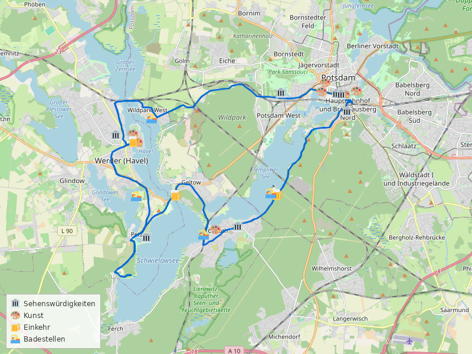
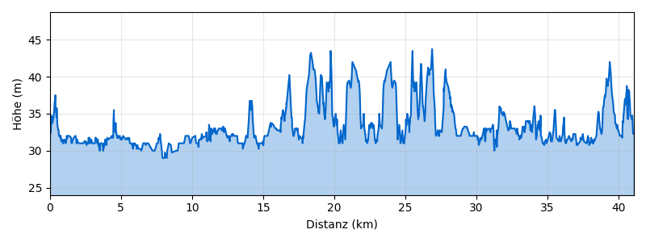

---
---

# Potsdam–Baumblütenfest-Runde ab Potsdam Hbf

**Distanz:** ~41 km (41,1 km lt. BRouter)
**Fahrzeit:** ca. 2,5–3 Std. (ohne Pausen)
**Routentyp:** Rundtour, überwiegend flach
**Start/Ziel:** S Potsdam Hauptbahnhof
**GPX-Datei:** [gpx/potsdam-baumbluetefest.gpx](gpx/potsdam-baumbluetefest.gpx)

> 🌸 **Besonderes Highlight:** Am 3. Mai 2026 findet das **Baumblütenfest in Werder (Havel)** statt — eines der ältesten Volksfeste Brandenburgs direkt an der Havel!

---

## Streckenverlauf

Potsdam Hbf → Schloss Charlottenhof → Werder (Baumblütenfest!) → Petzow → Geltow → Caputh → Schwielowsee → Templiner See → Potsdam Hbf

---

## Streckenabschnitte

### 1. Potsdam Hbf → Schloss Charlottenhof → Werder (Havel) (ca. 15 km)

Vom Hauptbahnhof durch den **Park Sanssouci** vorbei am Schloss Charlottenhof, dann westwärts über den **Havelradweg** und den **Europaradweg R1** nach Werder (Havel). Am 3. Mai ist letzter Tag des **Baumblütenfests**!

🏛️ **Schloss Charlottenhof** — elegantes Sommerschloss im Park Sanssouci
🏛️ **Schloss Sanssouci** — Wahrzeichen Potsdams (Umweg lohnt sich)
🎨 **Bildergalerie Sanssouci** — ältestes erhaltenes Museumsgebäude Deutschlands
🌸 **Baumblütenfest Werder** — Volksfest mit Obstbaumblüte, Musik, Wein & Bier

### 2. Werder → Petzow → Geltow (ca. 8 km)

Von Werder über **Petzow** am Schwielowsee entlang nach Geltow. Flache Uferwege mit herrlichen Aussichten auf den See.

🏛️ **Werder Altstadt** — historische Inselstadt in der Havel
🏛️ **Heilig-Geist-Kirche Werder** — gotische Kirche mit Aussicht
🏛️ **Schlosspark Petzow** — Lenné-Park mit Blick auf den Schwielowsee
🍺 Zahlreiche Festzelte, Weinstuben und Biergärten beim Baumblütenfest
🏊 **Schwielowsee** — Badestrand Geltow, klares Wasser

### 3. Geltow → Caputh → Schwielowsee (ca. 5 km)

Weiter am Südufer des Schwielowsees entlang nach Caputh. Ruhige Uferwege durch Wald und an Obstplantagen vorbei.

🏛️ **Schloss Caputh** — barockes Lustschloss, Sommerresidenz der Hohenzollern
🏛️ **Einstein-Sommerhaus Caputh** — Albert Einstein lebte hier 1929–1932
🍺 Café in Caputh — selbstgebackener Kuchen, direkt am Wasser ⭐

### 4. Caputh → Templiner See → Potsdam Hbf (ca. 5 km)

Rückweg am **Templiner See** entlang durch den Potsdamer Süden zurück zum Hauptbahnhof. Entspannte Fahrt mit Blick aufs Wasser.

🏊 **Templiner See** — Badestrand Templin
🍺 Café Charlottenhof — Kaffee und Kuchen im historischen Ambiente

---

## Badestellen

- 🏊 **Schwielowsee** — Badestrand Geltow
- 🏊 **Templiner See** — Badestrand Templin

---

## Einkehrmöglichkeiten

- 🍺 **Baumblütenfest Werder** — Festzelte, Wein, Bier, regionale Spezialitäten
- 🍺 Café in Caputh — selbstgebackener Kuchen am Wasser ⭐
- 🍺 Café Charlottenhof (Potsdam) — historisches Ambiente

---

## Wetter am Sonntag, 3. Mai 2026

> ℹ️ _Zuletzt geprüft: 1. Mai 2026. Vor der Tour aktuelles Wetter prüfen._

☀️ **Perfektes Frühlingswetter für das Baumblütenfest!**

|                |                              |
| -------------- | ---------------------------- |
| **Temperatur** | 10–28°C                      |
| **Regen**      | 0 mm (5% Wahrscheinlichkeit) |
| **Wind**       | ~16 km/h aus Süd             |
| **Wetterlage** | Bewölkt, aber trocken        |

Keine Warnungen. Ideales Wetter für das Baumblütenfest!

---

## Veranstaltungen

🌸 **Baumblütenfest Werder (Havel)** — 25. April bis 3. Mai 2026 (147. Ausgabe)
Eines der ältesten Volksfeste Brandenburgs. Obstbaumblüte, Musik, Wein und Bier aus der Region. Der 3. Mai ist der letzte Festivaltag — direkt an der Havel, gut per Rad erreichbar.

> ⚠️ **Hinweis:** Der RE1 ist am 3. Mai wegen des Baumblütenfestes stark ausgelastet. Empfehlung: Frühzeitig fahren oder über RB22/RB24 anreisen.

---

## Nahverkehrsanbindung

> ℹ️ _Verbindungen verifiziert für So, 3. Mai 2026. Vor der Tour aktuelle Fahrpläne prüfen._

**Hinfahrt — Option 1 (empfohlen):**
Ab **S Blankenfelde-Mahlow** → **RB24** bis Flughafen BER → **RB22** bis Potsdam Pirschheide → **RB33** bis **S Potsdam Hbf**

- Abfahrt: 10:09 Uhr ab Blankenfelde
- Ankunft Potsdam Hbf: 11:19 Uhr (2 Umstiege, ca. 70 Min.)

**Hinfahrt — Option 2:**
Ab **S Blankenfelde-Mahlow** → **RB24** bis Ostkreuz → **RE1** bis **S Potsdam Hbf**

- Abfahrt: 10:09 Uhr
- Ankunft: 11:29 Uhr
- ⚠️ RE1 am 3. Mai stark ausgelastet (Baumblütenfest)!

**Rückfahrt:**
Ab **S Potsdam Hbf** → **RE1** bis Berlin Hbf → **RE8** bis **S Blankenfelde-Mahlow**

- Abfahrt: 19:10 Uhr ab Potsdam Hbf
- Ankunft Blankenfelde: 20:01 Uhr (1 Umstieg, ca. 51 Min.)
- Stündliche Verbindungen

> 🚲 Fahrradmitnahme in S-Bahn und Regionalbahn ist im VBB möglich (Fahrradkarte erforderlich).

---
