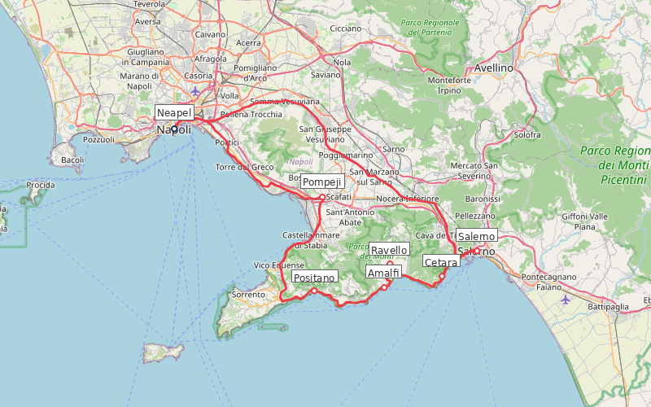

---
---

# Amalfiküste Roadtrip (7 Tage)

**Reisezeitraum:** Mai–Juni oder September–Oktober 2026
**Dauer:** 7 Tage / 6 Nächte
**Stationen:** 6 Stopps
**Gesamtstrecke:** ~173 km
**Flug:** BER → Neapel NAP (Direkt, easyJet) / Neapel NAP → BER (Direkt)
**Mietwagen:** Übernahme/Abgabe Neapel Flughafen Capodichino
**Budget:** Mittel

> 🌊 **Tipp:** Die Amalfiküste im Mai/Juni oder September — angenehme 22–28°C, das Meer ist warm genug zum Baden, die Sommermassen sind noch nicht da (oder schon weg), und die Zitronen leuchten an den Terrassen.

---

## Routenübersicht

Neapel → Pompeji → Positano → Amalfi → Ravello → Cetara → Salerno → Neapel

| #   | Station  | Nächte | Fahrzeit ab vorheriger              |
| --- | -------- | ------ | ----------------------------------- |
| 1   | Neapel   | 1      | — (Ankunft)                         |
| 2   | Positano | 2      | ~1 Std. 15 Min. (63 km via Pompeji) |
| 3   | Amalfi   | 1      | ~30 Min. (16 km)                    |
| 4   | Ravello  | 1      | ~10 Min. (8 km)                     |
| 5   | Cetara   | 1      | ~25 Min. (20 km)                    |
| 6   | Neapel   | —      | ~1 Std. (56 km via Salerno)         |

> 💡 **Puffer-Regel:** Neapel liegt am Anfang mit nur 1 Nacht (Ankunft). Die letzte Nacht in Cetara ist nah am Flughafen (~1 Std.), sodass der Rückflug gesichert ist.

> ⚠️ **Hinweis Küstenstraße:** Die SS163 (Amalfitana) ist eng, kurvenreich und im Sommer stark befahren. Früh morgens oder am späten Nachmittag fahren. Mietwagen: Kompaktwagen wählen!

---

## 1. Neapel (1 Nacht — Ankunft)

Chaotisch, laut, wunderschön — Neapel ist die Seele Süditaliens. Ein Abend reicht für einen ersten Eindruck: Pizza, Streetart und das Panorama vom Lungomare.

**Unterkunft:** Hotel Piazza Bellini oder Decumani Hotel de Charme — zentral in der Altstadt (~100–130 €/Nacht)

### Essen & Trinken

- 🍷 **L'Antica Pizzeria da Michele** — Seit 1870, nur Margherita und Marinara. Die Referenz für neapolitanische Pizza.
- 🍷 **Trattoria da Nennella** — Quartieri Spagnoli, authentische Küche, laut und lustig.
- ☕ **Torrefazione Carbonelli** — Neapolitanische Kaffeerösterei seit 1981, Verkostungen möglich.

### Kultur

- 🎨 **[MADRE — Museo d'Arte Contemporanea Donnaregina](https://www.madrenapoli.it/)** — Zeitgenössische Kunst im Palazzo Donnaregina. 7.200 m² Ausstellungsfläche mit ortsspezifischen Installationen. Mo, Mi–Sa 10–19:30 Uhr.
- 🏛️ **Museo Archeologico Nazionale** — Eine der wichtigsten Antikensammlungen weltweit (Pompeji-Funde, Farnese-Sammlung).
- 🎨 **PAN — Palazzo delle Arti Napoli** — Wechselausstellungen zeitgenössischer Kunst im Chiaia-Viertel.

---

## 2. Positano (2 Nächte)

Pastellfarbene Häuser, die sich an steile Klippen schmiegen — das Postkartenmotiv der Amalfiküste. Basis für den legendären Sentiero degli Dei.

**Unterkunft:** Hotel Palazzo Murat oder Villa Rosa — zentral, Meerblick (~120–150 €/Nacht)

**Unterwegs (Neapel → Positano):** Stopp in Pompeji (~30 Min. ab Neapel). Die archäologische Ausgrabungsstätte braucht mindestens 2–3 Stunden. Früh starten!

### Wandern

- 🥾 **Sentiero degli Dei (Götterweg)** — 8 km, 3–4 Std., moderat. Von Bomerano (Agerola) nach Nocelle. Spektakuläre Klippenwanderung hoch über dem Meer mit Blick auf Capri und die Faraglioni-Felsen. Der berühmteste Wanderweg der Amalfiküste.
- 🥾 **Nocelle → Positano (Abstieg)** — 1.700 Stufen hinunter nach Positano. Anstrengend für die Knie, aber grandioser Blick.

### Baden

- 🏊 **Spiaggia Grande** — Hauptstrand von Positano, direkt unterhalb der Altstadt.
- 🏊 **Spiaggia di Fornillo** — Ruhigerer Strand, 10 Min. Fußweg westlich. Weniger Touristen.

### Essen & Trinken

- 🍷 **Da Vincenzo** — Familienrestaurant mit frischem Fisch und hausgemachter Pasta. Terrasse mit Meerblick.
- 🍷 **Il Ritrovo** (Montepertuso) — Oberhalb von Positano, authentische Küche abseits der Touristenmassen.
- 🍋 **Limoncello-Verkostung** — Zahlreiche kleine Produzenten in Positano. Die Zitronen der Amalfiküste (Sfusato Amalfitano) sind berühmt.

---

## 3. Amalfi (1 Nacht)

Namensgeberin der Küste und einst mächtige Seerepublik. Der Dom mit seiner maurischen Fassade dominiert die Piazza, dahinter verstecken sich enge Gassen und Papiermühlen.

**Unterkunft:** Hotel Luna Convento oder Residenza del Duca — zentral (~100–140 €/Nacht)

### Wandern

- 🥾 **Valle delle Ferriere** — 10 km (Rundweg), 4 Std., moderat. Durch ein subtropisches Tal mit Wasserfällen und seltenen Riesenfarnen. Naturschutzgebiet oberhalb von Amalfi.

### Kultur

- 🏛️ **Dom Sant'Andrea** — Romanisch-arabische Kathedrale (9. Jh.) mit ornamentaler Fassade und dem Kreuzgang des Paradieses (Chiostro del Paradiso).
- 🏛️ **Museo della Carta** — Historische Papiermühle aus dem 13. Jh. Amalfi war eines der ersten europäischen Zentren der Papierherstellung.

### Essen & Trinken

- 🍷 **Trattoria Il Mulino** — Versteckt in einer Seitengasse, hausgemachte Scialatielli mit Meeresfrüchten.
- 🍋 **Pasticceria Pansa** — Seit 1830, berühmt für Delizia al Limone und Sfogliatella.

---

## 4. Ravello (1 Nacht)

Das „Belvedere der Amalfiküste" — 350 m über dem Meer thronend, mit legendären Gärten und Konzerten. Wagner, Grieg und Virginia Woolf ließen sich hier inspirieren.

**Unterkunft:** Hotel Parsifal oder Villa Amore — ruhig, mit Panoramablick (~100–140 €/Nacht)

### Kultur

- 🌿 **Villa Rufolo** — Gärten aus dem 13. Jh. mit Panoramaterrasse über dem Meer. Vorbild für Klingsors Zaubergarten in Wagners Parsifal. Ravello Festival (Konzerte im Sommer).
- 🌿 **Villa Cimbrone** — Weitläufiger Landschaftspark mit der „Terrazza dell'Infinito" — einer der schönsten Aussichtspunkte Italiens.
- 🎨 **Auditorium Oscar Niemeyer** — Modernes Konzerthaus des brasilianischen Architekten, markante weiße Welle über dem Tal.

### Wandern

- 🥾 **Ravello → Minori (Abstieg)** — 4 km, 1,5 Std., leicht. Über alte Treppenwege und Zitronenterrassen hinunter ans Meer.

### Essen & Trinken

- 🍷 **Cumpa' Cosimo** — Seit 1929 in Familienhand, traditionelle Küche mit Produkten aus eigenem Garten.
- 🍇 **Weingut Ettore Sammarco** — Lokaler Winzer, Verkostung von Costa d'Amalfi DOC Weinen (Traube: Tintore, Piedirosso).

---

## 5. Cetara (1 Nacht)

Authentisches Fischerdorf, berühmt für die Colatura di Alici — eine Fischsauce in der Tradition des römischen Garum. Hier gibt es keine Touristen, nur Fischer und exzellentes Essen.

**Unterkunft:** Hotel Cetus oder B&B Al Convento — direkt am Meer (~80–110 €/Nacht)

**Unterwegs (Ravello → Cetara):** Kurzer Stopp in Vietri sul Mare — bekannt für handbemalte Keramik (Majolika). Zahlreiche Werkstätten entlang der Hauptstraße.

### Essen & Trinken

- 🍷 **Acquapazza** — Sternerestaurant von Gennaro Castiello, Fisch direkt vom Boot. Spezialität: Spaghetti mit Colatura di Alici.
- 🍷 **Al Convento** — Traditionelle Fischküche, Thunfisch-Spezialitäten, Terrasse über dem Hafen.
- 🍷 **Cetarii** — Deli und Restaurant, Verkostung der berühmten Colatura di Alici.

### Baden

- 🏊 **Spiaggia di Cetara** — Kleiner Kiesstrand direkt am Dorf, kristallklares Wasser.

---

## 6. Rückfahrt über Salerno → Neapel

Morgens Abfahrt über Salerno (15 Min.). Optional: Spaziergang durch die Altstadt von Salerno und den Lungomare. Dann Autobahn A3 zurück nach Neapel (~45 Min. ab Salerno). Mietwagen-Abgabe am Flughafen.

---

## Wetter

> ℹ️ _Klimadaten für Mai/Juni und September/Oktober. Vor der Reise aktuelles Wetter prüfen._

| Monat     | Temperatur | Regentage | Wassertemp. | Besonderheiten            |
| --------- | ---------- | --------- | ----------- | ------------------------- |
| Mai       | 17–24°C    | 5–6       | 18–20°C     | Ideal, noch ruhig         |
| Juni      | 21–28°C    | 3–4       | 21–23°C     | Warm, Saison beginnt      |
| September | 20–27°C    | 5–6       | 24–25°C     | Bestes Badewasser         |
| Oktober   | 16–22°C    | 7–8       | 21–22°C     | Ruhiger, gelegentl. Regen |

---

## Anreise & Mietwagen

**Hinflug:** BER → Neapel (NAP), ~2,5 Std. Direktflüge mit easyJet (ganzjährig).
**Rückflug:** Neapel (NAP) → BER, ~2,5 Std.

- Geschätzte Flugkosten: ~80–150 € pro Person (Roundtrip)
- Frühbucher-Tipp: 2–3 Monate vorher buchen, Di–Do Abflug günstiger

**Mietwagen:**

- Übernahme: Neapel Flughafen Capodichino
- Abgabe: Neapel Flughafen Capodichino
- Empfehlung: **Kompaktwagen** (Fiat 500, Panda o.ä.) — die Küstenstraße ist extrem eng!
- Geschätzte Kosten: ~180–280 € für 7 Tage (Vollkasko inkl.)

> 💡 Mietwagen frühzeitig buchen. Vergleichsportale: CHECK24, billiger-mietwagen.de. Unbedingt Vollkasko ohne Selbstbeteiligung wählen — die engen Straßen fordern ihren Tribut.

---

## Kostenübersicht (Schätzung, 2 Personen)

| Posten                 | Geschätzt          |
| ---------------------- | ------------------ |
| Flüge (2×)             | ~160–300 €         |
| Mietwagen (7 Tage)     | ~180–280 €         |
| Unterkünfte (6 Nächte) | ~600–900 €         |
| Benzin (~173 km)       | ~30–40 €           |
| Essen & Aktivitäten    | ~400–600 €         |
| **Gesamt**             | **~1.370–2.120 €** |

---

## Länderinfo

|                           |                                                                                                                      |
| ------------------------- | -------------------------------------------------------------------------------------------------------------------- |
| **Preisniveau**           | Ähnlich wie Deutschland (Amalfiküste touristisch teurer)                                                             |
| **Tempolimit Landstraße** | 90 km/h                                                                                                              |
| **Tempolimit Autobahn**   | 130 km/h                                                                                                             |
| **Tempolimit innerorts**  | 50 km/h                                                                                                              |
| **Besonderheiten**        | Maut auf Autobahnen (Telepass oder bar), ZTL-Zonen in Innenstädten (Einfahrverbot!), Lichtpflicht tagsüber außerorts |
| **Reisehinweise**         | Keine Einschränkungen ([Auswärtiges Amt](https://www.auswaertiges-amt.de/de/ReiseUndSicherheit))                     |

---

## Packliste & Tipps

- **Schuhe:** Feste Wanderschuhe für den Sentiero degli Dei, bequeme Sandalen für die Dörfer
- **ZTL-Zonen:** Viele Küstenorte haben Einfahrverbote (Zona Traffico Limitato). Auto am Ortsrand parken, zu Fuß weiter
- **Parkgebühren:** Überall kostenpflichtig, 3–5 €/Std. Frühzeitig Parkplatz suchen
- **Fähren:** SITA-Busse und Fähren (Travelmar, NLG) verbinden die Küstenorte — Alternative zum Auto an Stautagen
- **Trinkgeld:** Coperto (Gedeck) 1–3 € ist üblich, Trinkgeld optional (5–10%)
- **Sonnenschutz:** Intensive Sonne an der Küste, besonders beim Wandern

---

## Erweiterungsideen

- **+2 Tage Capri:** Fähre ab Positano oder Amalfi (25 Min.). Blaue Grotte, Villa San Michele, Wanderung zum Monte Solaro.
- **+1 Tag Paestum:** Griechische Tempel südlich von Salerno (30 Min. ab Salerno). Drei der besterhaltenen dorischen Tempel weltweit.
- **+1 Tag Ischia:** Thermalinsel im Golf von Neapel. Fähre ab Neapel (1 Std.). Heiße Quellen, Wanderung auf den Monte Epomeo.
