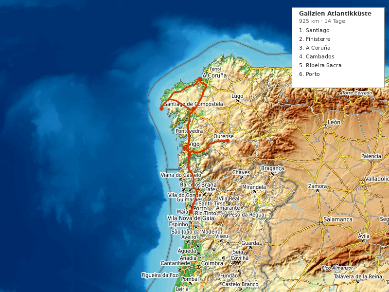

---
---

# Galizien Atlantikküste Roadtrip (14 Tage)

**Reisezeitraum:** 1. September – 14. September 2026
**Dauer:** 14 Tage / 13 Nächte
**Stationen:** 7 Stopps
**Gesamtstrecke:** ~925 km
**Flug:** BER → Porto OPO (Direkt) / Porto OPO → BER (Direkt)
**Mietwagen:** Übernahme/Abgabe Porto Flughafen (Cross-border PT→ES gebucht)

> 🌊 **Tipp:** Galizien im September — die Touristen sind weg, das Meer noch warm (18°C), die Meeresfrüchte-Saison auf dem Höhepunkt und die Albariño-Trauben werden geerntet. Keltische Kultur trifft Atlantik.

---

## Routenübersicht

Porto → Santiago de Compostela → Costa da Morte / Finisterre → A Coruña → Rías Baixas / Cambados → Ribeira Sacra → Porto

| #   | Station                     | Nächte | Fahrzeit ab vorheriger |
| --- | --------------------------- | ------ | ---------------------- |
| 1   | Santiago de Compostela      | 2      | ~2,5 Std. (229 km)     |
| 2   | Costa da Morte / Finisterre | 2      | ~1,5 Std. (87 km)      |
| 3   | A Coruña                    | 2      | ~1,5 Std. (109 km)     |
| 4   | Rías Baixas / Cambados      | 3      | ~2 Std. (163 km)       |
| 5   | Ribeira Sacra               | 2      | ~1,5 Std. (114 km)     |
| 6   | Porto (Puffer + Abreise)    | 2      | ~2,5 Std. (222 km)     |

> 💡 **Puffer-Regel:** Porto liegt am Ende mit 2 Nächten. Bei Verzögerungen unterwegs bleibt der Rückflug gesichert. Porto selbst ist eine fantastische Stadt (Kunst, Portwein, Küche).

> ℹ️ **Mietwagen Cross-border:** Bei Buchung "Grenzübertritt Portugal → Spanien" angeben. Bei großen Anbietern (Europcar, Hertz, Sixt) im EU-Raum meist erlaubt, Aufpreis ~50–100 €.

---

## 1. Santiago de Compostela (2 Nächte)

Ziel des Jakobswegs und UNESCO-Welterbe — eine der schönsten Altstädte Europas. Granit-Architektur, Pilger-Atmosphäre und überraschend gute zeitgenössische Kunst.

**Unterkunft:** Hotel Costa Vella oder Parador Hostal dos Reis Católicos — zentral in der Altstadt (~100–150 €/Nacht)

### Wandern

- 🥾 **Alameda-Park → Monte Pedroso** — 8 km, 3 Std., moderat. Panoramablick über die Altstadt und die Kathedrale von oben.
- 🥾 **Camino Portugués (letztes Teilstück)** — 5 km ab Lavacolla, leicht. Den Jakobsweg als Tageswanderung erleben.

### Essen & Trinken

- 🍷 **Mercado de Abastos** — Markthalle seit 1873. Meeresfrüchte, Käse, Empanadas. Zweitgrößter Markt Spaniens.
- 🍷 **O Curro da Parra** — Moderne galizische Küche, kleine Karte, exzellent.
- 🍷 **Abastos 2.0** — Tapas-Bar direkt in der Markthalle, Fisch vom Marktstand zubereitet.
- ☕ **Café Casino** — Historisches Café am Hauptplatz, seit 1873.

### Kultur

- 🎨 **[CGAC — Centro Galego de Arte Contemporánea](https://cgac.xunta.gal/)** — Zeitgenössische Kunst in Álvaro Siza-Architektur. Freier Eintritt.
- 🎨 **Fundación Granell** — Surrealismus-Museum (Eugenio Granell, Freund von Breton und Dalí).
- 🏛️ **Kathedrale von Santiago** — Romanik-Meisterwerk, Botafumeiro-Weihrauchfass.
- 🌿 **Parque de la Alameda** — Botanischer Stadtpark mit Eichen und Kamelien.

---

## 2. Costa da Morte / Finisterre (2 Nächte)

Die „Todesküste" — dramatische Klippen, einsame Strände, Leuchttürme und das Ende der Welt (Kap Finisterre). Hier beginnt der Camiño dos Faros.

**Unterkunft:** Hotel Rustico Lugar do Cotariño (Carnota) oder Casa Rural bei Finisterre — ~70–100 €/Nacht

### Wandern

- 🥾 **Camiño dos Faros — Etappe Finisterre → Lires** — 14 km, 4–5 Std., moderat. Spektakuläre Klippenwanderung entlang der Atlantikküste mit Leuchtturm-Blicken.
- 🥾 **Kap Finisterre Rundweg** — 5 km, 1,5 Std., leicht. Zum Leuchtturm am „Ende der Welt", Sonnenuntergang über dem Atlantik.
- 🥾 **Praia de Carnota → Ézaro-Wasserfall** — 8 km, 3 Std., leicht. Europas einziger Wasserfall, der direkt ins Meer stürzt.

### Baden

- 🏊 **Praia de Carnota** — 7 km langer Sandstrand, einer der längsten Galiziens. Wild und einsam im September.
- 🏊 **Praia de Langosteira** (Finisterre) — Geschützter Stadtstrand, wärmer als die offene Küste.

### Essen & Trinken

- 🍷 **O Pirata** (Finisterre) — Fischrestaurant am Hafen, Tagesfang.
- 🍷 **Restaurante Tira do Cordel** (Cee) — Pulpo á feira, Percebes (Entenmuscheln), Albariño.

### Kultur

- 🏛️ **Leuchtturm Kap Finisterre** — Römer glaubten hier endet die Welt. Pilger verbrennen ihre Schuhe.
- 🪖 **Schiffswracks-Geschichte** — Die Costa da Morte hat ihren Namen von hunderten Schiffswracks. Informationstafeln entlang der Küste.

---

## 3. A Coruña (2 Nächte)

Lebhafte Hafenstadt mit dem ältesten funktionierenden Leuchtturm der Welt (UNESCO), gläsernen Galerien und exzellenter Gastro-Szene.

**Unterkunft:** Hotel Blue Coruña oder Zenit Coruña — zentral, Hafen-Nähe (~80–120 €/Nacht)

### Wandern

- 🥾 **Paseo Marítimo** — 13 km, 3 Std., leicht. Europas längste Strandpromenade, von der Altstadt bis zum Leuchtturm.
- 🥾 **Fragas do Eume Nationalpark** — 10 km, 4 Std., moderat. Atlantischer Urwald, 30 Min. Fahrt. Einer der besterhaltenen Küstenwälder Europas.

### Baden

- 🏊 **Praia de Riazor / Orzán** — Stadtstrand direkt im Zentrum, Surfer-Spot.
- 🏊 **Praia das Lapas** — Kleine geschützte Bucht nahe dem Herkulesturm.

### Essen & Trinken

- 🍷 **Mercado de la Plaza de Lugo** — Überdachter Markt, Meeresfrüchte-Stände, Tapas-Bars.
- 🍷 **Pulpería A Penela** — Bester Pulpo (Oktopus) der Stadt.
- 🍷 **A Mundiña** — Moderne galizische Küche, Michelin-empfohlen.
- ☕ **Café La Suiza** — Historisches Café, Jugendstil-Interieur.

### Kultur

- 🎨 **[MACUF — Museo de Arte Contemporáneo Unión Fenosa](https://mac.gasnaturalfenosa.com/)** — Zeitgenössische Kunst in ehemaliger Fabrik.
- 🎨 **Fundación Luis Seoane** — Galizische Moderne, Grafik und Malerei.
- 🏛️ **Torre de Hércules** — Römischer Leuchtturm (2. Jh.), UNESCO-Welterbe, ältester funktionierender Leuchtturm der Welt.
- 🌿 **Jardín de San Carlos** — Romantischer Garten mit Atlantikblick.

---

## 4. Rías Baixas / Cambados (3 Nächte)

Die „unteren Rias" — warme Buchten, Albariño-Weinberge bis ans Meer, Muschelfischer und die schönsten Strände Galiziens. Drei Nächte für Wein, Strand und Inseln.

**Unterkunft:** Parador de Cambados oder Hotel Spa Bienestar Moaña — ~90–140 €/Nacht

### Wandern

- 🥾 **Ruta da Pedra e da Auga** (Ribadumia) — 7 km, 2,5 Std., leicht. Entlang alter Wassermühlen durch Weinberge.
- 🥾 **Islas Cíes — Ruta del Faro** — 7 km, 2,5 Std., moderat. Auf der Nationalpark-Insel zum Leuchtturm (Fähre ab Vigo, vorher reservieren!).
- 🥾 **Monte Castrove** — 6 km, 2 Std., leicht. Panorama über die Ría de Pontevedra.

### Baden

- 🏊 **Praia de Rodas (Islas Cíes)** — „Schönster Strand der Welt" (The Guardian). Weißer Sand, türkises Wasser. Nur per Fähre, Besucherzahl limitiert.
- 🏊 **Praia de A Lanzada** — 2,5 km offener Atlantikstrand, Surfer und Naturisten.
- 🏊 **Praia de Areas** (Sanxenxo) — Geschützter Familienstrand in der Bucht.

### Essen & Trinken

- 🍇 **Bodegas Martín Códax** (Cambados) — Albariño-Weingut mit Verkostung und Meerblick.
- 🍇 **Pazo Baión** — Historisches Weingut in einem Pazo (Herrenhaus), Führung + Verkostung.
- 🍷 **Restaurante Yayo Daporta** (Cambados) — Michelin-Stern, kreative Meeresfrüchte-Küche.
- 🍷 **Marisquería A Salseira** — Meeresfrüchte direkt vom Fischer, Percebes, Zamburiñas.
- 🍷 **Festa do Albariño** (falls Anfang August) — Weinfest in Cambados (prüfen ob September-Termine).

### Kultur

- 🎨 **Fundación Laxeiro** (Vigo) — Galizische zeitgenössische Kunst, 30 Min. Fahrt.
- 🏛️ **Pazo de Fefiñáns** (Cambados) — Renaissance-Palast und Weingut, Architektur-Juwel.
- 🏛️ **Ruinas de Santa Mariña Dozo** — Gotische Kirchenruine über Cambados, Friedhof mit Meerblick.

---

## 5. Ribeira Sacra (2 Nächte)

Heilige Ufer — steile Weinberg-Terrassen über der Sil-Schlucht, romanische Klöster und eine der spektakulärsten Flusslandschaften Europas. Weinregion Mencía (Rotwein).

**Unterkunft:** Hotel Monumento Parador de Santo Estevo oder Casa Rural in der Schlucht — ~90–130 €/Nacht

### Wandern

- 🥾 **Ruta de los Cañones del Sil** — 10 km, 4 Std., moderat. Entlang der Sil-Schlucht mit 500 m tiefen Steilwänden und Blick auf die Weinberg-Terrassen.
- 🥾 **Ruta dos Muíños do Mao** — 5 km, 2 Std., leicht. Wassermühlen-Weg durch Kastanienwälder.

### Baden

- 🏊 **Praia da Cova** — Flussstrand am Sil, geschützte Bucht zwischen den Schluchtwänden.
- 🏊 **Termas de Outariz** (Ourense, 40 Min.) — Kostenlose heiße Thermalquellen am Fluss Miño.

### Essen & Trinken

- 🍇 **Adega Algueira** — Biodynamisches Weingut an Steilhang-Terrassen, Mencía-Verkostung.
- 🍇 **Rectoral de Amandi** — Weingut mit Blick über die Sil-Schlucht.
- 🍷 **Restaurante Muíño da Pena** — Regionale Küche am Fluss, Kastanien und Wild.
- 🍷 **Pulpería in Castro Caldelas** — Traditioneller Oktopus mit Paprika.

### Kultur

- 🏛️ **Mosteiro de Santo Estevo** — Benediktinerkloster (6. Jh.), heute Parador-Hotel. Drei romanische Kreuzgänge.
- 🏛️ **Mosteiro de San Pedro de Rocas** — Ältestes Kloster Galiziens (6. Jh.), in Fels gehauen.
- 🏛️ **Catamarán por el Cañón del Sil** — Bootsfahrt durch die Schlucht (2 Std., vorher buchen).

---

## 6. Porto — Puffer & Abreise (2 Nächte)

Zurück in Porto für den ausführlichen Stadtbesuch. Mietwagen am Flughafen abgeben, dann per Metro in die Stadt. Portwein, Azulejos, zeitgenössische Kunst und eine der besten Food-Szenen Europas.

**Unterkunft:** Hotel Pestana Porto oder Rosa et Al Townhouse — Ribeira/Zentrum (~100–140 €/Nacht)

### Wandern

- 🥾 **Foz do Douro Küstenpfad** — 6 km, 2 Std., leicht. Vom Leuchtturm Felgueiras entlang der Atlantikküste.
- 🥾 **Passeio das Virtudes → Jardim do Palácio de Cristal** — 4 km, 1,5 Std., leicht. Durch Parks mit Douro-Panorama.

### Baden

- 🏊 **Praia do Homem do Leme** — Stadtstrand an der Foz do Douro-Mündung.
- 🏊 **Piscinas de Marés de Leça da Palmeira** — Meerwasser-Pools von Álvaro Siza (Architektur!).

### Essen & Trinken

- 🍷 **Mercado do Bolhão** — Frisch renovierte Markthalle, Fisch, Käse, Portwein.
- 🍷 **Cantinho do Avillez** — José Avillez (Portugals berühmtester Koch), bezahlbar.
- 🍷 **Taberna dos Mercadores** — Traditionelle Petiscos (portugiesische Tapas).
- ☕ **Combi Coffee Roasters** — Specialty Coffee Rösterei in Cedofeita.
- 🍇 **Graham's Port Lodge** (Vila Nova de Gaia) — Portwein-Verkostung mit Blick über den Douro.

### Kultur

- 🎨 **[Serralves — Museum für Zeitgenössische Kunst](https://www.serralves.pt/en/)** — Álvaro Siza-Bau + 18 ha Park. Eines der wichtigsten Kunstmuseen der Iberischen Halbinsel.
- 🎨 **Fundação de Serralves — Park** — Art-Deco-Villa + botanischer Skulpturenpark.
- 🏛️ **Livraria Lello** — Berühmteste Buchhandlung der Welt (Jugendstil, Harry-Potter-Inspiration).
- 🌿 **Jardins do Palácio de Cristal** — Botanischer Garten mit Pfauen und Douro-Panorama.
- 🏛️ **Ribeira** (UNESCO) — Historisches Flussufer, Azulejo-Fassaden.

---

## Wetter

> ℹ️ _September in Galizien/Nordportugal: Übergang Sommer → Herbst. Noch warm, aber Atlantik bringt gelegentlich Regen. Richtwerte — aktuelle Vorhersage vor Reiseantritt prüfen._

| Station        | Temperatur | Regen | Besonderheiten                     |
| -------------- | ---------- | ----- | ---------------------------------- |
| Santiago       | 13–23°C    | 40%   | Kann neblig sein morgens           |
| Costa da Morte | 14–21°C    | 35%   | Wind an den Klippen, Sonnencreme!  |
| A Coruña       | 15–22°C    | 30%   | Milde Küste                        |
| Rías Baixas    | 15–25°C    | 25%   | Wärmste Region, geschützte Buchten |
| Ribeira Sacra  | 12–26°C    | 20%   | Binnenland, wärmer, trockener      |
| Porto          | 15–25°C    | 25%   | Mild, Morgennebel am Douro         |

> ☀️ **September ist ideal** — Hochsaison vorbei, Wasser noch warm (17–19°C), Weinlese, milde Temperaturen. Regenjacke trotzdem einpacken (Atlantik!).

---

## Anreise & Mietwagen

**Hinflug:** BER → Porto (OPO), Direktflug, ~3 Std. (Ryanair, easyJet)

- Empfehlung: **Di 1. September, Abflug 07:00–09:00 Uhr**
- Geschätzte Kosten: ~70–130 € pro Person (one-way)

**Rückflug:** Porto (OPO) → BER, Direktflug, ~3 Std.

- Empfehlung: **So 14. September, Abflug 15:00–17:00 Uhr**

**Mietwagen:**

- Übernahme: Porto Flughafen, 1. September
- Abgabe: Porto Flughafen, 14. September
- **Cross-border:** Bei Buchung "Grenzübertritt Portugal → Spanien" angeben (Aufpreis ~50–100 €)
- Empfehlung: Kompaktwagen (reicht für 2 Personen + Gepäck)
- Geschätzte Kosten: ~400–600 € für 14 Tage (Vollkasko + Cross-border inkl.)

> 💡 Mietwagen frühzeitig buchen. Vergleichsportale: CHECK24, billiger-mietwagen.de

---

## Kostenübersicht (Schätzung, 2 Personen)

| Posten                  | Geschätzt          |
| ----------------------- | ------------------ |
| Flüge (2×, Roundtrip)   | ~280–520 €         |
| Mietwagen (14 Tage)     | ~400–600 €         |
| Unterkünfte (13 Nächte) | ~1.200–1.700 €     |
| Benzin (~925 km)        | ~100–130 €         |
| Essen & Aktivitäten     | ~700–1.000 €       |
| **Gesamt**              | **~2.700–3.950 €** |

---

## Packliste & Tipps

- **Regenjacke**: Atlantikklima — auch im September kurze Schauer möglich
- **Wanderschuhe**: Küstenpfade können rutschig sein (Felsen, Tau)
- **Badesachen**: Meer noch 17–19°C, Flussstrände wärmer
- **Sonnencreme**: UV-Strahlung an der Küste unterschätzt
- **Reservierungen**: Islas Cíes Fähre und Catamarán Sil-Schlucht vorher buchen (limitiert)
- **Sprache**: Galizisch (Galego) + Spanisch. Portugiesisch in Porto. Englisch in Touristenzentren.
- **Maut**: Portugal hat Mautstraßen (Via Verde elektronisch). In Spanien Autovías meist kostenlos.
- **Percebes**: Entenmuscheln — teure Delikatesse, unbedingt probieren!

---

## Länderinfo

|                           |                                                                                                           |
| ------------------------- | --------------------------------------------------------------------------------------------------------- |
| **Preisniveau**           | Günstiger als Deutschland (~20–30% weniger, besonders Essen und Wein)                                     |
| **Tempolimit Landstraße** | 90 km/h (Spanien), 90 km/h (Portugal)                                                                     |
| **Tempolimit Autobahn**   | 120 km/h (Spanien), 120 km/h (Portugal)                                                                   |
| **Tempolimit innerorts**  | 50 km/h (30 in Wohngebieten)                                                                              |
| **Besonderheiten**        | Portugal: Maut elektronisch (Via Verde). Spanien: Autovías meist mautfrei. Lichtpflicht bei Regen/Tunnel. |
| **Reisehinweise**         | Keine Einschränkungen ([Auswärtiges Amt](https://www.auswaertiges-amt.de/de/ReiseUndSicherheit))          |
