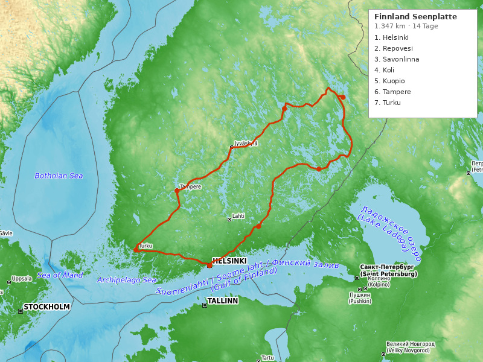

---
---

# Finnland Seenplatte Roadtrip (14 Tage)

**Reisezeitraum:** 1. September – 14. September 2026
**Dauer:** 14 Tage / 13 Nächte
**Stationen:** 8 Stopps (inkl. Helsinki Ankunft + Puffer)
**Gesamtstrecke:** ~1.347 km
**Flug:** BER → HEL (Hin) / HEL → BER (Rück)
**Mietwagen:** Übernahme/Abgabe Helsinki-Vantaa Flughafen

> 🍂 **Tipp:** Anfang September beginnt in Mittelfinnland die Ruska — die spektakuläre Herbstfärbung der Wälder. Perfekte Zeit für Wanderungen, noch warm genug zum Baden in den Seen.

---

## Routenübersicht

Helsinki → Repovesi NP → Savonlinna (Saimaa) → Koli NP → Kuopio → Tampere → Turku Schären → Helsinki

| #   | Station                     | Nächte | Fahrzeit ab vorheriger |
| --- | --------------------------- | ------ | ---------------------- |
| 1   | Helsinki (Ankunft)          | 1      | — (Ankunft)            |
| 2   | Repovesi / Kouvola          | 2      | ~2 Std. (139 km)       |
| 3   | Savonlinna / Saimaa         | 2      | ~3 Std. (213 km)       |
| 4   | Koli Nationalpark           | 2      | ~3 Std. (211 km)       |
| 5   | Kuopio                      | 2      | ~2,5 Std. (161 km)     |
| 6   | Tampere                     | 2      | ~4 Std. (295 km)       |
| 7   | Turku / Schärenküste        | 1      | ~2 Std. (163 km)       |
| 8   | Helsinki (Puffer + Abreise) | 1      | ~2 Std. (165 km)       |

> ⚠️ **Längste Etappe:** Kuopio → Tampere (295 km, ~4 Std.). Pause in Jyväskylä empfohlen.

> 💡 **Puffer-Regel:** Helsinki liegt am Ende der Route mit 1 Nacht Reserve. Bei Verzögerungen unterwegs kann ein Stopp gekürzt werden, ohne den Rückflug zu gefährden.

---

## 1. Helsinki — Ankunft (1 Nacht)

Ankunft am Flughafen, Mietwagen übernehmen, kurzer Abend in der Stadt. Helsinki wird am Ende der Reise ausführlich erkundet.

**Unterkunft:** Hotel Helka oder Scandic Hakaniemi — zentral, moderat (~100–140 €/Nacht)

### Essen & Trinken

- 🍷 **Löyly** — Restaurant + Sauna am Meer. Regionale Küche, spektakuläre Holzarchitektur. Perfekt für den ersten Abend.

---

## 2. Repovesi Nationalpark / Kouvola (2 Nächte)

Dramatische Schluchten, Hängebrücken und stille Seen — einer der schönsten Nationalparks Südfinnlands.

**Unterkunft:** Mökki (Ferienhaus) am See bei Hillosensalmi oder Orilampi — ab ~80 €/Nacht

### Wandern

- 🥾 **Ketunlenkki (Fuchsrunde)** — 5 km, 2 Std., leicht. Beliebtester Trail, Handfähre über den See, Feuerstellen.
- 🥾 **Kaakkurin kierros** — 15 km, 5–6 Std., anspruchsvoll. Mehrstündige Rundwanderung durch den gesamten Park mit Aussichtspunkten.
- 🥾 **Olhavanvuori Klettersteig** — 50 m vertikale Felswand (nur anschauen oder mit Erfahrung klettern). Aussicht vom Gipfel spektakulär.

### Baden

- 🏊 **Seen im Nationalpark** — Wildes Baden an den Ufern von Olhavanlampi und Kuutinlampi. Klares, sauberes Wasser.
- 🏊 **Orilampi** — Ruhiger See nahe dem Parkeingang, gut zugänglich.

### Essen & Trinken

- 🍷 **Ravintola Repovesi** (am Parkeingang) — Einfache finnische Küche, Suppen und Piroggen
- 🍷 **Kouvola Markthalle** — Regionale Produkte, Brot, Fisch

### Kultur

- 🎨 **Verla Mühlenmuseum** (UNESCO-Welterbe) — Historische Holzschleiferei, 30 Min. Fahrt. Einzigartiges Industriedenkmal.

---

## 3. Savonlinna / Saimaa-See (2 Nächte)

Das Herz der finnischen Seenplatte — Europas viertgrößter See, mittelalterliche Burg, Saimaa-Ringelrobbe.

**Unterkunft:** Hotelli Hospitz oder Mökki am Saimaa-Ufer — ~90–130 €/Nacht

### Wandern

- 🥾 **Kolovesi Nationalpark — Nahkiaiskierros** — 6 km, 2,5 Std., moderat. Uralte Felsmalereien, Urwald, Saimaa-Robben-Gebiet. Per Kanu oder zu Fuß.
- 🥾 **Punkaharju-Grat** — 7 km, 2 Std., leicht. Legendärer Sandgrat zwischen zwei Seen, einer der ältesten Naturschutzgebiete der Welt (seit 1803).

### Baden

- 🏊 **Huuhanranta** — 1,5 km langer Sandstrand am Saimaa, „Saimaa-Riviera". Einer der schönsten Strände Finnlands.
- 🏊 **Badestellen überall** — Am Saimaa kann man fast überall ins Wasser. Eigene Mökki-Sauna + Steg ideal.

### Essen & Trinken

- 🍷 **Ravintola Majakka** (Savonlinna) — Fisch aus dem Saimaa, Terrasse am Wasser
- 🍷 **Pihlajakosken Torppa** — Traditionelle savonische Küche in historischem Bauernhaus
- 🍷 **Marktplatz Savonlinna** — Muikku (gebratene Kleine Maräne) direkt vom Stand

### Kultur

- 🏛️ **Olavinlinna** — Mittelalterliche Wasserburg (1475), Wahrzeichen Savonlinnas. Im Sommer Opernfestival.
- 🎨 **Retretti Kunstzentrum** (saisonal) — Unterirdische Kunsthöhlen bei Punkaharju
- 🏛️ **Savonlinnan Maakuntamuseo** — Regionalmuseum zur Saimaa-Geschichte

---

## 4. Koli Nationalpark (2 Nächte)

Finnlands Nationallandschaft — die Aussicht vom Ukko-Koli über den Pielinen-See inspirierte Sibelius und die finnischen Nationalmaler. Anfang September beginnt hier die Ruska.

**Unterkunft:** Break Sokos Hotel Koli (direkt am Park) oder Mökki — ~100–150 €/Nacht

### Wandern

- 🥾 **Ukko-Koli Gipfelrunde** — 4 km, 1,5 Std., leicht. Zum höchsten Punkt (347 m) mit der berühmtesten Aussicht Finnlands.
- 🥾 **Herajärvi-Rundweg (Teilstück)** — 10 km, 4 Std., moderat. Durch Urwald und entlang des Herajärvi-Sees. Volle Runde = 40 km (mehrtägig).
- 🥾 **Pielisen Rantapolku (Uferpfad)** — 3 km, 1 Std., leicht. Am Seeufer entlang mit Blick auf die Koli-Hügel.

### Baden

- 🏊 **Lakkala-Strand** — Sandstrand am Pielinen-See am Fuß des Koli. Im September noch ~15°C Wassertemperatur.
- 🏊 **Hotel-Sauna + Eisbaden** — Break Sokos Hotel hat Seesauna mit direktem Seezugang.

### Essen & Trinken

- 🍷 **Ravintola Koli** (im Hotel) — Regionale Küche mit Wildfleisch, Fisch und Waldpilzen
- 🍷 **Alamaja** — Rustikales Restaurant am Seeufer, Lagerfeuer-Atmosphäre
- 🍷 **Karelische Piroggen** — Überall in der Region, traditionell mit Reisbrei gefüllt

### Kultur

- 🏛️ **Koli Naturzentrum Ukko** — Ausstellung zur Geologie und Kulturgeschichte des Koli
- 🎨 **Koli hat Generationen finnischer Maler inspiriert** — Eero Järnefelt, Pekka Halonen. Die Landschaft selbst ist das Kunstwerk.

---

## 5. Kuopio (2 Nächte)

Lebhafte Universitätsstadt am Kallavesi-See — Sauna-Hauptstadt, Markthalle und Kalakukko (Fischbrot).

**Unterkunft:** Scandic Kuopio oder Original Sokos Hotel Puijonsarvi — ~90–120 €/Nacht

### Wandern

- 🥾 **Puijo-Hügel Naturpfade** — 3–8 km, 1–3 Std., leicht bis moderat. Waldwege rund um den Puijo-Turm mit Panoramablick.
- 🥾 **Neulamäki Naturschutzgebiet** — 5 km, 2 Std., leicht. Urwald und Moorlandschaft am Stadtrand.

### Baden

- 🏊 **Väinölänniemi Strand** — Öffentlicher Stadtstrand am Kallavesi, Sauna nebenan
- 🏊 **Jätkänkämppä Rauchsauna** — Berühmte öffentliche Rauchsauna am See. Authentischstes Sauna-Erlebnis der Reise.

### Essen & Trinken

- 🍷 **Hanna Partanen Kalakukkoleipomo** — Die beste Kalakukko-Bäckerei seit 1931. Vendace-Fisch im Roggenbrot.
- 🍷 **Kuopion Kauppahalli (Markthalle)** — Seit 1902, lokale Spezialitäten, Fisch, Käse, Brot.
- 🍷 **Ravintola Musta Lammas** — Gehobene finnische Küche mit regionalen Zutaten.
- 🍷 **Marktplatz** — Muikku, Kalakukko und Lihapiirakka (Fleischpastete) vom Stand.

### Kultur

- 🏛️ **Puijo-Turm** — 75 m hoher Aussichtsturm mit Drehrestaurant, Panorama über die Seenlandschaft
- 🎨 **Kuopion Taidemuseo** — Kunstmuseum mit finnischer Moderne
- 🏛️ **Orthodoxes Kirchenmuseum** — Einzigartige Sammlung orthodoxer Kunst in Finnland

---

## 6. Tampere (2 Nächte)

Finnlands zweitgrößte Stadt zwischen zwei Seen — Sauna-Hauptstadt der Welt (60 öffentliche Saunen), Industriekultur und lebhafte Gastro-Szene.

**Unterkunft:** Dream Hostel & Hotel oder Lapland Hotels Tampere — ~80–130 €/Nacht

### Wandern

- 🥾 **Pyynikki-Grat** — 3 km, 1 Std., leicht. Höchster Kies-Grat der Welt (160 m), Aussichtsturm mit legendären Donuts.
- 🥾 **Kauppi Waldgebiet** — 5–10 km, 2–3 Std., leicht. Ausgedehnte Waldwege direkt am Stadtrand.
- 🥾 **Seitseminen Nationalpark** — 8 km, 3 Std., moderat. 1 Std. Fahrt, Urwald und Moorlandschaft.

### Baden

- 🏊 **Rauhaniemi Strand** — Öffentlicher Strand am Näsijärvi mit Sauna. Ganzjährig beliebt.
- 🏊 **Pyynikki Strand** — Am Fuß des Pyynikki-Grats, ruhiger Sandstrand.

### Essen & Trinken

- 🍷 **Sauna Restaurant Kuuma** — Nordische Küche + Sauna + Seebad in einem. Einzigartiges Konzept.
- 🍷 **Pyynikin Munkkikahvila** — Legendäres Donut-Café im Aussichtsturm. Die besten Munkki Finnlands.
- 🍷 **Näsinneula** — Drehrestaurant im höchsten Aussichtsturm der Nordischen Länder (168 m).
- 🍷 **Pyynikin Brewhouse** — Craft Beer + regionale Küche am See.

### Kultur

- 🏛️ **Vapriikki Museumszentrum** — Mehrere Museen unter einem Dach (Naturkunde, Eishockey, Medien)
- 🎨 **Sara Hildén Kunstmuseum** — Moderne und zeitgenössische Kunst am Seeufer
- 🏛️ **Rajaportti Sauna** — Älteste öffentliche Sauna Finnlands (seit 1906). Holzbeheizt, authentisch.
- 🏛️ **Finlayson-Areal** — Historische Textilfabrik, heute Kulturzentrum mit Kinos, Restaurants, Museen.

---

## 7. Turku / Schärenküste (1 Nacht)

Finnlands älteste Stadt und Tor zum Schärenmeer — 20.000 Inseln vor der Küste.

**Unterkunft:** Centro Hotel oder Radisson Blu Marina Palace — ~90–120 €/Nacht

### Wandern

- 🥾 **Ruissalo Naturpfad** — 5 km, 2 Std., leicht. Eichenwald-Insel vor Turku, botanischer Garten, Strände.
- 🥾 **Archipelago Trail (Teilstück)** — Fähren zwischen den Inseln, kurze Wanderungen auf Nagu oder Korpo.

### Baden

- 🏊 **Ruissalo Strände** — Mehrere Sandstrände auf der Insel, im September ruhig.
- 🏊 **Saaronniemi** — Naturstrand auf der Schäreninsel Nagu.

### Essen & Trinken

- 🍷 **Kauppahalli Turku (Markthalle)** — Fisch, Brot, lokale Delikatessen seit 1896.
- 🍷 **Smör** — Nordische Küche, saisonal und regional. Eines der besten Restaurants Turkus.
- 🍷 **Ravintola Kaskis** — Michelin-empfohlen, finnische Zutaten kreativ interpretiert.

### Kultur

- 🏛️ **Burg Turku** — Mittelalterliche Burg (1280), größtes erhaltenes Gebäude Finnlands
- 🏛️ **Dom zu Turku** — Nationalheiligtum, seit 1300
- 🎨 **Aboa Vetus & Ars Nova** — Archäologie + zeitgenössische Kunst in einem Museum
- 🎨 **Wäinö Aaltonen Museum** — Finnische Skulptur und Malerei

---

## 8. Helsinki — Puffer & Abreise (1 Nacht)

Zurück in Helsinki für den ausführlichen Stadtbesuch. Mietwagen abgeben (Flughafen oder Innenstadt-Station), dann zu Fuß die Stadt erkunden. Puffer-Tag falls unterwegs etwas länger gedauert hat.

**Unterkunft:** Hotel Helka oder Scandic Hakaniemi — zentral (~100–140 €/Nacht)

### Wandern

- 🥾 **Nuuksio Nationalpark — Korpinkierros (Rabenrunde)** — 7 km, 2–2,5 Std., moderat. Durch Urwald, vorbei an stillen Seen. 40 Min. Fahrt ab Helsinki. (Nur wenn Mietwagen noch verfügbar, sonst per Bus.)

### Baden

- 🏊 **Allas Sea Pool** — Meerwasser-Pool und Sauna direkt am Hafen, ganzjährig geöffnet
- 🏊 **Sompasauna** — kostenlose öffentliche Sauna am Meer (Selbstbedienung, kultiger Ort)

### Essen & Trinken

- 🍷 **Plein** (Vallila) — Bestes Restaurant Helsinkis 2026 lt. Time Out. Nordische Küche, gehobenes Preisniveau.
- 🍷 **Savoy** — Klassiker seit 1937, finnische Traditionsküche mit Blick über den Hafen
- 🍷 **Kauppahalli (Alte Markthalle)** — Lachs, Rentier, Karelische Piroggen.

### Kultur

- 🎨 **Kiasma** — Museum für zeitgenössische Kunst (Steven Holl Architektur)
- 🎨 **Amos Rex** — Unterirdisches Kunstmuseum, wechselnde Ausstellungen
- 🏛️ **Suomenlinna** — UNESCO-Welterbe Inselfestung, per Fähre erreichbar
- 🏛️ **Temppeliaukio-Kirche** — In Fels gehauene Kirche, einzigartige Akustik

---

## Wetter

> ℹ️ _Anfang September in Finnland: Übergang Sommer → Herbst. Wetterdaten sind Richtwerte für die Region, aktuelle Vorhersage vor Reiseantritt prüfen._

| Station    | Temperatur | Regen  | Besonderheiten              |
| ---------- | ---------- | ------ | --------------------------- |
| Helsinki   | 10–18°C    | 30–40% | Milde Küste, längere Abende |
| Repovesi   | 8–16°C     | 35%    | Waldgebiet, morgens kühl    |
| Savonlinna | 7–15°C     | 30%    | Seenebel morgens möglich    |
| Koli       | 5–13°C     | 35%    | Ruska beginnt! Nächte kühl. |
| Kuopio     | 6–14°C     | 30%    | Binnenlandklima             |
| Tampere    | 8–16°C     | 35%    | Zwischen zwei Seen          |
| Turku      | 10–17°C    | 30%    | Küstenklima, etwas milder   |

> ⚠️ **Packtipp:** Schichten! Morgens 5°C, mittags 18°C möglich. Regenjacke und Mütze für Abende einpacken. Badesachen trotzdem mitnehmen — Seen haben noch ~15–17°C.

---

## Anreise & Mietwagen

**Hinflug:** BER → HEL, ~2,5 Std. Direktflüge mit Ryanair, Eurowings, Finnair.

- Empfehlung: **Di 1. September, Abflug 07:00–09:00 Uhr** → Ankunft Helsinki ~10:30–12:00 (Zeitverschiebung +1h)
- Früher Flug = maximaler erster Tag

**Rückflug:** HEL → BER, ~2,5 Std.

- Empfehlung: **So 14. September, Abflug 15:00–17:00 Uhr** → Ankunft BER ~16:30–18:00
- Später Flug = entspannter letzter Vormittag in Helsinki

- Geschätzte Flugkosten: ~90–180 € pro Person (Roundtrip, je nach Buchungszeitpunkt)
- Frühbucher-Tipp: 2–3 Monate vorher buchen für beste Preise

**Mietwagen:**

- Übernahme: Helsinki-Vantaa Flughafen, 1. September
- Abgabe: Helsinki-Vantaa Flughafen, 14. September
- Empfehlung: Kompaktwagen (z.B. VW Golf, Toyota Corolla) — reicht für 2 Personen + Gepäck
- Geschätzte Kosten: ~500–700 € für 14 Tage (Vollkasko inkl.)

> 💡 Mietwagen frühzeitig buchen. Vergleichsportale: CHECK24, billiger-mietwagen.de, rentalcars.com

---

## Kostenübersicht (Schätzung, 2 Personen)

| Posten                  | Geschätzt          |
| ----------------------- | ------------------ |
| Flüge (2×)              | ~300–360 €         |
| Mietwagen (14 Tage)     | ~500–700 €         |
| Unterkünfte (13 Nächte) | ~1.300–1.800 €     |
| Benzin (~1.400 km)      | ~180–220 €         |
| Essen & Aktivitäten     | ~800–1.200 €       |
| **Gesamt**              | **~3.100–4.300 €** |

---

## Packliste & Tipps

- **Schichten**: T-Shirt + Fleece + Regenjacke. Morgens kalt, mittags warm.
- **Wanderschuhe**: Wasserdicht, knöchelhoch. Wege können feucht sein.
- **Badesachen + Handtuch**: Seen und Saunen überall.
- **Mückenspray**: Anfang September weniger als im Sommer, aber in Seenähe noch aktiv.
- **Jedermannsrecht (Jokamiehenoikeus)**: In Finnland darf man überall in der Natur wandern, zelten und Beeren/Pilze sammeln — auch auf privatem Land. Respektvoll nutzen.
- **Sauna-Etikette**: Nackt, leise, kein Alkohol in der Sauna. Vorher duschen. Birkenquast (vihta) optional.
- **Bargeld**: Fast nie nötig. Kartenzahlung überall, auch für kleine Beträge.

---

## Länderinfo

|                           |                                                                                                               |
| ------------------------- | ------------------------------------------------------------------------------------------------------------- |
| **Preisniveau**           | Teurer als Deutschland (~20–30% höher, besonders Alkohol und Restaurants)                                     |
| **Tempolimit Landstraße** | 80 km/h                                                                                                       |
| **Tempolimit Autobahn**   | 120 km/h (Sommer), 100 km/h (Winter)                                                                          |
| **Tempolimit innerorts**  | 50 km/h (oft 40 oder 30 in Wohngebieten)                                                                      |
| **Besonderheiten**        | Lichtpflicht (Abblendlicht immer an), Wildtiere (Elche, Rentiere), Bußgelder einkommensabhängig und sehr hoch |

---

## Erweiterungsidee: Lappland

> 📝 Diese Tour deckt die **Seenplatte** (Mittel-Finnland, 60°–63° N) ab. Lappland (Polarkreis+, 66°+ N) wäre ein separater Trip.

**Beste Zeit:** Mitte September (Ruska-Höhepunkt, keine Mücken nach erstem Frost, erste Nordlichter).

**Achtung Mücken:** Im Sommer (Juni–August) extreme Mückenplage in Lappland — Kopfnetz und starkes Repellent nötig. Ab Mitte September kein Problem mehr.

**Anreise:** Flug BER → HEL → Rovaniemi (Umstieg, ~5 Std.) oder Nachtzug Helsinki → Rovaniemi (12 Std., Schlafwagen — Erlebnis!).

**Mögliche Route:** Rovaniemi → Levi → Inari → Saariselkä → Kuusamo → Oulu (Rückflug). ~1.200 km, 10–14 Tage.
