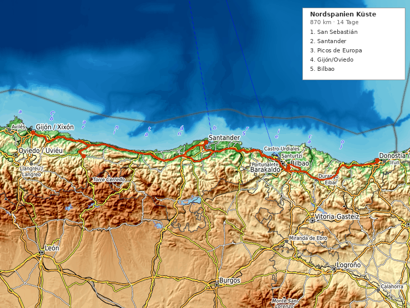

---
---

# Nordspanien Küste Roadtrip (14 Tage)

**Reisezeitraum:** 15. September – 28. September 2026
**Dauer:** 14 Tage / 13 Nächte
**Stationen:** 7 Stopps
**Gesamtstrecke:** ~870 km
**Flug:** BER → Bilbao BIO (1 Stopp) / Bilbao BIO → BER (1 Stopp)
**Mietwagen:** Übernahme/Abgabe Bilbao Flughafen

> 🌊 **Tipp:** Die spanische Nordküste ist das Gegenteil vom Mittelmeer-Klischee — grüne Berge, wilde Atlantikküste, Pintxos-Bars, Sidra-Häuser und die Picos de Europa direkt hinter dem Strand. September: warm, wenig Touristen, perfekte Wanderbedingungen.

---

## Routenübersicht

Bilbao → San Sebastián → Santander → Picos de Europa → Gijón/Oviedo → Bilbao (Puffer + Abreise)

| #   | Station                          | Nächte | Fahrzeit ab vorheriger |
| --- | -------------------------------- | ------ | ---------------------- |
| 1   | San Sebastián                    | 2      | ~1 Std. (102 km)       |
| 2   | Santander                        | 2      | ~1,5 Std. (105 km)     |
| 3   | Picos de Europa / Cangas de Onís | 3      | ~1,5 Std. (136 km)     |
| 4   | Gijón / Oviedo                   | 2      | ~1 Std. (86 km)        |
| 5   | Bilbao (Puffer + Abreise)        | 2      | ~3 Std. (269 km)       |

> ⚠️ **Längste Etappe:** Gijón → Bilbao (269 km, ~3 Std.) am letzten Fahrtag. Alternativ: Zwischenstopp in Castro Urdiales (Küstenort auf halber Strecke).

> 💡 **Puffer-Regel:** Bilbao am Ende mit 2 Nächten — genug Zeit für Guggenheim, Pintxos und Puffer für den Rückflug.

---

## 1. San Sebastián / Donostia (2 Nächte)

Gastronomie-Hauptstadt Europas — mehr Michelin-Sterne pro Kopf als irgendwo sonst. Drei perfekte Stadtstrände, baskische Kultur und die beste Pintxos-Szene der Welt.

**Unterkunft:** Pensión Bellas Artes oder Hotel Parma — Altstadt-Nähe (~100–140 €/Nacht)

### Wandern

- 🥾 **Monte Urgull** — 3 km, 1,5 Std., leicht. Festung über der Altstadt mit 360°-Panorama über die Bucht.
- 🥾 **Monte Igueldo → Paseo Nuevo** — 8 km, 3 Std., moderat. Küstenwanderung mit Blick auf die Concha-Bucht.
- 🥾 **Camino del Norte (Etappe Pasaia → San Sebastián)** — 12 km, 4 Std., moderat. Küstenabschnitt des Jakobswegs.

### Baden

- 🏊 **Playa de la Concha** — Einer der schönsten Stadtstrände Europas. Muschelförmige Bucht, ruhiges Wasser.
- 🏊 **Playa de la Zurriola** — Surfer-Strand im Stadtteil Gros.

### Essen & Trinken

- 🍷 **Parte Vieja (Altstadt) Pintxos-Crawl** — Bar Nestor (Tortilla), La Cuchara de San Telmo (heiße Pintxos), Gandarias (Txuleta).
- 🍷 **Bar Zeruko** — Avantgarde-Pintxos, molekulare Küche auf dem Tresen.
- 🍇 **Txakoli-Weingut Getaria** (20 Min. Fahrt) — Baskischer Weißwein direkt am Meer, Verkostung.
- ☕ **Sakona Coffee Roasters** — Specialty Coffee in der Altstadt.

### Kultur

- 🎨 **[San Telmo Museoa](https://www.santelmomuseoa.eus/en/)** — Baskische Kultur + zeitgenössische Kunst in ehemaligem Kloster.
- 🎨 **Tabakalera** — Internationales Zentrum für zeitgenössische Kultur in ehemaliger Tabakfabrik.
- 🎨 **[Chillida-Leku](https://www.museochillidaleku.com/en/)** — Skulpturenpark von Eduardo Chillida (15 Min. Fahrt). Monumentale Stahlskulpturen in baskischer Landschaft. **Pflichtbesuch.**
- 🏛️ **Peine del Viento** — Chillida-Skulpturen in den Klippen am Meer.

### Unterwegs (Bilbao → San Sebastián)

- 🏛️ **San Juan de Gaztelugatxe** — Dramatische Felsinsel mit Kapelle (Game of Thrones „Dragonstone"). 20 Min. Abstecher ab Autobahn.

---

## 2. Santander (2 Nächte)

Elegante Hafenstadt an der kantabrischen Küste — Strände, Surfen, Markthalle und der Zugang zu den Picos de Europa.

**Unterkunft:** Hotel Bahía oder Jardín Secreto — Zentrum/Sardinero (~90–130 €/Nacht)

### Wandern

- 🥾 **Cabo Mayor → Playa de Mataleñas** — 6 km, 2 Std., leicht. Klippenpfad mit Leuchtturm und versteckten Buchten.
- 🥾 **Parque de la Naturaleza de Cabárceno** — Weitläufiger Naturpark (kein Zoo), 20 Min. Fahrt.

### Baden

- 🏊 **Playa del Sardinero** — Eleganter Stadtstrand mit Belle-Époque-Architektur.
- 🏊 **Playa de la Arnía** — Wilde Felsbucht, spektakuläre Erosionsformen. 15 Min. Fahrt.

### Essen & Trinken

- 🍷 **Mercado de la Esperanza** — Markthalle mit Fisch, Käse und Tapas-Bars im Obergeschoss.
- 🍷 **Bodega del Riojano** — Traditionelle kantabrische Küche seit 1908.
- 🍷 **Cañadío** — Moderne Küche, exzellente Meeresfrüchte.

### Kultur

- 🎨 **[Centro Botín](https://www.centrobotin.org/en/)** — Renzo Piano-Bau am Hafen. Zeitgenössische Kunst + Ausstellungen. **Highlight.**
- 🏛️ **Palacio de la Magdalena** — Königlicher Sommerpalast auf Halbinsel.
- 🌿 **Jardines de Piquío** — Art-Deco-Gärten zwischen den Stränden.

### Unterwegs (San Sebastián → Santander)

- 🏛️ **Comillas** — Gaudí-Gebäude (El Capricho), mittelalterliches Dorf. 30 Min. Abstecher.

---

## 3. Picos de Europa / Cangas de Onís (3 Nächte)

Spaniens spektakulärster Nationalpark — 2.600 m hohe Kalksteingipfel, tiefe Schluchten, Gletscherseen und asturische Bergdörfer. Drei Nächte für die besten Wanderungen.

**Unterkunft:** Hotel Posada del Valle oder Casa Rural bei Cangas de Onís — ~80–120 €/Nacht

### Wandern

- 🥾 **Ruta del Cares** — 22 km (hin+zurück), 6–7 Std., moderat. Spektakulärste Schlucht-Wanderung Spaniens — Pfad in Felswände gehauen, 200 m über dem Fluss. **Highlight der Reise.**
- 🥾 **Lagos de Covadonga Rundweg** — 6 km, 2,5 Std., leicht. Zwei Gletscherseen auf 1.000 m, umgeben von Gipfeln. Morgens früh starten (Zufahrt im Sommer limitiert).
- 🥾 **Mirador del Naranjo de Bulnes** (ab Sotres) — 10 km, 4 Std., moderat. Blick auf den ikonischen Felszahn der Picos.

### Baden

- 🏊 **Río Sella** (bei Arriondas) — Flussbaden in kristallklarem Gebirgswasser.
- 🏊 **Playa de Gulpiyuri** — Inland-Strand! Meerwasser fließt durch unterirdische Höhlen zu einem Strand 100 m von der Küste entfernt. Einzigartig.

### Essen & Trinken

- 🍷 **Sidrería (Sidra-Haus)** — Asturischer Apfelwein, traditionell „escanciar" (aus Höhe eingeschenkt). Überall in Cangas de Onís.
- 🍷 **Restaurante El Molín de la Pedrera** (Cangas) — Regionale Küche, Fabada Asturiana.
- 🍷 **Quesu Cabrales** — Blauschimmelkäse aus den Picos, in Höhlen gereift. Probieren in Arenas de Cabrales.

### Kultur

- 🏛️ **Basílica de Covadonga** — Heilige Stätte der Reconquista (722 n.Chr.), in Felshöhle gebaut.
- 🏛️ **Puente Romano** (Cangas de Onís) — Römische Brücke mit hängendem Kreuz, Wahrzeichen Asturiens.

---

## 4. Gijón / Oviedo (2 Nächte)

Zwei Städte, ein Aufenthalt — Gijón (Hafen, Strand, Sidra) und Oviedo (Präromanik, Kunst, Eleganz). 30 Min. auseinander.

**Unterkunft:** Hotel Casona de Jovellanos (Gijón) oder Hotel de la Reconquista (Oviedo) — ~90–130 €/Nacht

### Wandern

- 🥾 **Senda del Cervigón** (Gijón) — 8 km, 2,5 Std., leicht. Küstenpfad mit Skulpturen entlang der Klippen.
- 🥾 **Senda del Oso** (30 Min. ab Oviedo) — 12 km, 3 Std., leicht. Ehemaliger Bergbau-Pfad durch Schluchten, Bären-Schutzgebiet.

### Baden

- 🏊 **Playa de San Lorenzo** (Gijón) — 1,5 km Stadtstrand, Surfen möglich.
- 🏊 **Playa del Silencio** (40 Min. westlich) — Versteckte Bucht zwischen Klippen, einer der schönsten Strände Asturiens.

### Essen & Trinken

- 🍷 **Sidrería Tierra Astur** (Gijón) — Authentische Sidra + asturische Küche.
- 🍷 **Mercado del Fontán** (Oviedo) — Historische Markthalle unter Arkaden.
- 🍷 **Casa Fermín** (Oviedo) — Gehobene asturische Küche, Michelin-empfohlen.
- ☕ **Cafetería Rialto** (Oviedo) — Historisches Café, Jugendstil.

### Kultur

- 🎨 **[LABoral Centro de Arte](https://www.laboralcentrodearte.org/en)** — Zeitgenössische Kunst + Technologie in monumentalem Franco-Bau. Gijón.
- 🎨 **Museo de Bellas Artes de Asturias** (Oviedo) — Spanische Kunst von El Greco bis Dalí.
- 🏛️ **Präromanische Kirchen** (UNESCO) — Santa María del Naranco, San Miguel de Lillo. 9. Jahrhundert, einzigartig in Europa.
- 🌿 **Jardín Botánico Atlántico** (Gijón) — Atlantischer Botanischer Garten, 25 ha.

---

## 5. Bilbao — Puffer & Abreise (2 Nächte)

Zurück in Bilbao für Guggenheim, Pintxos und Puffer. Mietwagen am Flughafen abgeben, dann per Metro in die Stadt.

**Unterkunft:** Hotel Miró oder Gran Hotel Domine (Guggenheim-Blick) — ~100–150 €/Nacht

### Wandern

- 🥾 **Artxanda Funicular + Rundweg** — 5 km, 2 Std., leicht. Standseilbahn auf den Hausberg, Panorama über die Stadt.

### Essen & Trinken

- 🍷 **Plaza Nueva Pintxos-Crawl** — Gilda (Sardelle+Olive+Peperoni), Txuleta, Bacalao.
- 🍷 **Mercado de la Ribera** — Europas größte überdachte Markthalle, Tapas-Bars im Obergeschoss.
- 🍷 **Restaurante Mina** — Michelin-Stern, baskische Avantgarde-Küche am Fluss.
- ☕ **Café Iruña** — Maurisch dekoriertes Café von 1903, Institution.

### Kultur

- 🎨 **[Guggenheim Bilbao](https://www.guggenheim-bilbao.eus/en)** — Frank Gehry-Ikone. Zeitgenössische Kunst, wechselnde Ausstellungen. **Pflichtbesuch.** Außen: Jeff Koons' „Puppy", Louise Bourgeois' „Maman".
- 🎨 **Museo de Bellas Artes** — Spanische + baskische Kunst, von Goya bis Chillida.
- 🏛️ **Casco Viejo** — Mittelalterliche Altstadt, Siete Calles (7 Gassen).
- 🏛️ **Puente Bizkaia** — UNESCO-Welterbe Schwebefähre (1893), 15 Min. Fahrt.

---

## Wetter

> ℹ️ _Mitte September an der spanischen Nordküste: Spätsommer, noch warm aber Atlantik bringt gelegentlich Regen. Richtwerte — aktuelle Vorhersage vor Reiseantritt prüfen._

| Station         | Temperatur | Regen | Besonderheiten                       |
| --------------- | ---------- | ----- | ------------------------------------ |
| San Sebastián   | 15–24°C    | 30%   | Milde Küste, abends frisch           |
| Santander       | 15–23°C    | 30%   | Ähnlich, etwas windiger              |
| Picos de Europa | 8–20°C     | 35%   | Berge! Morgens kühl, Nachmittag warm |
| Gijón/Oviedo    | 14–22°C    | 35%   | Küste mild, Inland etwas wärmer      |
| Bilbao          | 15–25°C    | 30%   | Geschützte Lage, wärmste Station     |

> ☀️ **September ist ideal** — Hochsaison vorbei, Meer noch 19–21°C, milde Temperaturen. Regenjacke einpacken (Nordküste!), aber viele Sonnentage.

---

## Anreise & Mietwagen

**Hinflug:** BER → Bilbao (BIO), 1 Stopp (via Madrid oder Barcelona), ~4 Std. total

- Empfehlung: **Mo 15. September, Abflug 07:00–08:00 Uhr** → Ankunft Bilbao ~11:00–12:00
- Airlines: Vueling (via BCN), Iberia (via MAD), Ryanair (via MAD)
- Geschätzte Kosten: ~100–180 € pro Person (one-way)

**Rückflug:** Bilbao (BIO) → BER, 1 Stopp

- Empfehlung: **So 28. September, Abflug 14:00–16:00 Uhr**

**Mietwagen:**

- Übernahme: Bilbao Flughafen, 15. September
- Abgabe: Bilbao Flughafen, 28. September (morgens vor Rückflug)
- Empfehlung: Kompaktwagen
- Geschätzte Kosten: ~400–600 € für 14 Tage (Vollkasko inkl.)

> 💡 Mietwagen frühzeitig buchen. Vergleichsportale: CHECK24, billiger-mietwagen.de

---

## Kostenübersicht (Schätzung, 2 Personen)

| Posten                  | Geschätzt          |
| ----------------------- | ------------------ |
| Flüge (2×, Roundtrip)   | ~400–720 €         |
| Mietwagen (14 Tage)     | ~400–600 €         |
| Unterkünfte (13 Nächte) | ~1.200–1.700 €     |
| Benzin (~870 km)        | ~90–120 €          |
| Essen & Aktivitäten     | ~800–1.200 €       |
| **Gesamt**              | **~2.900–4.340 €** |

---

## Packliste & Tipps

- **Regenjacke**: Nordküste = Atlantikklima. Kurze Schauer auch im September.
- **Wanderschuhe**: Picos de Europa erfordert festes Schuhwerk (Ruta del Cares!).
- **Badesachen**: Meer noch 19–21°C, Flüsse kälter.
- **Reservierungen**: Ruta del Cares braucht keine, aber Lagos de Covadonga Zufahrt im Sommer limitiert (Bus ab Cangas). Im September meist frei.
- **Pintxos-Etikette**: Bestellen am Tresen, Zahlen am Ende (Zahnstocher zählen). Txakoli wird aus Höhe eingeschenkt.
- **Sidra**: Wird „escanciar" — aus 1 m Höhe ins Glas gegossen. Sofort trinken (Kohlensäure verfliegt).
- **Sprache**: Baskisch (Euskara) + Spanisch im Baskenland. Asturisch (Bable) in Asturien. Spanisch überall verstanden.

---

## Länderinfo

|                           |                                                                                                         |
| ------------------------- | ------------------------------------------------------------------------------------------------------- |
| **Preisniveau**           | Ähnlich wie Deutschland (Baskenland etwas teurer, Asturien günstiger)                                   |
| **Tempolimit Landstraße** | 90 km/h                                                                                                 |
| **Tempolimit Autobahn**   | 120 km/h                                                                                                |
| **Tempolimit innerorts**  | 50 km/h (30 in Wohngebieten)                                                                            |
| **Besonderheiten**        | Autovías (Autobahnen) meist mautfrei. Einige Autopistas kostenpflichtig. Lichtpflicht bei Regen/Tunnel. |
| **Reisehinweise**         | Keine Einschränkungen ([Auswärtiges Amt](https://www.auswaertiges-amt.de/de/ReiseUndSicherheit))        |
