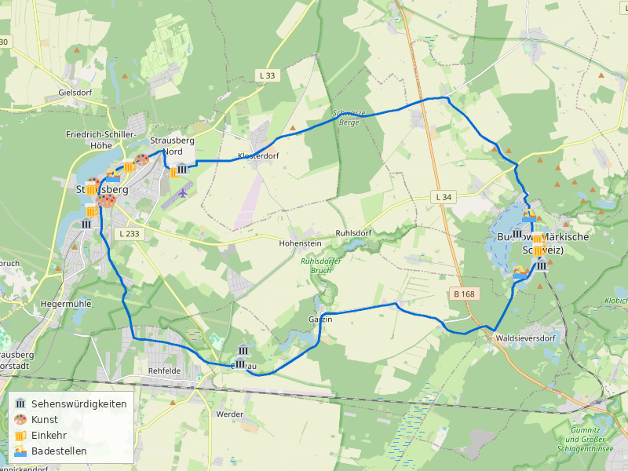
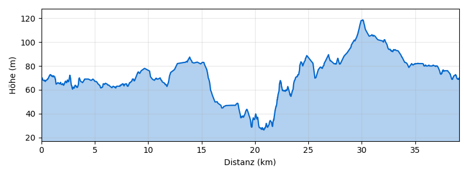

---
---

# Strausberg–Buckow-Runde ab S Strausberg Nord

**Distanz:** ~39 km (39,1 km lt. BRouter)
**Fahrzeit:** ca. 2,5–3,5 Std. (ohne Pausen)
**Routentyp:** Rundtour, hügelig (Märkische Schweiz)
**Start/Ziel:** S Strausberg Nord (S5)
**GPX-Datei:** [gpx/strausberg-buckow.gpx](gpx/strausberg-buckow.gpx)

> 🌿 **Tipp:** Die „Märkische Schweiz" ist Brandenburgs kleinstes, aber landschaftlich reizvollstes Naturschutzgebiet — mit tiefen Schluchten, stillen Seen und dem Kurort Buckow als Herzstück.

---

## Streckenverlauf

S Strausberg Nord → Waldsieversdorf → Buckow → Pritzhagen → Garzau → S Strausberg Nord

---

## Streckenabschnitte

### 1. S Strausberg Nord → Waldsieversdorf (ca. 10 km)

Vom S-Bahnhof Strausberg Nord geht es südwärts durch die Strausberger Vorstadt. Über die **Hegermühlenstraße** und ruhige Nebenstraßen führt die Route durch den Wald Richtung Südosten. Die Strecke verläuft überwiegend auf asphaltierten Feld- und Waldwegen durch die Brandenburger Endmoränenlandschaft.

🏛️ **Stadtmuseum Strausberg** — Stadtgeschichte und Regionalkultur (Di–Do 10–17 Uhr)
🏛️ **St.-Marien-Kirche** — Gotische Backsteinkirche im Zentrum von Strausberg
🎨 **Hingucker Atelier** — Galerie mit wechselnden Ausstellungen in der Strausberger Altstadt
🎨 **Angoraziegenbock** (Gerhard Rommel, 1985) — Bronzeskulptur am Straussee
🏊 **Straussee (Badestellen)** — Mehrere naturnahe Badestellen am Westufer des Straussees

### 2. Waldsieversdorf → Buckow (ca. 8 km)

Von Waldsieversdorf führt die Route durch den **Naturpark Märkische Schweiz** nach Buckow. Die Landschaft wird deutlich hügeliger — die namensgebende „Schweiz" zeigt sich mit Höhenunterschieden bis zu 60 m. Der Weg führt durch dichte Buchenwälder.

🏛️ **DDR & Nostalgie Museum** (Waldsieversdorf) — Alltagskultur der DDR-Zeit
🏛️ **Dorfkirche Garzin** — Einschiffige Saalkirche mit Westquerturm aus dem 13. Jahrhundert

### 3. Buckow — Aufenthalt (ca. 4 km im Ort)

Buckow, die „Perle der Märkischen Schweiz", ist der Höhepunkt der Tour. Der Kurort liegt malerisch zwischen Schermützelsee und Buckowsee. Hier lohnt sich eine ausgiebige Pause.

🏛️ **Fahrbetrieb und Eisenbahnmuseum „Buckower Kleinbahn"** — Historische Kleinbahn mit Museumsfahrten (Sa/So 10–18 Uhr)
🏛️ **Heimatstube Buckow** — Ortsgeschichte und Naturkunde
🏛️ **Bismarckhöhe** — Aussichtspunkt mit Panoramablick über den Schermützelsee
🏛️ **Ferdinandshöhe** — Weiterer Aussichtspunkt über die Märkische Schweiz
🏛️ **Stadtpfarrkirche Buckow** — Historische Kirche im Ortskern

🍺 **MOSES Café Bistro Vinothek** — Mediterrane Küche, Kuchen und Eis, Terrasse (Di–So 11–21 Uhr)
🍺 **Café am Markt** — Kaffee und Kuchen im Zentrum (Di–So 11–17 Uhr)
🍺 **Castello Angelo** — Italienische Küche (Mi–So ab 12/15 Uhr)
🍺 **Zur Märkischen Schweiz** — Regionale Küche (täglich 11–22 Uhr)
🍺 **Pension Strandcafé** — Direkt am Schermützelsee

🏊 **Strandbad Schermützelsee** — Öffentliches Strandbad mit Sandstrand, Steg und klarem Wasser

### 4. Buckow → Garzau → S Strausberg Nord (ca. 17 km)

Die Rückfahrt führt über die nördliche Route durch den Naturpark. Über **Pritzhagen** und die Höhen nördlich von Buckow geht es durch abwechslungsreiche Wald- und Feldlandschaft. Über **Garzau** und die Waldwege nördlich von Strausberg erreicht man den S-Bahnhof. Die Strecke ist hügeliger als der Hinweg und bietet weite Ausblicke über die Endmoränenlandschaft.

🏛️ **Schloss Garzau** — Historisches Gutshaus im Landschaftspark
🏛️ **Pyramide von Garzau** — Einzige erhaltene Feldsteinpyramide Deutschlands (1784), Teil des ehemaligen Landschaftsparks
🏛️ **Dorfkirche Garzau** — Saalkirche aus dem 13./14. Jahrhundert mit Westquerturm
🏛️ **Flugplatzmuseum Strausberg** — Luftfahrtgeschichte am ehemaligen Militärflugplatz

🍺 **Gasthof Strausberg Nord** — Regionale Küche direkt am S-Bahnhof (täglich ab 7/8 Uhr)
🍺 **Restaurant Doppeldecker** — Regionale Küche, Burger, Fisch (Di–So 12–21 Uhr)

---

## Badestellen

- 🏊 **Strandbad Schermützelsee** (Buckow) — Klarer Badesee mit Strandbad, Steg und Liegewiese. Einer der saubersten Seen Brandenburgs.
- 🏊 **Straussee** (Strausberg) — Mehrere naturnahe Badestellen am Westufer, direkt an der Route.
- 🏊 **Schermützelsee Südufer** — Ruhige Badestelle südlich von Buckow, weniger besucht.

---

## Einkehrmöglichkeiten

- 🍺 **MOSES Café Bistro Vinothek** (Buckow) — Mediterran, Kuchen, Eis, Terrasse
- 🍺 **Café am Markt** (Buckow) — Kaffee und Kuchen
- 🍺 **Zur Märkischen Schweiz** (Buckow) — Regionale Küche
- 🍺 **Castello Angelo** (Buckow) — Italienisch
- 🍺 **Pension Strandcafé** (Buckow) — Am Schermützelsee
- 🍺 **Gasthof Strausberg Nord** — Regionale Küche am S-Bahnhof
- 🍺 **Restaurant Doppeldecker** (Strausberg) — Regionale Küche, Burger
- 🍺 **Landhaus am See** (Strausberg) — Bayerische Küche am Straussee (Mo, Mi–Sa 12–21 Uhr)

---

## Wetter am Sonntag, 3. Mai 2026

> ℹ️ _Zuletzt geprüft: 2. Mai 2026. Vor der Tour aktuelles Wetter prüfen._

☀️ **Sehr gutes Radwetter — warm und weitgehend trocken**

|                |                                            |
| -------------- | ------------------------------------------ |
| **Temperatur** | 8–27°C                                     |
| **Regen**      | 0,1 mm (3% Wahrscheinlichkeit)             |
| **Wind**       | ~16 km/h Südwest                           |
| **Wetterlage** | Leicht bewölkt, vereinzelt Schauer möglich |

Sonnencreme und ausreichend Wasser mitnehmen bei bis zu 27°C.

---

## Veranstaltungen

Keine aktuellen Veranstaltungen entlang der Route gefunden. Buckow bietet im Sommer regelmäßig Konzerte und Lesungen im Brecht-Weigel-Haus — vorab auf [buckow-info.de](https://www.buckow-info.de) prüfen. Seetours Märkische Schweiz bietet tägliche Rundfahrten auf dem Schermützelsee (Apr–Okt, ca. 1 Std.).

---

## Nahverkehrsanbindung

> ℹ️ _Verbindungen verifiziert für 3. Mai 2026. Vor der Tour aktuelle Fahrpläne prüfen._

> ⚠️ **Schienenersatzverkehr:** S2 zwischen Blankenfelde und Priesterweg bis Mo 4.5. 01:30 Uhr. Die empfohlenen Verbindungen nutzen RB24/S5 und sind **nicht betroffen**.

**Hinfahrt:**
Ab **S Blankenfelde (TF) Bhf** → _RB24_ → S+U Lichtenberg Bhf → _S5_ → **S Strausberg Nord**

- Abfahrt: 10:09 Uhr ab Blankenfelde → Ankunft 11:45 Uhr in Strausberg Nord
- 1 Umstieg, 1 Std. 36 Min.
- Alternativ: 10:52 Uhr RE8 → Hbf → S5, Ankunft 12:25 (1 Umstieg)

**Rückfahrt:**
Ab **S Strausberg Nord** → _S5_ → S Ostkreuz → _RB24_ → **S Blankenfelde (TF) Bhf**

- Abfahrt: 20:30 Uhr ab Strausberg Nord → Ankunft 21:51 Uhr in Blankenfelde
- 1 Umstieg, 1 Std. 21 Min.
- Alternativ: 21:10 Uhr S5 → Lichtenberg → RB24, Ankunft 22:51

**Tarif (2 Personen + 2 Fahrräder):**

| Option                                     | Preis       |
| ------------------------------------------ | ----------- |
| 2× Einzelfahrt + 2× Fahrradkarte (pro Weg) | 19,80 €     |
| Hin + Rück (4× Einzelfahrt + 2× Fahrrad)   | 32,40 €     |
| 2× Tageskarte + 2× Fahrradkarte            | 31,20 €     |
| **Empfehlung: 2× Tageskarte + 2× Fahrrad** | **31,20 €** |

> 🚲 Fahrradmitnahme in S-Bahn und Regionalbahn ist im VBB möglich (Fahrradkarte erforderlich).
