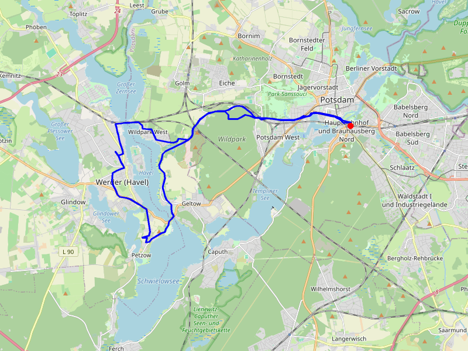
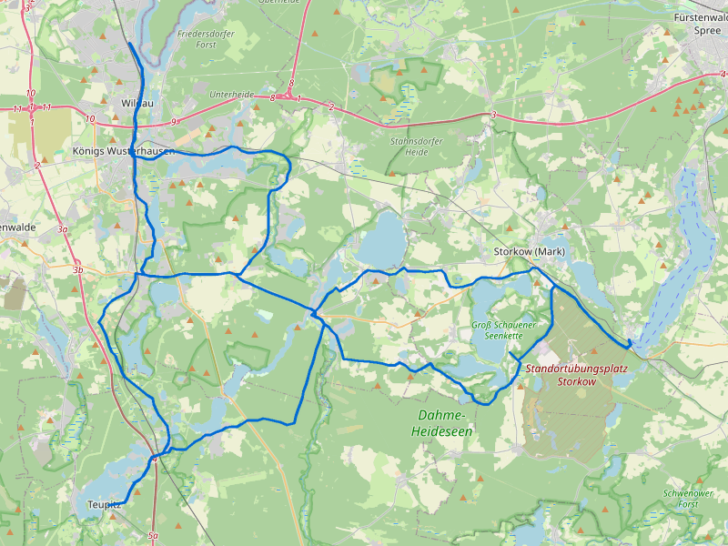

# 🚲 Tourenkatalog

Radtouren-Sammlung für Tagesausflüge im Raum Berlin/Brandenburg. Alle Touren sind **Rundkurse** (Start = Ziel) und per Nahverkehr ab Blankenfelde-Mahlow erreichbar.

---

## 🌸 Potsdam–Baumblütenfest-Runde

|                      |                                |
| -------------------- | ------------------------------ |
| **Distanz**          | ~33 km                         |
| **Fahrzeit**         | 2–2,5 Std.                     |
| **Start/Ziel**       | Potsdam Hbf                    |
| **Region**           | Potsdam / Werder (Havel)       |
| **Badeseen**         | 🏊 Schwielowsee, Templiner See |
| **Schwierigkeit**    | ⭐ Leicht                      |
| **Beste Jahreszeit** | Apr–Okt (Baumblütenfest: Mai)  |

Durch den **Park Sanssouci** nach **Werder (Havel)** zum Baumblütenfest, zurück über **Petzow**, **Caputh** und den **Schwielowsee**. Schlösser, Obstbaumblüte und Biergärten.

→ [Zur Tourbeschreibung](potsdam-baumbluetefest-runde.md)

---

## 🌊 Dahme-Seen-Runde

|                      |                                                           |
| -------------------- | --------------------------------------------------------- |
| **Distanz**          | ~73 km                                                    |
| **Fahrzeit**         | 4–5 Std.                                                  |
| **Start/Ziel**       | Königs Wusterhausen Bhf                                   |
| **Region**           | Dahme-Seenland                                            |
| **Badeseen**         | 🏊 Zeuthener See, Storkower See, Teupitzsee, Bindower See |
| **Schwierigkeit**    | ⭐⭐ Mittel (Distanz)                                     |
| **Beste Jahreszeit** | Mai–Sep                                                   |

Große Seenrunde auf dem **Dahme-Radweg** über **Zeuthen**, **Storkow**, **Teupitz** und **Bindow**. Vier Badeseen, mittelalterliche Burgen und viel Waldschatten.

→ [Zur Tourbeschreibung](dahme-seen-runde.md)

---

## 🌲 Erkner–Müggelsee-Runde

|                      |                                             |
| -------------------- | ------------------------------------------- |
| **Distanz**          | ~26 km                                      |
| **Fahrzeit**         | 1,5–2 Std.                                  |
| **Start/Ziel**       | Erkner Bhf                                  |
| **Region**           | Müggelsee / Köpenick                        |
| **Badeseen**         | 🏊 Strandbad Müggelsee, Strandbad Rahnsdorf |
| **Schwierigkeit**    | ⭐ Leicht                                   |
| **Beste Jahreszeit** | Mai–Sep                                     |

Kompakte Runde um den **Müggelsee** — Berlins größten Binnensee. Über **Rahnsdorf** und **Friedrichshagen** mit Brauhaus, Künstlerateliers und zwei Strandbädern.

→ [Zur Tourbeschreibung](erkner-mueggelsee-runde.md)

---

## Nach Distanz

- **Kurz (< 30 km):** [Erkner–Müggelsee](erkner-mueggelsee-runde.md) (~26 km)
- **Mittel (30–50 km):** [Potsdam–Baumblütenfest](potsdam-baumbluetefest-runde.md) (~33 km)
- **Lang (> 50 km):** [Dahme-Seen-Runde](dahme-seen-runde.md) (~73 km)

## Nach Region

- **Potsdam / Havel:** [Potsdam–Baumblütenfest](potsdam-baumbluetefest-runde.md)
- **Dahme-Seenland (südöstlich):** [Dahme-Seen-Runde](dahme-seen-runde.md)
- **Müggelsee / Köpenick (östlich):** [Erkner–Müggelsee](erkner-mueggelsee-runde.md)

## Saisonale Empfehlungen

| Jahreszeit            | Empfehlung                                                | Warum                                                             |
| --------------------- | --------------------------------------------------------- | ----------------------------------------------------------------- |
| 🌸 Frühling (Apr–Mai) | [Potsdam–Baumblütenfest](potsdam-baumbluetefest-runde.md) | Baumblütenfest in Werder, Obstbaumblüte, Park Sanssouci           |
| ☀️ Sommer (Jun–Aug)   | [Dahme-Seen-Runde](dahme-seen-runde.md)                   | 4 Badeseen entlang der Route, Waldschatten                        |
| 🍂 Herbst (Sep–Okt)   | [Erkner–Müggelsee](erkner-mueggelsee-runde.md)            | Laubfärbung am Müggelsee, kurze Tour für kürzere Tage             |
| ❄️ Winter (Nov–Mär)   | [Erkner–Müggelsee](erkner-mueggelsee-runde.md)            | Kurz genug für kalte Tage, Brauhaus Friedrichshagen zum Aufwärmen |

## Anreise & Rückfahrt

Alle Touren sind per Nahverkehr ab **S Blankenfelde-Mahlow** erreichbar:

| Tour                   | Hinfahrt           | Umstiege | Fahrzeit | Rückfahrt   | Umstiege | Fahrzeit |
| ---------------------- | ------------------ | -------- | -------- | ----------- | -------- | -------- |
| Potsdam–Baumblütenfest | RB24 → RB22 → RB33 | 2        | ~70 Min. | RE1 → RE8   | 1        | ~51 Min. |
| Dahme-Seen-Runde       | RB24 → RE20        | 1        | ~33 Min. | RE20 → RB24 | 1        | ~35 Min. |
| Erkner–Müggelsee       | RB24 → S3          | 1        | ~61 Min. | S3 → RB24   | 1        | ~66 Min. |

> 🚲 Fahrradmitnahme in S-Bahn und Regionalbahn ist im VBB möglich (Fahrradkarte erforderlich).
