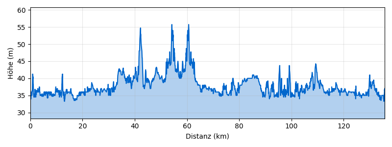

# Dahme-Seen-Runde ab Königs Wusterhausen

**Distanz:** ~136 km (135,8 km lt. BRouter)
**Fahrzeit:** ca. 9 Std. (ohne Pausen)
**Routentyp:** Rundtour, flach
**Start/Ziel:** S Königs Wusterhausen Bhf
**GPX-Datei:** [gpx/dahme-seen.gpx](gpx/dahme-seen.gpx)

## Streckenverlauf

Königs Wusterhausen → Zeuthen → Zeuthener See → Prieros → Storkower See → Wendisch Rietz → Teupitz → Bindow → Königs Wusterhausen

---

## Streckenabschnitte

### 1. Königs Wusterhausen → Zeuthener See (ca. 12 km)

Vom Bahnhof KW geht es über ruhige Nebenstraßen und den **Dahme-Radweg** nach Zeuthen. Die Route führt am Ufer des **Zeuthener Sees** entlang — ein wunderschöner Einstieg mit Blick aufs Wasser.

🏛️ **Schloss Zeuthen** — historisches Gutshaus direkt am See
🍺 Café am Zeuthener See — Kaffee und Kuchen mit Seeblick
🏊 **Zeuthener See** — Badestrand Zeuthen, gut zugänglich

### 2. Zeuthener See → Storkower See (ca. 20 km)

Durch den **Friedersdorfer Forst** und über Prieros zum Storkower See. Überwiegend Waldwege und ruhige Dorfstraßen, kaum Verkehr.

🏛️ **Burg Storkow** — mittelalterliche Wasserburg direkt am See, sehr sehenswert
🏊 **Storkower See** — mehrere Badestellen, klares Wasser
🍺 Café in Wendisch Rietz am Seeufer

### 3. Storkower See → Teupitz (ca. 15 km)

Weiter südlich durch Waldlandschaft zum **Teupitzsee** mit der malerischen Burg Teupitz.

🏛️ **Burg Teupitz** — Wasserburg auf einer Halbinsel im Teupitzsee, einzigartiges Panorama
🏊 **Teupitzsee** — Strandbad Teupitz
🎨 Galerie im Dorfkern Teupitz — lokale Kunstausstellungen

### 4. Teupitz → Bindow → Königs Wusterhausen (ca. 26 km)

Rückweg über Bindow und den **Dahme-Radweg** zurück nach KW. Flache Waldwege, entspanntes Fahren.

🏊 **Bindower See** — ruhige Badestelle abseits der Touristenpfade
🍺 Einkehrmöglichkeiten in Bindow

---

## Badestellen

- 🏊 **Zeuthener See** — Strandbad Zeuthen
- 🏊 **Storkower See** — Badestrand Wendisch Rietz
- 🏊 **Teupitzsee** — Strandbad Teupitz
- 🏊 **Bindower See** — naturnahe Badestelle

---

## Einkehrmöglichkeiten

- 🍺 Café am Zeuthener See (Zeuthen) — Kuchen und Kaffee mit Seeblick
- 🍺 Café/Restaurant in Wendisch Rietz am Storkower See
- 🍺 Gaststätte in Teupitz — regionale Küche

---

## Wetter am Sonntag, 3. Mai 2026

> ℹ️ _Zuletzt geprüft: 1. Mai 2026. Vor der Tour aktuelles Wetter prüfen._

☀️ **Sehr gutes Radwetter!**

|                |                              |
| -------------- | ---------------------------- |
| **Temperatur** | 10–28°C                      |
| **Regen**      | 0 mm (5% Wahrscheinlichkeit) |
| **Wind**       | ~16 km/h aus Süd             |
| **Wetterlage** | Bewölkt, aber trocken        |

Keine Warnungen. Sonnencreme und ausreichend Wasser mitnehmen bei bis zu 28°C.

---

## Veranstaltungen

Kein bekanntes Großevent direkt an der Route. Ruhige Seenlandschaft — ideal für einen entspannten Sonntagsausflug.

---

## Nahverkehrsanbindung

> ℹ️ _Verbindungen verifiziert für So, 3. Mai 2026. Vor der Tour aktuelle Fahrpläne prüfen._

**Hinfahrt:**
Ab **S Blankenfelde-Mahlow** → **RB24** bis Flughafen BER → Umstieg **RE20** oder **RB22** → **S Königs Wusterhausen Bhf**

- Abfahrt: 10:09 Uhr ab Blankenfelde
- Ankunft KW: 10:42 Uhr (1 Umstieg, ca. 33 Min.)
- Stündliche Verbindungen

**Rückfahrt:**
Ab **S Königs Wusterhausen Bhf** → **RE20** bis Flughafen BER → **RB24** bis **S Blankenfelde-Mahlow**

- Abfahrt: 19:16 Uhr ab KW
- Ankunft Blankenfelde: 19:51 Uhr (1 Umstieg, ca. 35 Min.)
- Stündliche Verbindungen

> 🚲 Fahrradmitnahme in S-Bahn und Regionalbahn ist im VBB möglich (Fahrradkarte erforderlich).

---
