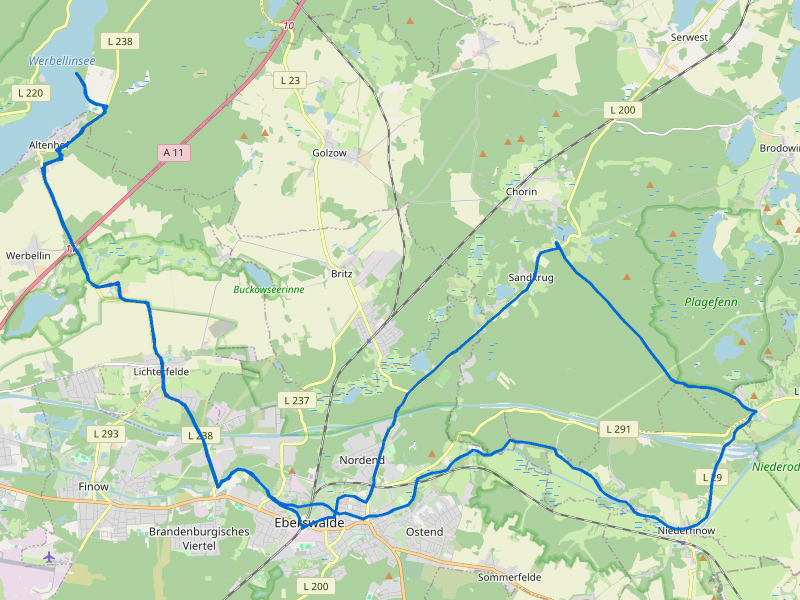
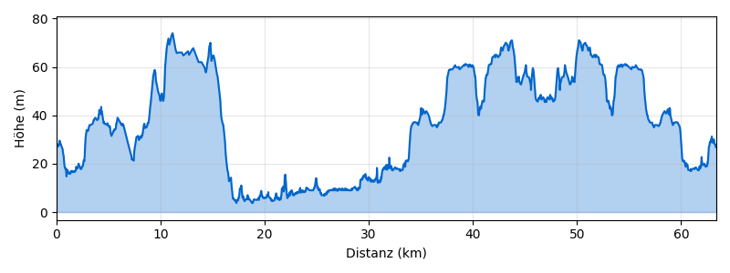

# Eberswalde–Chorin–Werbellinsee-Runde ab Eberswalde

**Distanz:** ~63 km (63,4 km lt. BRouter)
**Fahrzeit:** ca. 4–5 Std. (ohne Pausen)
**Routentyp:** Rundtour, hügelig
**Start/Ziel:** Eberswalde Hbf
**GPX-Datei:** [gpx/eberswalde-chorin-werbellinsee.gpx](gpx/eberswalde-chorin-werbellinsee.gpx)

> 🏛️ **Tipp:** Kloster Chorin, Schiffshebewerk Niederfinow und der Werbellinsee — drei Top-Sehenswürdigkeiten Brandenburgs auf einer Tour!

---

## Streckenverlauf

Eberswalde → Kloster Chorin → Niederfinow (Schiffshebewerk) → Werbellinsee → Eberswalde

---

## Streckenabschnitte

### 1. Eberswalde → Kloster Chorin → Niederfinow (ca. 20 km)

Durch den **Choriner Wald** zum Kloster, dann weiter zum Schiffshebewerk. Der Abschnitt führt über ruhige Waldwege und kleine Dorfstraßen durch die hügelige Uckermark-Landschaft.

🏛️ **Kloster Chorin** — gotisches Zisterzienserkloster aus dem 13. Jh., Sommerkonzerte
🏛️ **Schiffshebewerk Niederfinow** — technisches Denkmal, neues Hebewerk seit 2022
🍺 Klosterschänke Chorin — regionale Küche im Klostergarten

### 2. Niederfinow → Werbellinsee (ca. 25 km)

Durch die **Schorfheide** zum Werbellinsee (Fontanes „Märkisches Meer"). Abwechslungsreiche Strecke durch dichte Wälder und sanfte Hügel mit gelegentlichen Ausblicken auf die Seenlandschaft.

🏛️ **Werbellinsee** — einer der klarsten Seen Brandenburgs, 10 km lang
🏊 **Strandbad Joachimsthal** am Werbellinsee
🎨 Biorama-Projekt Joachimsthal — Kunst und Natur im alten Wasserturm
🍺 Café am Werbellinsee

### 3. Werbellinsee → Eberswalde (ca. 18 km)

Rückweg durch die **Schorfheide**, hügelig mit Waldschatten. Entspanntes Ausrollen auf den letzten Kilometern zurück nach Eberswalde.

🏛️ **Finowkanal** — ältester noch befahrbarer Kanal Deutschlands
🍺 Einkehr in Eberswalde — Altstadt mit Cafés

---

## Badestellen

- 🏊 **Strandbad Joachimsthal** (Werbellinsee)

---

## Einkehrmöglichkeiten

- 🍺 Klosterschänke Chorin — regionale Küche im Klostergarten
- 🍺 Café am Werbellinsee

---

## Wetter am Sonntag, 3. Mai 2026

> ℹ️ _Zuletzt geprüft: 1. Mai 2026. Vor der Tour aktuelles Wetter prüfen._

☀️ **Sehr gutes Radwetter!**

|                |                              |
| -------------- | ---------------------------- |
| **Temperatur** | 9–28°C                       |
| **Regen**      | 0 mm (5% Wahrscheinlichkeit) |
| **Wind**       | ~16 km/h                     |
| **Wetterlage** | Bewölkt, aber trocken        |

246 m Höhenmeter — mehr Anstrengung als die flachen Touren, ausreichend Wasser mitnehmen.

---

## Veranstaltungen

Chorin Musiksommer (Konzerte im Kloster, Saison Mai–Aug)

---

## Nahverkehrsanbindung

> ℹ️ _Verbindungen nicht per API verifiziert. Vor der Tour aktuelle Fahrpläne prüfen._

**Hinfahrt:**
Ab **S Blankenfelde (TF) Bhf** → **RB24** bis **Eberswalde Hbf** (DIREKT, kein Umstieg!)

- Stündliche Verbindungen, ca. 60 Min. Fahrzeit

**Rückfahrt:**
Ab **Eberswalde Hbf** → **RB24** bis **S Blankenfelde (TF) Bhf** (DIREKT)

- Stündliche Verbindungen, ca. 60 Min. Fahrzeit

> 🚲 Fahrradmitnahme in S-Bahn und Regionalbahn ist im VBB möglich (Fahrradkarte erforderlich).

---
