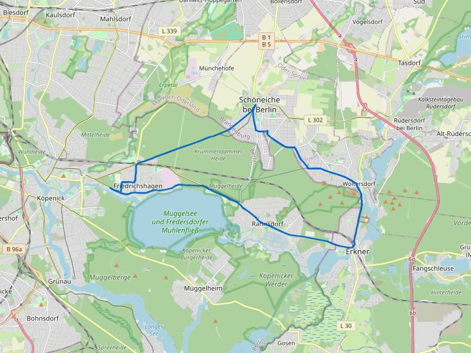
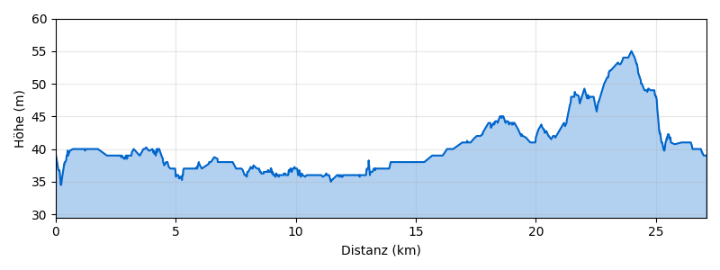

# Erkner–Müggelsee-Runde ab Erkner

**Distanz:** ~27 km (27,1 km lt. BRouter)
**Fahrzeit:** ca. 1,5–2 Std. (ohne Pausen)
**Routentyp:** Rundtour, flach
**Start/Ziel:** S Erkner Bhf
**GPX-Datei:** [gpx/erkner-mueggelsee.gpx](gpx/erkner-mueggelsee.gpx)

> **Tipp:** Kompakte Rundtour direkt ab S Erkner Bhf — ideal als halber Tagesausflug oder in Kombination mit einem Besuch am Müggelsee.

---

## Streckenverlauf

Erkner → Rahnsdorf → Müggelseedamm → Friedrichshagen → Schöneiche bei Berlin → Erkner

---

## Streckenabschnitte

### 1. Erkner → Rahnsdorf (ca. 7 km)

Vom Bahnhof Erkner westwärts über den **Müggelseedamm** am Nordufer des Müggelsees entlang. Herrlicher Blick auf den größten Berliner Binnensee, überwiegend flacher Radweg bis Rahnsdorf.

🏛️ **Gerhart-Hauptmann-Museum Erkner** — Literaturmuseum im ehemaligen Wohnhaus des Nobelpreisträgers (kurzer Abstecher vom Start)
🏛️ **Müggelsee** — größter Berliner Binnensee, beeindruckende Weite
🏊 **Strandbad Rahnsdorf** — naturnaher Badestrand am Müggelsee-Ostufer

### 2. Rahnsdorf → Friedrichshagen (ca. 8 km)

Am Südufer des Müggelsees entlang durch die **Müggelheide** nach Friedrichshagen. Ruhige Waldwege, kaum Autoverkehr. In Friedrichshagen lohnt ein Bummel durch die **Bölschestraße** mit ihren Cafés und Galerien.

🏛️ **Müggelturm** — Aussichtsturm in den Müggelbergen (kleiner Umweg, tolle Aussicht)
🎨 **Ateliers in Friedrichshagen** — im ehemaligen Villenviertel leben viele Künstler, wechselnde Ausstellungen
🍺 **Brauhaus Friedrichshagen** — historisches Brauhaus direkt am See, Biergarten
🏊 **Strandbad Müggelsee** — großes Strandbad in Friedrichshagen

### 3. Friedrichshagen → Schöneiche → Erkner (ca. 11 km)

Von Friedrichshagen über die **Bölschestraße** nach Süden, durch Schöneiche bei Berlin zurück nach Erkner. Ruhige Wohnstraßen und Waldwege.

🍺 Café in Schöneiche — Kaffee und selbstgebackener Kuchen

---

## Badestellen

- 🏊 **Strandbad Müggelsee** (Friedrichshagen) — großes Strandbad
- 🏊 **Strandbad Rahnsdorf** — naturnaher Badestrand

---

## Einkehrmöglichkeiten

- 🍺 **Brauhaus Friedrichshagen** — Biergarten direkt am Müggelsee, Hausbrauerei
- 🍺 Café in Schöneiche — selbstgebackener Kuchen

---

## Wetter am Sonntag, 3. Mai 2026

> ℹ️ _Zuletzt geprüft: 1. Mai 2026. Vor der Tour aktuelles Wetter prüfen._

☀️ **Sehr gutes Radwetter!**

|                |                              |
| -------------- | ---------------------------- |
| **Temperatur** | 10–28°C                      |
| **Regen**      | 0 mm (5% Wahrscheinlichkeit) |
| **Wind**       | ~16 km/h aus Süd             |
| **Wetterlage** | Bewölkt, aber trocken        |

---

## Veranstaltungen

Keine bekannten Großveranstaltungen direkt an der Route. Ruhige Natur- und Seenlandschaft.

---

## Nahverkehrsanbindung

> ℹ️ _Verbindungen verifiziert für So, 3. Mai 2026. Vor der Tour aktuelle Fahrpläne prüfen._

**Hinfahrt:**
Ab **S Blankenfelde-Mahlow** → **RB24** bis Ostkreuz → **S3** bis **S Erkner Bhf**

- Abfahrt: 10:09 Uhr ab Blankenfelde
- Ankunft Erkner: 11:10 Uhr (1 Umstieg, ca. 61 Min.)

**Rückfahrt:**
Ab **S Erkner Bhf** → **S3** bis Ostkreuz → **RB24** bis **S Blankenfelde-Mahlow**

- Abfahrt: 19:45 Uhr ab Erkner
- Ankunft Blankenfelde: 20:51 Uhr (1 Umstieg, ca. 66 Min.)
- Stündliche Verbindungen

> 🚲 Fahrradmitnahme in S-Bahn und Regionalbahn ist im VBB möglich (Fahrradkarte erforderlich).

---
