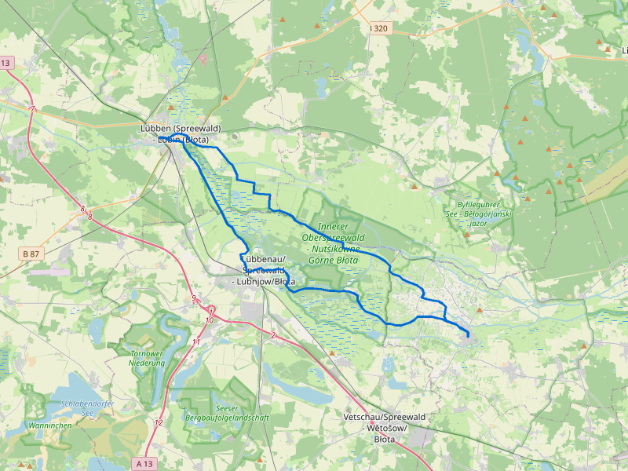

# Spreewald-Runde ab Lübben

**Distanz:** ~55 km (55,1 km lt. BRouter)
**Fahrzeit:** ca. 3,5–4 Std. (ohne Pausen)
**Routentyp:** Rundtour, flach
**Start/Ziel:** S Lübben (Spreewald) Bhf
**GPX-Datei:** [gpx/spreewald.gpx](gpx/spreewald.gpx)

> 🌿 **Tipp:** Spreewaldtour durch die einzigartige Fließlandschaft — sorbische Kultur, Kahnfahrten und Gurkenradweg inklusive!

---

## Streckenverlauf

Lübben → Lübbenau → Lehde → Burg (Spreewald) → Lübben

---

## Streckenabschnitte

### 1. Lübben → Lübbenau/Lehde (ca. 15 km)

Vom Bahnhof Lübben über den **Gurkenradweg** durch die typische Spreewaldlandschaft nach Lübbenau. Flache Wege entlang der Fließe, vorbei an Wiesen und kleinen Gehöften. In Lehde lohnt ein Abstecher ins Künstlerdorf.

🏛️ **Freilandmuseum Lehde** — sorbisches Freilichtmuseum mit historischen Spreewaldhöfen
🎨 **Ateliers in Lehde** — Künstlerdorf mit Galerien und wechselnden Ausstellungen
🍺 Kahnfährhafen Lübbenau — Spreewälder Gurken und Leinöl direkt am Hafen

### 2. Lübbenau → Burg (Spreewald) (ca. 20 km)

Durch den **Hochwald** entlang der Fließe nach Burg. Der längste Abschnitt führt durch dichte Wälder und vorbei an idyllischen Wasserläufen — das Herz des Spreewalds.

🏛️ **Bismarckturm Burg** — Aussichtsturm mit Panoramablick über den Spreewald
🍺 Gasthaus in Burg — traditionelle sorbische Küche mit Pellkartoffeln und Quark

### 3. Burg → Lübben (ca. 20 km)

Rückweg über ruhige Waldwege und Dorfstraßen zurück nach Lübben. Entspanntes Ausrollen durch die flache Spreewaldlandschaft.

🏛️ **Slawenburg Raddusch** — rekonstruierte Ringwallanlage aus der Slawenzeit (kleiner Umweg, sehr sehenswert)
🍺 Einkehr in Lübben zum Abschluss — gemütlicher Ausklang der Tour

---

## Badestellen

- 🏊 **Spreebad Lübben** — Freibad am Stadtrand
- 🏊 **Spreewelten Bad Lübbenau** — Erlebnisbad (kurzer Abstecher)

---

## Einkehrmöglichkeiten

- 🍺 Kahnfährhafen Lübbenau — Gurken, Leinöl und regionale Spezialitäten
- 🍺 Gasthaus Burg — traditionelle sorbische Küche

---

## Wetter am Sonntag, 3. Mai 2026

> ℹ️ _Zuletzt geprüft: 1. Mai 2026. Vor der Tour aktuelles Wetter prüfen._

☀️ **Sehr gutes Radwetter!**

|                |                              |
| -------------- | ---------------------------- |
| **Temperatur** | 9–28°C                       |
| **Regen**      | 0 mm (5% Wahrscheinlichkeit) |
| **Wind**       | ~16 km/h                     |
| **Wetterlage** | Bewölkt, aber trocken        |

Keine Warnungen. Sonnencreme und ausreichend Wasser mitnehmen bei bis zu 28°C.

---

## Veranstaltungen

Keine bekannten Großveranstaltungen direkt an der Route. Ruhige Spreewaldlandschaft — ideal für einen entspannten Tagesausflug.

---

## Nahverkehrsanbindung

> ℹ️ _Verbindungen verifiziert für So, 3. Mai 2026. Vor der Tour aktuelle Fahrpläne prüfen._

**Hinfahrt:**
Ab **S Blankenfelde (TF) Bhf** → **RB24** bis Flughafen BER → **RE20** bis **Lübben, Bahnhof**

- Abfahrt: 12:09 Uhr ab Blankenfelde → Ankunft 13:06 Uhr in Lübben
- 1 Umstieg am Flughafen BER, 57 Min.
- Stündliche Verbindungen (auch 13:09, 14:09 Uhr)

**Rückfahrt:**
Ab **Lübben, Bahnhof** → **RE7** bis S Ostkreuz → **RB24** bis **S Blankenfelde (TF) Bhf**

- Abfahrt: 20:02 Uhr ab Lübben → Ankunft 21:51 Uhr in Blankenfelde
- 1 Umstieg am Ostkreuz, 109 Min.
- Alternative: RE2 (ab 20:34) über Königs Wusterhausen → RB22 → RB24 (2 Umstiege, 77 Min.)

> 🚲 Fahrradmitnahme in S-Bahn und Regionalbahn ist im VBB möglich (Fahrradkarte erforderlich).

---
