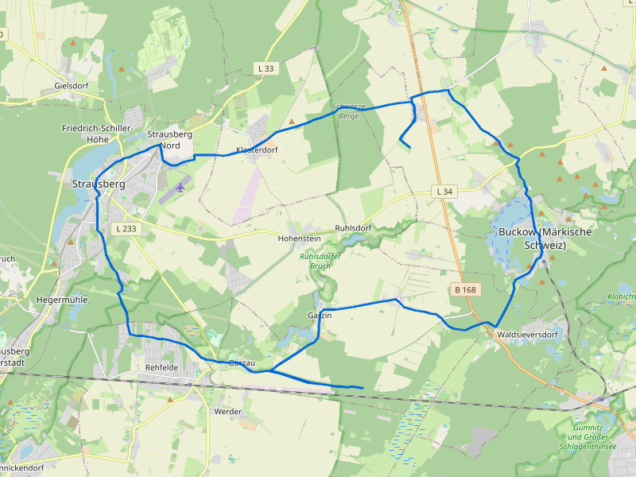
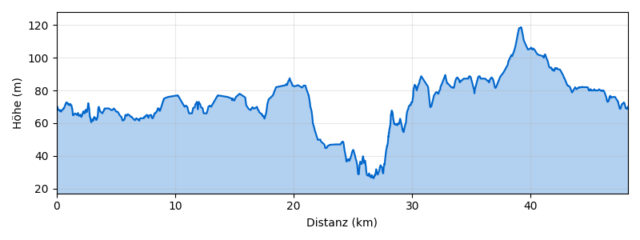

# Strausberg–Buckow-Runde ab S Strausberg Nord

**Distanz:** ~48 km (48,3 km lt. BRouter)
**Fahrzeit:** ca. 3–4 Std. (ohne Pausen)
**Routentyp:** Rundtour, hügelig (Märkische Schweiz)
**Start/Ziel:** S Strausberg Nord (S5)
**GPX-Datei:** [gpx/strausberg-buckow.gpx](gpx/strausberg-buckow.gpx)

> 🌿 **Tipp:** Die „Märkische Schweiz" ist Brandenburgs kleinstes, aber landschaftlich reizvollstes Naturschutzgebiet — mit tiefen Schluchten, stillen Seen und dem Kurort Buckow als Herzstück.

## Streckenverlauf

S Strausberg Nord → Waldsieversdorf → Buckow → Naturpark Märkische Schweiz (Nord) → S Strausberg Nord

### 1. S Strausberg Nord → Waldsieversdorf (ca. 12 km)

Vom S-Bahnhof Strausberg Nord geht es zunächst südwärts durch die Strausberger Vorstadt. Über die **Hegermühlenstraße** und ruhige Nebenstraßen führt die Route durch den Wald Richtung Südosten. Die Strecke verläuft überwiegend auf asphaltierten Feld- und Waldwegen durch die Brandenburger Endmoränenlandschaft. Kurz vor Waldsieversdorf passiert man den **Däbersee**.

🏛️ **Strausberger Altstadt** — Historischer Stadtkern mit Marienkirche (13. Jh.) und der einzigen Straßenbahn-Fähre Deutschlands über den Straussee.

### 2. Waldsieversdorf → Buckow (ca. 8 km)

Von Waldsieversdorf führt die Route durch den **Naturpark Märkische Schweiz** nach Buckow. Die Landschaft wird hier deutlich hügeliger — die namensgebende „Schweiz" zeigt sich mit Höhenunterschieden bis zu 60 m. Der Weg führt durch dichte Buchenwälder und vorbei am **Großen Däbersee**.

🏛️ **Naturpark-Besucherzentrum Schweizer Haus** (Waldsieversdorf) — Ausstellung zur Geologie und Natur der Märkischen Schweiz.

🍺 **Café am See** (Waldsieversdorf) — Kaffee und Kuchen direkt am Däbersee.

### 3. Buckow — Aufenthalt (ca. 4 km im Ort)

Buckow, die „Perle der Märkischen Schweiz", ist der Höhepunkt der Tour. Der Kurort liegt malerisch zwischen Schermützelsee und Buckowsee. Hier lohnt sich eine ausgiebige Pause.

🏛️ **Brecht-Weigel-Haus** — Sommerhaus von Bertolt Brecht und Helene Weigel, heute Museum mit Originaleinrichtung. Hier entstanden die „Buckower Elegien".

🎨 **Kunstverein Märkische Schweiz** — Wechselnde Ausstellungen zeitgenössischer Kunst in Buckow. Regelmäßig Atelierbesuche und Skulpturen im Kurpark.

🍺 **Strandhotel Buckow — Restaurant & Café** — Direkt am Schermützelsee gelegen. Regionale Küche und **selbstgebackener Kuchen** in der hauseigenen Konditorei. Terrasse mit Seeblick.

🍺 **Hotel & Restaurant Märkische Schweiz** — Traditionshaus von 1860 mit regionaler Brandenburger Küche und Biergarten.

🏊 **Schermützelsee (Strandbad Buckow)** — Öffentliches Strandbad mit Sandstrand, Steg und klarem Wasser. Eintritt frei.

### 4. Buckow → Naturpark Nord → S Strausberg Nord (ca. 24 km)

Die Rückfahrt führt über die nördliche Route durch den Naturpark. Über **Pritzhagen** und die Höhen nördlich von Buckow geht es durch abwechslungsreiche Wald- und Feldlandschaft zurück nach Strausberg. Die Strecke ist hügeliger als der Hinweg und bietet weite Ausblicke über die Endmoränenlandschaft. Über **Garzau** und die Waldwege nördlich von Strausberg erreicht man den S-Bahnhof.

🏛️ **Pritzhagener Mühle** — Historische Wassermühle im Stobbertal, beliebtes Ausflugsziel mit Gaststätte.

🏛️ **Pyramide von Garzau** — Einzige erhaltene Feldsteinpyramide Deutschlands (1784), Teil des ehemaligen Landschaftsparks Garzau.

## Badestellen

- 🏊 **Schermützelsee (Strandbad Buckow)** — Klarer Badesee mit Strandbad, Steg und Liegewiese. Einer der saubersten Seen Brandenburgs.
- 🏊 **Buckowsee** — Ruhiger Badesee am Ortsrand von Buckow, weniger besucht als der Schermützelsee.

## Einkehrmöglichkeiten

- 🍺 **Café am See** (Waldsieversdorf) — Kaffee und Kuchen am Däbersee
- 🍺 **Strandhotel Buckow — Restaurant & Café** — Regionale Küche, selbstgebackener Kuchen, Seeterrasse
- 🍺 **Hotel & Restaurant Märkische Schweiz** (Buckow) — Brandenburger Küche seit 1860
- 🍺 **Pritzhagener Mühle** — Rustikale Gaststätte im Stobbertal

## Wetter am Sonntag, 3. Mai 2026

> ℹ️ _Zuletzt geprüft: 1. Mai 2026. Vor der Tour aktuelles Wetter prüfen._

☀️ **Hervorragendes Radwetter — sonnig und warm**

|                |                                                                               |
| -------------- | ----------------------------------------------------------------------------- |
| **Temperatur** | 9–27°C                                                                        |
| **Regen**      | 0 mm (3% Wahrscheinlichkeit)                                                  |
| **Wind**       | ~15 km/h Südwest                                                              |
| **Wetterlage** | Überwiegend bewölkt, trocken und warm. Ideale Bedingungen für eine Tagestour. |

## Veranstaltungen

Keine aktuellen Veranstaltungen entlang der Route gefunden. Buckow bietet im Sommer regelmäßig Konzerte und Lesungen im Brecht-Weigel-Haus — vorab auf [buckow-info.de](https://www.buckow-info.de) prüfen.

## Nahverkehrsanbindung

> ℹ️ _Verbindungen verifiziert für 3. Mai 2026. Vor der Tour aktuelle Fahrpläne prüfen._

**Hinfahrt:**
S Blankenfelde (TF) Bhf → _RB24_ → S+U Lichtenberg Bhf (1 Umstieg) → _S5_ → S Strausberg Nord

- Ab 10:09, Ankunft 11:45 (1 Std. 36 Min.)
- Takt: stündlich (RB24), alle 20 Min. (S5)

**Rückfahrt:**
S Strausberg Nord → _S5_ → S+U Lichtenberg Bhf (1 Umstieg) → _RB24_ → S Blankenfelde (TF) Bhf

- Ab 19:10, Ankunft 20:51 (1 Std. 41 Min.)
- Alternativ: ab 20:30 über S Ostkreuz, Ankunft 21:51

> 🚲 Fahrradmitnahme in S-Bahn und Regionalbahn ist im VBB möglich (Fahrradkarte erforderlich).
