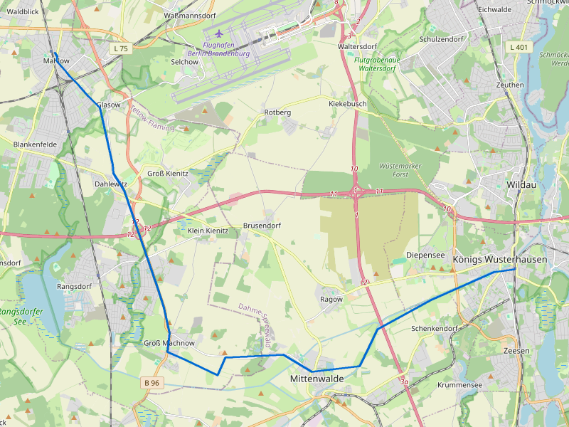
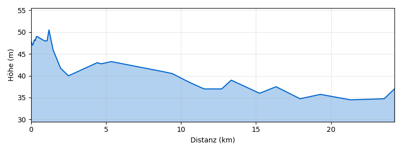

# Radtour: S Blankenfelde (TF) Bhf → Königs Wusterhausen (sichere Route)

**Datum:** Sonntag, 21. Juni 2026 (nachmittags)

## Eckdaten

|                |                                                                                |
| -------------- | ------------------------------------------------------------------------------ |
| Strecke        | 25,5 km                                                                        |
| Höhenmeter ↑   | 6 m                                                                            |
| Fahrzeit (ca.) | 2h 07min                                                                       |
| Profil         | BRouter „safety" — bevorzugt Radwege, meidet Landstraßen ohne Radinfrastruktur |
| Gelände        | Flach, komplett auf asphaltierten Wegen/Radwegen                               |

## Wetter

Nachmittags 29–31 °C, bewölkt, schwacher Wind (11–14 km/h). **Achtung:** Gegen 17:00 ist ein kurzes Gewitter mit leichtem Hagel vorhergesagt (0,7 mm). Danach klart es auf.

**Empfehlung:** Spätestens um 14:00 losfahren, dann seid ihr vor dem Gewitter in KW. Oder alternativ nach 18:00 starten — dann ist es klar und angenehme 22–23 °C.

## Routenbeschreibung

Die Route nutzt das BRouter-Profil „safety", das gezielt Straßen ohne Radweg vermeidet und separate Radwege, Nebenstraßen und Waldwege bevorzugt. Das bedeutet: Kein Kontakt mit der B96 oder anderen Landstraßen ohne Radinfrastruktur.

**Grobe Streckenführung:**

1. Start S Blankenfelde (TF) Bhf → Richtung Süden durch Blankenfelde
2. Über Glasow/Dahlewitz auf Feldwegen/Radwegen Richtung Rangsdorf
3. Weiter über Groß Machnow / Klein Kienitz
4. Durch die Landschaft südlich des Rangsdorfer Sees
5. Über Mittenwalde bzw. nördlich daran vorbei
6. Entlang der Nottekanal-Region Richtung KW
7. Ziel: S Königs Wusterhausen Bhf

## Einkehrmöglichkeiten

### Unterwegs

- **KONRAD** (Café/Eisdiele) — direkt am Start in Mahlow, Mo–Fr 06:30–17:30, Sa+So 07:00–17:00
- **Eiscafé Rangsdorf** — bei km ~10
- **KONRAD** (Café/Eisdiele in Eichwalde) — Mo–Fr 07:00–17:00, Sa+So 07:00–12:00

### Am Ziel in Königs Wusterhausen

- **Jagdschloss 1896 Biergarten** — Mo–So 11:30–22:00, [jagdschloss-1896.de](https://www.jagdschloss-1896.de/) 🍺
- **Mühlencafe am Schloss** — Mo–Fr 09:00–15:00, Sa+So 09:00–16:00, [muehlencafeamschloss.de](https://www.muehlencafeamschloss.de/)
- **Zuckerbäckerei** (Café)
- **Sweet Home** (Café) — Mo–Fr 09:00–19:00, Sa 09:00–18:00, So 09:00–13:00
- 🚰 Trinkwasserbrunnen am Bahnhof KW

## Rückfahrt

Vom S Königs Wusterhausen Bhf zurück nach S Blankenfelde (TF) Bhf:

| Abfahrt | Ankunft | Verbindung                                      |
| ------- | ------- | ----------------------------------------------- |
| 18:16   | 19:11   | RE20 → Südkreuz, umsteigen S2 → Blankenfelde    |
| 18:38   | 19:51   | RE7 → Ostkreuz → S41 Südkreuz → S2 Blankenfelde |

Die RE-Verbindungen haben Fahrradmitnahme (Stellplätze im RE begrenzt, am Wochenende aber meist kein Problem).

## GPX & Karten

- GPX: [blankenfelde-kw-sicher.gpx](gpx/blankenfelde-kw-sicher.gpx)
- Routenkarte: 
- Höhenprofil: 
