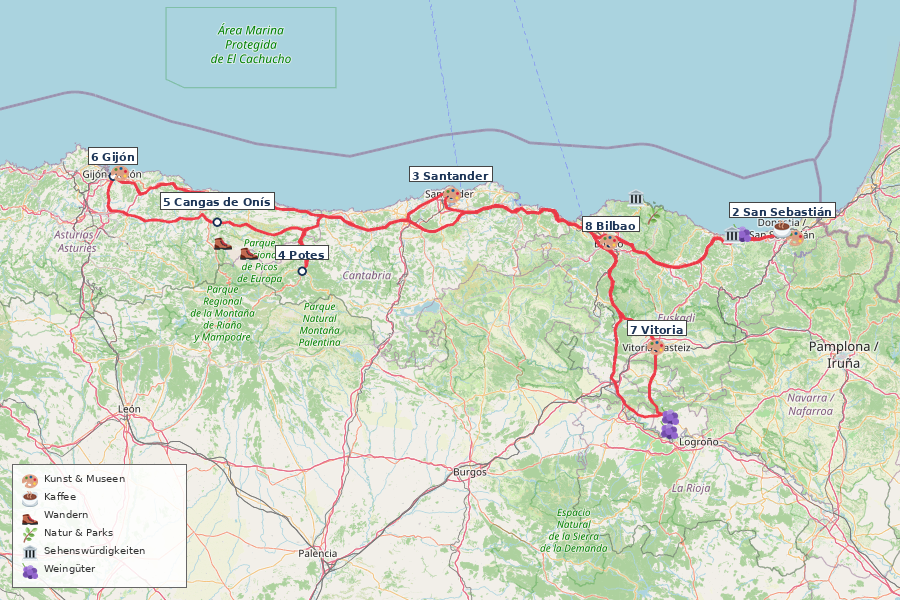

---
---

# Nordspanien Küste Roadtrip (16 Tage)

**Reisezeitraum:** 4. September – 19. September 2026
**Dauer:** 16 Tage / 15 Nächte
**Stationen:** 7 Stopps
**Gesamtstrecke:** ~1.086 km
**Flug:** BER → Bilbao BIO (Direktflug Eurowings) / Bilbao BIO → BER (Direktflug Eurowings)
**Mietwagen:** Übernahme/Abgabe Bilbao Flughafen

> 🌊 **Tipp:** Die spanische Nordküste ist das Gegenteil vom Mittelmeer-Klischee — grüne Berge, wilde Atlantikküste, Pintxos-Bars, Sidra-Häuser und die Picos de Europa direkt hinter dem Strand. Anfang September: warm, wenig Touristen, perfekte Wanderbedingungen.

---

## Routenplanung

Bilbao → San Sebastián → Santander → Potes → Picos de Europa → Gijón/Oviedo → Vitoria-Gasteiz/Rioja Alavesa → Bilbao

| Tag | Datum      | Station                                           | Programm                                                                                                                                                                                                                                                                   |
| --- | ---------- | ------------------------------------------------- | -------------------------------------------------------------------------------------------------------------------------------------------------------------------------------------------------------------------------------------------------------------------------- |
| 1   | Fr 4. Sep  | **Bilbao** (Ankunft)                              | Abendflug BER→BIO. Mietwagen übernehmen, Fahrt ins Zentrum (~15 Min.). Abendessen Casco Viejo.                                                                                                                                                                             |
| 2   | Sa 5. Sep  | 🚗 → **San Sebastián** · 139 km, ~3 Std. + Stopps | Küstenstraße: Gaztelugatxe (morgens früh, 241 Stufen), Bermeo Kaffee am Hafen, Urdaibai Aussichtspunkt, Lekeitio Mittagessen (Fisch), Zumaia Flysch-Küste (30 Min. Spaziergang), 🎨 Balenciaga Museum Getaria, 🍇 Txakoli-Verkostung. Ankunft abends. Pintxos Parte Vieja. |
| 3   | So 6. Sep  | San Sebastián                                     | 🥾 Monte Igueldo Küstenwanderung (8 km, 3 Std.). 🏊 Playa de la Concha. 🎨 Chillida-Leku Skulpturenpark. Abend: Pintxos-Crawl (Zeruko, La Cuchara de San Telmo).                                                                                                           |
| 4   | Mo 7. Sep  | 🚗 → **Santander** · 198 km, ~2,5 Std.            | Stopp Castro Urdiales (Kaffee, gotische Kirche). Ankunft Mittag. 🎨 Centro Botín (Renzo Piano). 🏛️ Palacio de la Magdalena. 🏊 Playa del Sardinero. Abend: Mercado de la Esperanza.                                                                                        |
| 5   | Di 8. Sep  | Santander                                         | 🥾 Cabo Mayor → Mataleñas Klippenpfad (6 km, 2 Std.). 🏊 Playa de la Arnía. Abend: Bodega del Riojano.                                                                                                                                                                     |
| 6   | Mi 9. Sep  | 🚗 → **Potes** · 106 km, ~1,5 Std. + Stopps       | 🏛️ Santillana del Mar (mittelalterliches Dorf) + Altamira-Museum. Optional: Comillas (Gaudís El Capricho). 🏛️ Desfiladero de la Hermida (21 km Schlucht, 175 Kurven). 🥾 Mirador de Santa Catalina (4 km, 1,5 Std.). Abend: Cocido Lebaniego + 🍇 Orujo-Verkostung.        |
| 7   | Do 10. Sep | 🚗 → **Cangas de Onís** · 109 km, ~1,5 Std.       | Fahrt über Desfiladero de los Beyos. 🏛️ Puente Romano, Basílica de Covadonga. Abend: Sidrería — Sidra escanciar lernen.                                                                                                                                                    |
| 8   | Fr 11. Sep | Picos de Europa                                   | 🥾 **Ruta del Cares** (21 km, 6–7 Std.) — Ganztageswanderung, früh starten. Abend: Quesu Cabrales in Arenas de Cabrales.                                                                                                                                                   |
| 9   | Sa 12. Sep | Picos de Europa                                   | 🚗🥾 Lagos de Covadonga (Rundweg 6,4 km, 2,5 Std., morgens früh). 🏊 Río Sella Flussbaden oder Playa de Gulpiyuri (Inland-Strand). Abend: Fabada Asturiana im El Molín de la Pedrera.                                                                                      |
| 10  | So 13. Sep | 🚗 → **Gijón** · 87 km, ~1 Std.                   | 🥾 Senda del Cervigón Küstenpfad (8 km, 2,5 Std.). 🏊 Playa de San Lorenzo. 🌿 Jardín Botánico Atlántico. Abend: Sidrería Tierra Astur.                                                                                                                                    |
| 11  | Mo 14. Sep | Oviedo (Tagesausflug, 30 Min.)                    | 🏛️ Präromanische Kirchen (UNESCO). 🎨 Museo de Bellas Artes. Mercado del Fontán. ☕ Cafetería Rialto. Rückweg: 🎨 LABoral Centro de Arte (Gijón).                                                                                                                          |
| 12  | Di 15. Sep | 🚗 → **Vitoria-Gasteiz** · 326 km, ~3,5 Std.      | Pause Castro Urdiales (~2 Std. Fahrt). Ankunft Nachmittag. 🎨 Itinerario Muralístico Rundgang (1,5 Std.). Abend: Pintxos Casco Viejo (Calle Cuchillería).                                                                                                                  |
| 13  | Mi 16. Sep | Rioja Alavesa (Tagesausflug, 30 Min.)             | 🍇 Bodegas Ysios (Calatrava-Bau, Verkostung). Mittag: Lamm al sarmiento. 🍇 Marqués de Riscal (Gehry-Hotel). 🏛️ Laguardia Altstadt + unterirdische Keller. 🏛️ Salinas de Añana (Rückweg, geführte Tour).                                                                   |
| 14  | Do 17. Sep | 🚗 → **Bilbao** · 66 km, ~1 Std.                  | 🎨 Artium Museoa (2 Std.). 🏛️ Catedral de Santa María. Fahrt Bilbao. Mietwagen Flughafen abgeben, Metro Zentrum. Abend: Mercado de la Ribera.                                                                                                                              |
| 15  | Fr 18. Sep | Bilbao                                            | 🎨 **Guggenheim** (3 Std.). Restaurante Mina. 🏛️ Casco Viejo + Puente Bizkaia (UNESCO). 🥾 Artxanda Funicular (Sonnenuntergang). Abend: Plaza Nueva Pintxos-Crawl.                                                                                                         |
| 16  | Sa 19. Sep | Bilbao (Abreise)                                  | ☕ Café Iruña. Bummel Altstadt. Metro Flughafen. Rückflug BIO→BER nachmittags.                                                                                                                                                                                             |

> ⚠️ **Längste Etappe:** Tag 12, Gijón → Vitoria (326 km, ~3,5 Std.). Pause in Castro Urdiales empfohlen.

> 💡 **Flexibilität:** Bei Regen Museumstage vorziehen (Guggenheim, Artium, Centro Botín). Bei Hitze: Strandtage priorisieren. Ruta del Cares nur bei trockenem Wetter.

---

## Stationen & POIs

### San Sebastián / Donostia (2 Nächte)

**Unterkunft:** Pensión Nuevas Artes (9,1, ~200 Reviews) oder Hotel Parma (8,5, ~2.300 Reviews) — Altstadt-Nähe, Frühstück inkl. (~100–140 €/Nacht, booking.com)

- 🥾 **Monte Urgull** — 3 km, 1,5 Std., leicht. Festung, 360°-Panorama.
- 🥾 **Monte Igueldo → Paseo Nuevo** — 8 km, 3 Std., moderat. ⭐ 4,5 (58 Reviews). Küstenwanderung.
- 🥾 **Camino del Norte (Pasaia → San Sebastián)** — 12 km, 4 Std., moderat. Jakobsweg-Küstenabschnitt. [Waymarked Trails](https://hiking.waymarkedtrails.org/#route?id=1116809)
- 🏊 **Playa de la Concha** — Muschelförmige Bucht, ruhiges Wasser.
- 🏊 **Playa de la Zurriola** — Surfer-Strand, Stadtteil Gros.
- 🍷 **Parte Vieja Pintxos** — Bar Nestor (Tortilla), La Cuchara de San Telmo, Gandarias, Bar Zeruko.
- 🎨 **[San Telmo Museoa](https://www.santelmomuseoa.eus/en/)** — Baskische Kultur + zeitgenössische Kunst.
- 🎨 **[Tabakalera](https://www.tabakalera.eus/en)** — Zeitgenössische Kultur in ehemaliger Tabakfabrik.
- 🎨 **[Chillida-Leku](https://www.museochillidaleku.com/en/)** — Skulpturenpark, monumentale Stahlskulpturen. **Pflichtbesuch.**
- 🏛️ **Peine del Viento** — Chillida-Skulpturen in den Klippen.
- ☕ **[Sakona Coffee Roasters](https://sakonacoffee.com)** — Specialty Coffee, Altstadt.

### Küstenstraße Bilbao → San Sebastián (Tag 2)

- 🌿 **Urdaibai** — Feuchtgebiete, Aussichtspunkt Mundaka (Surfer-Welle).
- 🎨 **[Cristóbal Balenciaga Museoa](https://www.cristobalbalenciagamuseoa.com/en/)** — Getaria. Haute Couture als Kunstform.
- 🏛️ **[San Juan de Gaztelugatxe](https://www.visitbiscay.eus/en/san-juan-gaztelugatxe)** — Felsinsel, 241 Stufen, GoT „Dragonstone". Morgens früh (Parkplatz!).
- 🏛️ **Bermeo** — Fischerhafen, Ercilla-Turm (15. Jh.), UNESCO-Biosphärenreservat Urdaibai.
- 🏛️ **Lekeitio** — Fischerdorf, Basilika Santa María, Insel San Nicolás (bei Ebbe zu Fuß).
- 🏛️ **Zumaia Flysch** — UNESCO Geopark, 60 Mio. Jahre Erdgeschichte. [geoparkea.eus](https://geoparkea.eus/en)
- �� **[Txakoli-Verkostung](https://www.txominetxaniz.com)** — Getaria, z.B. Bodega Txomin Etxaniz.
- 🍷 **Getaria Hafen** — Gegrillter Fisch auf Holzkohle.

### Santander (2 Nächte)

**Unterkunft:** Hostal Jardín Secreto (9,7, ~45 Reviews) — Zentrum, familiär, Frühstück inkl. (~90–130 €/Nacht, booking.com)

- 🥾 **Cabo Mayor → Mataleñas** — 6 km, 2 Std., leicht. Klippenpfad, Leuchtturm.
- 🏊 **Playa del Sardinero** — Stadtstrand, Belle-Époque.
- 🏊 **Playa de la Arnía** — Wilde Felsbucht, 15 Min. Fahrt.
- 🍷 **Mercado de la Esperanza** — Markthalle, Fisch, Tapas-Bars.
- 🍷 **Cañadío** — Moderne Küche, Meeresfrüchte.
- 🍷 **Bodega del Riojano** — Kantabrische Küche seit 1908.
- 🌿 **Jardines de Piquío** — Art-Deco-Gärten.
- 🎨 **[Centro Botín](https://www.centrobotin.org/en/)** — Renzo Piano, zeitgenössische Kunst. **Highlight.**
- 🏛️ **Palacio de la Magdalena** — Königlicher Sommerpalast.

### Potes / Liébana-Tal (1 Nacht)

**Unterkunft:** Posada San Pelayo (9,7, ~540 Reviews) — familiär, Pool, Picos-Blick, Frühstück inkl. (~80–110 €/Nacht, booking.com)

- 🥾 **Mirador de Santa Catalina** — 4 km, 1,5 Std., leicht. Picos-Panorama.
- 🍷 **Cocido Lebaniego** — Kichererbsen-Eintopf, Spezialität des Tals.
- 🏛️ **Torre del Infantado** — Wehrturm (15. Jh.), Ausstellungsraum.
- 🏛️ **Monasterio de Santo Toribio** (3 km) — Kloster 6. Jh., Pilgerort.
- 🏛️ **Santillana del Mar** (Anfahrt) — Mittelalterliches Dorf, Stiftskirche.
- 🏛️ **[Altamira-Höhle](https://www.culturaydeporte.gob.es/mnaltamira/en/home.html)** (bei Santillana) — UNESCO, prähistorische Malereien (Replik).
- 🏛️ **Comillas** (Anfahrt) — Gaudís El Capricho.
- 🏛️ **Desfiladero de la Hermida** (Anfahrt) — 21 km Schlucht, 600 m Felswände.
- 🍇 **Orujo-Destillerien** — Tresterbrand, geschützte Herkunft. Verkostung in Potes.

### Picos de Europa / Cangas de Onís (3 Nächte)

**Unterkunft:** Hotel Posada del Valle (9,4, ~150 Reviews) — familiär, ländlich, Frühstück inkl. (~80–120 €/Nacht, booking.com)

- 🥾 **Ruta del Cares** [PR-PNPE 3] — 21 km, 6–7 Std., moderat. ⭐ 4,5 (1.880 Reviews). Schlucht-Wanderung, Pfad in Felswände gehauen. **Highlight.** [Waymarked Trails](https://hiking.waymarkedtrails.org/#route?id=2687934)
- 🥾 **Lagos de Covadonga** [PR-PNPE 2] — 6,4 km, 2,5 Std., leicht. ⭐ 4,2 (520 Reviews). Gletscherseen auf 1.000 m. [Waymarked Trails](https://hiking.waymarkedtrails.org/#route?id=4664408)
- 🥾 **Mirador del Naranjo de Bulnes** (ab Sotres) — 10 km, 4 Std., moderat.
- 🏊 **Río Sella** (Arriondas) — Flussbaden, kristallklar.
- 🏊 **Playa de Gulpiyuri** — Inland-Strand (Meerwasser durch Höhlen).
- 🍷 **Sidrería** — Sidra escanciar (aus Höhe einschenken).
- 🍷 **Quesu Cabrales** — Blauschimmelkäse, in Höhlen gereift.
- 🍷 **El Molín de la Pedrera** — Fabada Asturiana.
- 🏛️ **Basílica de Covadonga** — Reconquista-Stätte (722 n.Chr.), Felshöhle.
- 🏛️ **Puente Romano** (Cangas) — Römische Brücke, Wahrzeichen Asturiens.

### Gijón / Oviedo (2 Nächte)

**Unterkunft:** La Casona de Jovellanos (9,4, ~300 Reviews) — Gijón Altstadt, familiär, Frühstück inkl. (~90–130 €/Nacht, booking.com)

- 🥾 **Senda del Cervigón** (Gijón) — 8 km, 2,5 Std., leicht. Küstenpfad mit Skulpturen.
- 🥾 **Senda del Oso** (30 Min. ab Oviedo) — 12 km, 3 Std., leicht. ⭐ 4,5 (54 Reviews). Ehem. Bergbau-Pfad. [Vía Verde](https://www.viasverdes.com/itinerarios/itinerario.asp?id=27)
- 🏊 **Playa de San Lorenzo** (Gijón) — 1,5 km Stadtstrand.
- 🏊 **Playa del Silencio** (40 Min. westlich) — Versteckte Bucht, Klippen.
- 🍷 **Sidrería Tierra Astur** (Gijón) — Sidra + asturische Küche.
- 🍷 **Mercado del Fontán** (Oviedo) — Historische Markthalle.
- 🍷 **Casa Fermín** (Oviedo) — Michelin-empfohlen.
- 🌿 **[Jardín Botánico Atlántico](https://www.botanicoatlantico.com)** (Gijón) — 25 ha, atlantische Flora.
- 🎨 **[LABoral Centro de Arte](https://www.laboralcentrodearte.org/en)** — Zeitgenössische Kunst + Technologie. Gijón.
- 🎨 **[Museo de Bellas Artes](https://www.museobbaa.com)** (Oviedo) — El Greco bis Dalí.
- 🏛️ **Präromanische Kirchen** (UNESCO) — Santa María del Naranco, San Miguel de Lillo. 9. Jh.
- ☕ **Cafetería Rialto** (Oviedo) — Historisches Jugendstil-Café.

### Vitoria-Gasteiz / Rioja Alavesa (2 Nächte)

**Unterkunft:** Hospedería de los Parajes (9,1, ~670 Reviews) — Laguardia, Boutique, Weinkeller, Spa, Frühstück inkl. (~110–150 €/Nacht, booking.com)

- 🥾 **Salinas de Añana Salzweg** — 8 km, 3 Std., leicht. Oder nur geführte Salinen-Tour (1,5 Std.).
- 🍷 **Casco Viejo Pintxos** (Vitoria) — Calle Cuchillería. Pintxo de Foie, Txuleta.
- 🍷 **Lamm al sarmiento** — Auf Rebholz gegrillt, Rioja-Spezialität.
- 🎨 **[Artium Museoa](https://www.artium.eus)** — Zeitgenössische Kunst, 2.700+ Werke, 1950er bis heute. **Pflichtbesuch.**
- 🎨 **Itinerario Muralístico (IMVG)** — Europas größte Freiluft-Mural-Galerie. Rundgang ~1,5 Std.
- 🏛️ **[Catedral de Santa María](https://www.catedralvitoria.eus/en)** — Gotisch, „offene Baustelle" (Ken Follett-Inspiration).
- 🏛️ **[Salinas de Añana](https://www.vallesalado.com)** — Älteste Saline der Welt (6.500 Jahre).
- 🍇 **[Bodegas Ysios](https://www.ysios.com)** (Laguardia) — Calatrava-Bau, Premium-Verkostung. **Architektur-Highlight.**
- 🍇 **[Marqués de Riscal](https://www.marquesderiscal.com)** (Elciego) — Gehry-Hotel, Weingut seit 1858.
- 🍇 **Laguardia** — Mittelalterliches Weindorf, unterirdische Keller.

### Bilbao — Puffer & Abreise (2 Nächte)

**Unterkunft:** Hotel Miró (8,8, ~370 Reviews) — Guggenheim-Nähe, Design, Frühstück inkl. (~100–150 €/Nacht, booking.com)

- 🥾 **Artxanda Funicular + Rundweg** — 5 km, 2 Std., leicht. Panorama.
- 🍷 **Plaza Nueva Pintxos** — Gilda, Txuleta, Bacalao al Pil-Pil.
- 🍷 **Mercado de la Ribera** — Europas größte Markthalle, Tapas-Bars.
- 🍷 **Restaurante Mina** — Michelin-Stern, baskische Avantgarde.
- 🎨 **[Guggenheim Bilbao](https://www.guggenheim-bilbao.eus/en)** — Gehry-Ikone, zeitgenössische Kunst. **Pflichtbesuch.**
- 🎨 **[Museo de Bellas Artes](https://bilbaomuseoa.eus)** — Goya bis Chillida.
- 🏛️ **Casco Viejo** — Siete Calles, mittelalterliche Altstadt.
- 🏛️ **[Puente Bizkaia](https://puente-colgante.com/en)** — UNESCO-Schwebefähre (1893), 15 Min. Fahrt.
- 🍇 **Patxaran** — Schlehenlikör, baskischer Digestif.
- ☕ **[Café Iruña](https://www.cafeirunabilbao.net)** — Maurisch dekoriert, seit 1903.

---

## Wetter

> ℹ️ _Anfang September: Spätsommer, noch warm aber Atlantik bringt gelegentlich Regen. Aktuelle Vorhersage vor Reiseantritt prüfen._

| Station         | Temperatur | Regen | Besonderheiten             |
| --------------- | ---------- | ----- | -------------------------- |
| San Sebastián   | 15–24°C    | 30%   | Milde Küste, abends frisch |
| Santander       | 15–23°C    | 30%   | Etwas windiger             |
| Potes / Liébana | 12–26°C    | 25%   | Geschütztes Tal, wärmer    |
| Picos de Europa | 8–20°C     | 35%   | Berge! Morgens kühl        |
| Gijón/Oviedo    | 14–22°C    | 35%   | Küste mild                 |
| Vitoria / Rioja | 12–27°C    | 20%   | Inland, trockener          |
| Bilbao          | 15–25°C    | 30%   | Geschützte Lage            |

> ☀️ September ist ideal — Hochsaison vorbei, Meer 19–21°C. Regenjacke einpacken (Nordküste!).

---

## Anreise & Mietwagen

**Hinflug:** BER → Bilbao (BIO), Direktflug Eurowings, ~2,5 Std.

- Empfehlung: Fr 4. September, Ankunft abends
- Geschätzte Kosten: ~80–150 € pro Person (one-way)

**Rückflug:** Bilbao (BIO) → BER, Direktflug Eurowings, ~2,5 Std.

- Empfehlung: Fr 19. September, Abflug nachmittags

**Mietwagen:**

- Übernahme: Bilbao Flughafen, 4. Sep abends
- Abgabe: Bilbao Flughafen, 19. Sep mittags
- Kompaktwagen, ~450–700 € für 15 Tage (Vollkasko inkl.)

> 💡 Frühzeitig buchen: billiger-mietwagen.de

---

## Kostenübersicht (2 Personen)

| Posten                  | Geschätzt          |
| ----------------------- | ------------------ |
| Flüge (2×, Roundtrip)   | ~320–600 €         |
| Mietwagen (15 Tage)     | ~450–700 €         |
| Unterkünfte (15 Nächte) | ~1.400–2.000 €     |
| Benzin (~1.086 km)      | ~120–150 €         |
| Essen & Aktivitäten     | ~900–1.400 €       |
| **Gesamt**              | **~3.090–4.850 €** |

---

## Tipps & Länderinfo

**Packliste:** Regenjacke (Atlantikklima!), Wanderschuhe (Ruta del Cares), Badesachen (Meer 19–21°C).

**Lokale Bräuche:**

- Pintxos: Am Tresen bestellen, Zahnstocher zählen beim Zahlen
- Sidra: „Escanciar" — aus 1 m Höhe ins Glas, sofort trinken
- Txakoli: Aus Höhe eingeschenkt
- Sprache: Baskisch (Euskara) + Spanisch im Baskenland, Asturisch (Bable) in Asturien

| Thema              | Info                                                                                                                                               |
| ------------------ | -------------------------------------------------------------------------------------------------------------------------------------------------- |
| **Preisniveau**    | Ähnlich wie Deutschland (Baskenland etwas teurer, Asturien günstiger)                                                                              |
| **Tempolimit**     | Innerorts 50 (30 Wohngebiete), Landstraße 90, Autobahn 120 km/h                                                                                    |
| **Besonderheiten** | Autovías meist mautfrei. Lichtpflicht bei Regen/Tunnel.                                                                                            |
| **Reisehinweise**  | Keine Einschränkungen ([Auswärtiges Amt](https://www.auswaertiges-amt.de/de/ReiseUndSicherheit))                                                   |
| **Notruf**         | 112 (allgemein, auch Bergrettung), 091 (Policía Nacional), 062 (Guardia Civil), 061 (Rettungsdienst). Bergrettung (GREIM) wird über 112 alarmiert. |

---

## Erweiterungsideen

**A: Verlängerung bis Galizien (+4–5 Tage)** — Gijón → Lugo (röm. Stadtmauer) → A Coruña (Herkulesturm) → Santiago de Compostela. Kein Direktflug SCQ→BER, daher One-Way-Mietwagen zurück nach Bilbao (~6 Std.) oder Umsteigeflug.

**B: Pamplona als Startpunkt (+1–2 Tage)** — Navarra: Stadtmauern, Stierlauf-Route, Kathedrale, Weinregion.

**C: Französisches Baskenland (+1–2 Tage)** — Biarritz/Saint-Jean-de-Luz ab San Sebastián (20–40 Min.). Art Deco, Surfen, französisch-baskische Küche.

---

## Quellen

Markierte Wanderwege ([Waymarked Trails](https://waymarkedtrails.org), OSM-Daten):

| Route                            | Länge  | Link                                                                        |
| -------------------------------- | ------ | --------------------------------------------------------------------------- |
| Ruta del Cares                   | 21 km  | [waymarkedtrails.org](https://hiking.waymarkedtrails.org/#route?id=2687934) |
| Lagos de Covadonga               | 6,4 km | [waymarkedtrails.org](https://hiking.waymarkedtrails.org/#route?id=4664408) |
| Camino del Norte (Euskal Herria) | 228 km | [waymarkedtrails.org](https://hiking.waymarkedtrails.org/#route?id=1116809) |

Routen-Inspiration (recherchiert Mai 2026):

- [The Gap Decaders — 7–10 Days](https://thegapdecaders.com/north-spain-road-trip/) — Pamplona → Santiago
- [kimkim — 13 Days](https://www.kimkim.com/c/north-of-spain-ultimate-roadtrip-13-days) — Bilbao → Santiago (linear)
- [Along Dusty Roads — 10 Days](https://www.alongdustyroads.com/posts/northern-spain-road-trip-itinerary) — Baskenland → Galizien
- [Journaway — 10 Tage](https://rundreisen.urlaubsguru.de/de/angebote/nordspanien-roadtrip-50321) — Madrid → Bilbao → Madrid (Rundreise)
- [Andrew Harper — 14 Days](https://andrewharper.com/itinerary/spain-road-trip-galicia/) — Santiago → Rioja → Baskenland

Reiseführer (Wikivoyage, CC BY-SA 3.0): [San Sebastián](https://de.wikivoyage.org/wiki/Donostia-San_Sebastián) · [Bilbao](https://de.wikivoyage.org/wiki/Bilbao) · [Costa Vasca](https://de.wikivoyage.org/wiki/Costa_Vasca)

> ℹ️ Kein Direktflug Santiago de Compostela (SCQ) → Berlin (BER). Daher Rundreise ab/bis Bilbao.

> ℹ️ Wanderrouten-Bewertungen aus Web-Recherche (Mai 2026), Quelle: AllTrails. Nicht per API verifiziert.
