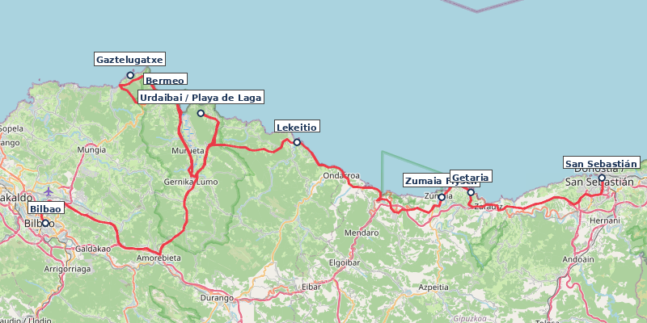
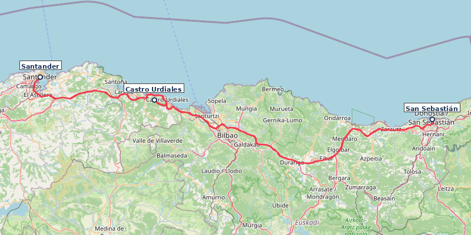
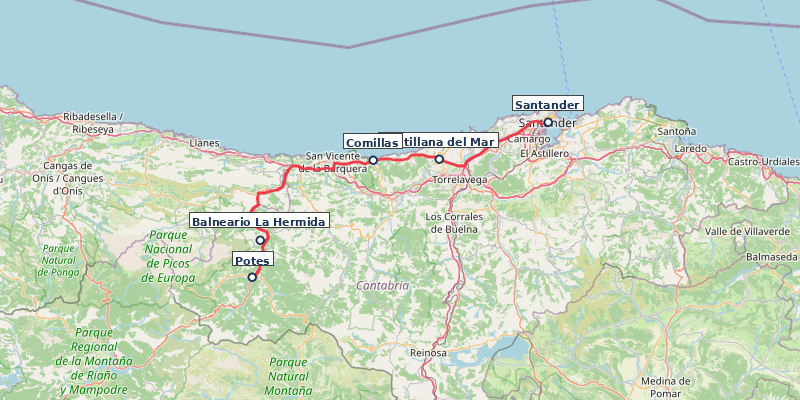
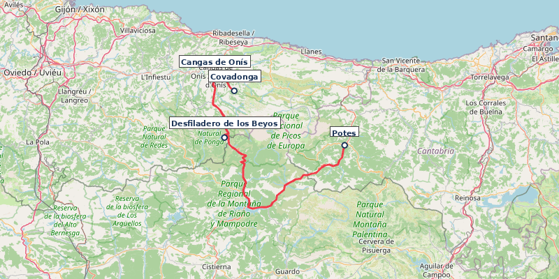
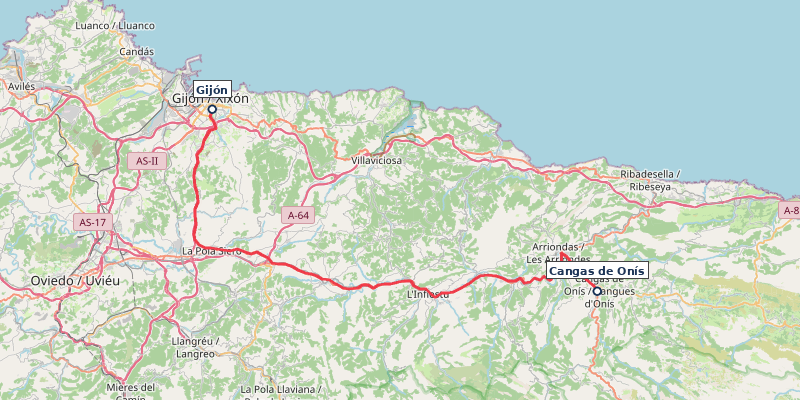
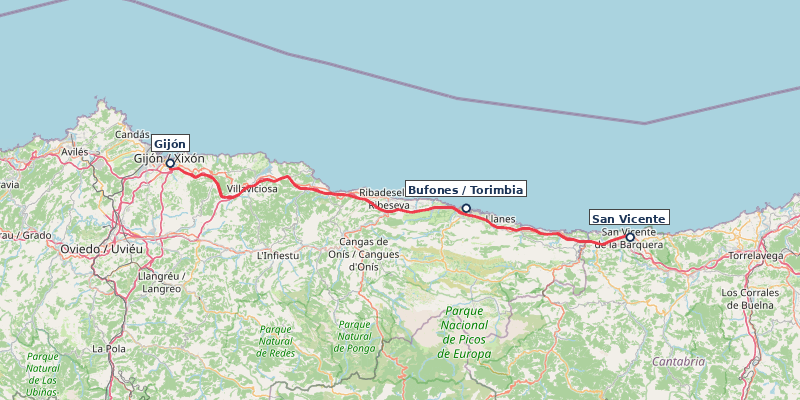
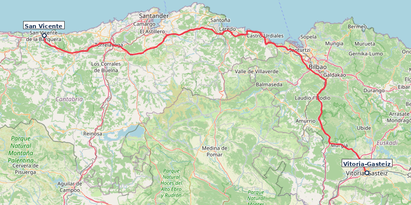
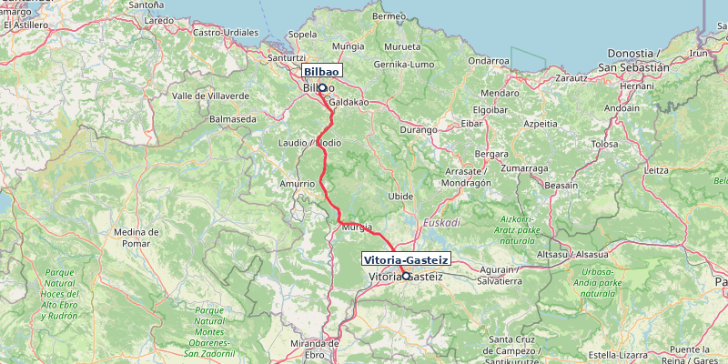

---
---

# Nordspanien Küste Roadtrip

**Reisezeitraum:** Fr 4. September – So 20. September 2026 · 17 Tage · ~1.150 km (inkl. Tagesausflüge)
**Flug:** BER ↔ Bilbao BIO, Direktflug Eurowings (nur Mo/Fr/So, Abendflüge)
**Mietwagen:** Übernahme Sa 5. Sep (Stadtstation Bilbao) / Abgabe Fr 18. Sep (Flughafen) — 13 Tage

> 🌊 Die spanische Nordküste: grüne Berge, wilde Atlantikküste, Pintxos-Bars, Sidra-Häuser und die Picos de Europa direkt hinter dem Strand. Anfang September: warm, wenig Touristen, perfekte Wanderbedingungen.

> ☀️ **Wetter:** Küste 14–25°C, Berge 8–20°C, Regen 20–35%. Meer 19–21°C. Regenjacke einpacken!

> 🇪🇸 **Länderinfo:** Preisniveau ähnlich DE. Tempolimit: 50 / 90 / 120 km/h. Autovías mautfrei. Lichtpflicht bei Regen/Tunnel. Notruf 112. Pintxos: Zahnstocher zählen beim Zahlen. Sidra: „escanciar" — aus 1 m Höhe ins Glas.

---

## Reiseverlauf

Bilbao → San Sebastián → Santander → Potes → Picos de Europa → Gijón/Oviedo → San Vicente de la Barquera → Vitoria-Gasteiz/Rioja Alavesa → Bilbao

> 💡 **Fahrstrecken:** Durch den Stopp in **San Vicente de la Barquera** sind alle Etappen jetzt unter 2,5 Stunden reine Fahrzeit. Die Reise ist somit sehr entspannt.

> 💡 **Flexibilität:** Bei Regen Museumstage vorziehen (Guggenheim, Artium, Centro Botín). Bei Hitze: Strandtage priorisieren. Ruta del Cares nur bei trockenem Wetter.

---

### Tag 1 · Fr 4. Sep · Bilbao — Ankunft

**Hinflug:** BER → Bilbao (BIO), Direktflug Eurowings, ~2,5 Std. Abflug 17:00 Uhr (Fr).

- ℹ️ Kein Morgenflug BER→BIO verfügbar. Eurowings fliegt nur abends (Mo/Fr/So).
- Geschätzte Kosten: ~100–180 € pro Person (one-way)

**Transfer Flughafen → Zentrum:**

- **Bus A3247 (Bizkaibus):** Alle 15 Min., Dauer ~25 Min. Einzelticket 4,50 € (kontaktlos im Bus).
- **Taxi:** Direkt vor der Halle, ~25–35 €, Dauer ~15 Min.
- 💡 **Tipp:** [Barik-Guthabenkarte](https://www.ctb.eus/en/how-barik-works) (3 €) am Automaten kaufen, Busfahrt kostet dann nur ~1,14 €. Karte kann zu zweit geteilt werden.

**Unterkunft:** [room Select Bilbao](https://www.booking.com/hotel/es/bilbao-jardines.html) (8,9, ~269 Reviews) — Casco Viejo, modern, zentral (~80–110 €/Nacht)

Abendessen [Casco Viejo](https://tourism.euskadi.eus/en/towns/bilbao/webtur00-content/en/) — Bilbaos mittelalterliche Altstadt, Siete Calles, Pintxos-Bars an der Plaza Nueva.

---

### Tag 2 · Sa 5. Sep · Bilbao → San Sebastián / Donostia · 165 km, ~4–5 Std. mit Stopps

[Route in Google Maps](https://www.google.com/maps/dir/Bilbao/Urdaibai/San+Juan+de+Gaztelugatxe/Bermeo/Lekeitio/Zumaia/Getaria/San+Sebastián)

**Mietwagen:** Übernahme Bilbao Stadtstation (z.B. Bahnhof Abando). Kompaktwagen, ~400–650 € für 13 Tage (Vollkasko inkl.). Abgabe Tag 15 am Flughafen.

Küstenstraße mit Stopps:

- 🌿 **[Urdaibai](https://www.visitbiscay.eus/en/urdaibai)** — UNESCO-Biosphärenreservat, Feuchtgebiete, Aussichtspunkt Mundaka (Surfer-Welle).
- 🏊 **Playa de Laga** [📍](https://www.google.com/maps/search/?api=1&query=43.3983,-2.6617) — Goldener Sandstrand im Biosphärenreservat, am Fuß des Kap Ogoño. Badestopp unterwegs.
- 🏛️ **[San Juan de Gaztelugatxe](https://www.visitbiscay.eus/en/san-juan-gaztelugatxe)** — Felsinsel, 241 Stufen, GoT „Dragonstone". ⚠️ **Kostenloses Ticket vorab online reservieren** (tiketa.bizkaia.eus). Morgens früh (Parkplatz!).
- 🏛️ **[Bermeo](https://tourism.euskadi.eus/en/towns/bermeo/webtur00-content/en/)** — Fischerhafen, Ercilla-Turm (15. Jh.), UNESCO-Biosphärenreservat Urdaibai.
- 🏛️ **[Lekeitio](https://tourism.euskadi.eus/en/towns/lekeitio/webtur00-content/en/)** — Fischerdorf, Basilika Santa María, Insel San Nicolás (bei Ebbe zu Fuß).
- 🏛️ **[Zumaia Flysch](https://geoparkea.eus/en/what-see/essential-places)** — UNESCO Geopark, 60 Mio. Jahre Erdgeschichte.
- 🎨 **[Cristóbal Balenciaga Museoa](https://www.cristobalbalenciagamuseoa.com/en/)** — Getaria. Haute Couture als Kunstform.
- 🍷 **Getaria Hafen** — Gegrillter Fisch auf Holzkohle, Txakoli-Wein.

**Unterkunft:** [Pensión Nuevas Artes](https://www.booking.com/hotel/es/pension-bellas-artes.html) (9,1, ~200 Reviews) oder [Hotel Parma](https://www.booking.com/hotel/es/parma.html) (8,5, ~2.300 Reviews) — Altstadt-Nähe, Frühstück inkl. (~100–140 €/Nacht)

### Tag 3 · So 6. Sep · San Sebastián

- 🚣 **Bandera de La Concha** — Prestigeträchtige Ruderregatta an den ersten beiden Sonntagen im September. Die Bucht ist gesäumt von tausenden Zuschauern. **Großes Spektakel.** ⚠️ Voll!
- 🎊 **Euskal Jaiak (Baskische Feste)** — Anfang September. Traditioneller Sport, Musik und Tanz in der Stadt.
- 🥾 **Camino del Norte (Pasaia → San Sebastián)** — 12 km, 4 Std., moderat. Jakobsweg-Küstenabschnitt, spektakuläre Küstenblicke. ⚠️ One-way; Hinfahrt Bus E09 nach Pasaia (~11 Min., alle 15 Min., [Lurraldebus/Avanza](https://gipuzkoa.avanzagrupo.com)). [Waymarked Trails](https://hiking.waymarkedtrails.org/#route?id=1116809) ·
- 🍷 **Parte Vieja Pintxos** — Bar Nestor (Tortilla), La Cuchara de San Telmo, Gandarias, Bar Zeruko.

**Weitere POIs in San Sebastián:**

- 🥾 **Monte Urgull** — 3 km, 1,5 Std., leicht. Festung, 360°-Panorama.
- 🥾 **Monte Igueldo → Paseo Nuevo** — 8 km, 3 Std., moderat. ⭐ 4,5 (58 Reviews). Küstenwanderung.
- 🏊 **Playa de la Concha** — Muschelförmige Bucht, ruhiges Wasser.
- 🏊 **Playa de la Zurriola** — Surfer-Strand, Stadtteil Gros.
- 🎨 **[San Telmo Museoa](https://www.santelmomuseoa.eus)** — Baskische Kultur + zeitgenössische Kunst. (~7 €/P.)
- 🎨 **[Tabakalera](https://www.tabakalera.eus/en)** — Zeitgenössische Kultur in ehemaliger Tabakfabrik.
- 🎨 **[Chillida-Leku](https://www.museochillidaleku.com/en/)** [📍](https://www.google.com/maps/search/?api=1&query=43.2847,-1.9183) — Skulpturenpark, monumentale Stahlskulpturen. **Pflichtbesuch.** (~14 €/P., Do–Mo, Di+Mi geschlossen)
- 🏛️ **Peine del Viento** — Chillida-Skulpturen in den Klippen.

---

### Tag 4 · Mo 7. Sep · San Sebastián → Santander · 198 km, ~2,5 Std.

[Route in Google Maps](https://www.google.com/maps/dir/San+Sebastián/Castro+Urdiales/Santander)

Stopp Castro Urdiales (Kaffee, gotische Kirche). Ankunft Mittag.

**Unterkunft:** [Urban Suite Santander](https://www.booking.com/hotel/es/urban-suites-santander.html) (8,7, ~1.100 Reviews) — Modern, zentral, nah am Centro Botín (~90–120 €/Nacht)

- 🏛️ **[Palacio de la Magdalena](https://palaciomagdalena.com/en/)** — Königlicher Sommerpalast, Halbinsel-Rundgang.
- 🥾 **Península de la Magdalena** — 4 km, 1,5 Std., leicht. Rundweg um die Halbinsel mit Palast, Zoo und Strandblick.
- 🏊 **Playa del Sardinero** — Stadtstrand, Belle-Époque.
- 🍷 **Mercado de la Esperanza** — Markthalle, Fisch, Tapas-Bars.

> Hinweis: Centro Botín montags geschlossen.

### Tag 5 · Di 8. Sep · Santander

- 🥾 **Cabo Mayor → Mataleñas** — 6 km, 2 Std., leicht. Klippenpfad, Leuchtturm. 🏊 Endet an der Playa de Mataleñas — geschützte Bucht, kristallklares Wasser.
  - 🍷 **Einkehr:** Chiringuito an der Playa de Mataleñas (Sommer, Getränke + Snacks).
- 🎨 **[Centro Botín](https://www.centrobotin.org/en/)** — Renzo Piano, zeitgenössische Kunst. **Highlight.** (~9 €/P., Di–So, Mo geschlossen)
- 🏊 **Playa de la Arnía** [📍](https://www.google.com/maps/search/?api=1&query=43.4738,-3.8783) — Wilde Felsbucht, spektakuläre Felsformationen. 15 Min. Fahrt.
- 🍷 **Bodega del Riojano** — Kantabrische Küche seit 1908.

**Weitere POIs in Santander:**

- 🥾 **Faro del Caballo** (Santoña, 45 Min. östlich) — 700 Stufen zu türkisfarbener Bucht. Halbtagesausflug.
- 🍷 **Cañadío** — Moderne Küche, Meeresfrüchte.
- 🌿 **Jardines de Piquío** — Art-Deco-Gärten.

---

### Tag 6 · Mi 9. Sep · Santander → Potes / Liébana-Tal · 106 km, ~1,5 Std. + Stopps

[Route in Google Maps](https://www.google.com/maps/dir/Santander/Santillana+del+Mar/Comillas/Potes)

- 🏛️ **[Santillana del Mar](https://www.spain.info/en/destination/santillana-del-mar/)** (Anfahrt) — Mittelalterliches Dorf, Stiftskirche.
- 🏛️ **[Altamira-Museum](https://www.culturaydeporte.gob.es/mnaltamira/en/home.html)** (bei Santillana) — UNESCO, prähistorische Malereien (Replik). (~3 €/P., ⚠️ Tickets vorab online buchen)
- 🏛️ **[Comillas](https://www.spain.info/en/places-of-interest/capricho-gaudi/)** (Anfahrt) — Gaudís El Capricho.
- 🏛️ **Desfiladero de la Hermida** (Anfahrt) — 21 km Schlucht, 600 m Felswände.
- 🏊 **[Balneario La Hermida](https://balneariolahermida.com/)** [📍](https://www.google.com/maps/search/?api=1&query=43.2283,-4.6017) — Thermalquelle (60°C) mitten in der Schlucht. Thermalhöhle + Außenbecken 38°C. Direkt auf der Route.

**Unterkunft:** [Posada San Pelayo](https://www.booking.com/hotel/es/posada-san-pelayo.html) (9,7, ~540 Reviews) — familiär, Pool, Picos-Blick, Frühstück inkl. (~80–110 €/Nacht)

- 🥾 **Fuente Dé Seilbahn** [📍](https://www.google.com/maps/search/?api=1&query=43.1536,-4.8092) → Wanderung zu **Horcados Rojos** (hochalpin, 4 Std.) oder gemütlich über Puertos de Áliva zurück. (~21 €/P. hin+zurück)
- 🍷 **Cocido Lebaniego** — Kichererbsen-Eintopf, Spezialität des Tals.

**Weitere POIs in Potes:**

- 🥾 **Mirador de Santa Catalina** — 4 km, 1,5 Std., leicht. Picos-Panorama & Blick in die Hermida-Schlucht.
- 🏛️ **Torre del Infantado** — Wehrturm (15. Jh.), Ausstellungsraum.
- 🏛️ **Monasterio de Santo Toribio** (3 km) — Kloster 6. Jh., Pilgerort.

---

### Tag 7 · Do 10. Sep · Potes → Picos de Europa / Cangas de Onís · 81 km, ~1,5 Std.

[Route in Google Maps](https://www.google.com/maps/dir/Potes/Desfiladero+de+los+Beyos/Cangas+de+Onís)

Fahrt über Desfiladero de los Beyos.

**Unterkunft:** [Hotel Posada del Valle](https://www.booking.com/hotel/es/posada-del-valle.html) (9,4, ~150 Reviews) — familiär, ländlich, Frühstück inkl. (~80–120 €/Nacht)

- 🏛️ **[Puente Romano](https://www.spain.info/en/places-of-interest/puente-rio-sella/)** (Cangas) — Römische Brücke, Wahrzeichen Asturiens.
- 🥾 **Ruta del Río Dobra** [📍](https://www.google.com/maps/search/?api=1&query=43.3100,-5.0800) — 6 km, 2 Std., leicht. Flusswanderung mit türkisfarbener Badestelle bei Cangas. 🏊 Río Dobra — Felstöpfe mit smaragdgrünem Wasser.
- 🏛️ **[Basílica de Covadonga](https://www.turismoasturias.es/en/-/blogs/guia-para-visitar-covadonga-los-lagos-y-alrededores)** — Reconquista-Stätte (722 n.Chr.), Felshöhle.
- 🍷 **Sidrería** — Sidra escanciar (aus Höhe einschenken) lernen.

### Tag 8 · Fr 11. Sep · Picos de Europa

- 🥾 **Ruta del Cares** [PR-PNPE 3] — 22 km (hin+zurück), 6–8 Std., moderat. ⭐ 4,5 (1.880 Reviews). Schlucht-Wanderung, Pfad in Felswände gehauen. **Highlight.** Ganztageswanderung, früh starten (Poncebos). ⚠️ Steinschlagrisiko nach Waldbrand — aktuelle Lage vor Ort prüfen! [Waymarked Trails](https://hiking.waymarkedtrails.org/#route?id=2687934) ·
  - 🍷 **Einkehr:** Bar Garganta del Cares (am Parkplatz Poncebos, vor/nach der Wanderung). In Caín (Wendepunkt): Casa Cuevas, La Taberna de Caín — einfache Menüs, günstig.
- 🍷 **Quesu Cabrales** — Blauschimmelkäse, in Höhlen gereift. Abend in Arenas de Cabrales.

### Tag 9 · Sa 12. Sep · Picos de Europa

- 🚌 **Lagos de Covadonga** [PR-PNPE 2] — 6,4 km, 2,5 Std., leicht. ⭐ 4,2 (520 Reviews). Gletscherseen auf 1.000 m. ⚠️ **Zufahrt im September für PKW gesperrt.**
  - **Anreise:** Mit dem ALSA-Bus ab Cangas de Onís oder den Parkplätzen P1-P4.
  - **Buchung:** Tickets zwingend vorab online reservieren ([ALSA Lagos de Covadonga](https://www.alsa.com/en/travel-plans/lakes-of-covadonga)). Kosten ~9 € p.P.
  - 🍷 **Einkehr:** Restaurant am Lago Enol (Buferrera-Besucherzentrum) — asturische Küche, Terrasse mit Seeblick.
- 🏊 **Río Sella** (Arriondas) — Flussbaden, kristallklar.
- 🏊 **Playa de Gulpiyuri** [📍](https://www.google.com/maps/search/?api=1&query=43.4378,-4.9117) — Inland-Strand (Meerwasser durch Höhlen).
- 🍷 **El Molín de la Pedrera** — Fabada Asturiana.

**Weitere POIs in den Picos:**

- 🥾 **Mirador del Naranjo de Bulnes** (ab Sotres) — 10 km, 4 Std., moderat.

---

### Tag 10 · So 13. Sep · Cangas de Onís → Gijón / Oviedo · 76 km, ~1 Std.

[Route in Google Maps](https://www.google.com/maps/dir/Cangas+de+Onís/Gijón)

Fahrt nach Gijón.

**Unterkunft:** [La Casona de Jovellanos](https://www.booking.com/hotel/es/la-casona-de-jovellanos.html) (9,4, ~300 Reviews) — Gijón Altstadt, familiär, Frühstück inkl. (~90–130 €/Nacht)

- 🥾 **Senda del Cervigón** (Gijón) — 8 km, 2,5 Std., leicht. Küstenpfad mit Skulpturen. 🏊 Endet an der Playa de La Ñora — kleine Bucht zum Abkühlen.
  - 🍷 **Einkehr:** Bar Playa La Ñora (am Endpunkt, Getränke + Bocadillos).
- 🎨 **Elogio del Horizonte** — Monumentale Chillida-Skulptur am Cerro de Santa Catalina. Man kann in die Skulptur treten und dem Meer "lauschen".
- 🏊 **Playa de San Lorenzo** (Gijón) — 1,5 km Stadtstrand.
- 🍷 **Sidrería Tierra Astur** (Gijón) — Sidra + asturische Küche.

### Tag 11 · Mo 14. Sep · Oviedo (Tagesausflug, 30 Min.)

- 🎊 **Fiestas de San Mateo** (Oviedo, ab 11. Sept.) — Größtes Stadtfest mit Live-Musik und "Chiringuitos" in der Altstadt.
- 🏛️ **Präromanische Kirchen** (UNESCO) — Santa María del Naranco, San Miguel de Lillo. 9. Jh. (Mo 09:30–13:00 kostenlos, ohne Guide)
- 🎨 **Street Art Oviedo** — Skulpturen-Rundgang: "Maternidad" (Botero) und "Culis Monumentalibus" (Eduardo Úrculo).
- 🍷 **Mercado del Fontán** (Oviedo) — Historische Markthalle.

> Hinweis: Museen montags geschlossen.

**Weitere POIs in Gijón/Oviedo:**

- 🎨 **Museo Barjola** (Gijón) — Zeitgenössische Kunst in einer historischen Kapelle.
- 🥾 **Senda del Oso** (50 Min. ab Gijón, Startpunkt Tuñón) — 18 km, 4 Std., leicht. ⭐ 4,5 (54 Reviews). Ehem. Bergbau-Pfad (Vía Verde Tuñón–Proaza). [Vía Verde](https://www.viasverdes.com/itinerarios/itinerario.asp?id=27)
- 🏊 **Playa del Silencio** (40 Min. westlich) — Versteckte Bucht, Klippen.
- 🍷 **Casa Fermín** (Oviedo) — Michelin-empfohlen.
- 🌿 **[Jardín Botánico Atlántico](https://www.botanicoatlantico.com)** (Gijón) — 25 ha, atlantische Flora.
- 🎨 **[LABoral Centro de Arte](https://www.laboralcentrodearte.org/en)** — Zeitgenössische Kunst + Technologie. Gijón. (Di–Sa, So+Mo geschlossen)
- 🎨 **[Museo de Bellas Artes](https://www.museobbaa.com)** (Oviedo) — El Greco bis Dalí. (Di–So, Mo geschlossen)

---

### Tag 12 · Di 15. Sep · Gijón → San Vicente de la Barquera · 119 km, ~1,5 Std.

[Route in Google Maps](https://www.google.com/maps/dir/Gijón/San+Vicente+de+la+Barquera)

Fahrt entlang der Küste nach Kantabrien.

**Unterkunft:** [Hotel Azul de Galimar](https://www.booking.com/hotel/es/azul-de-galimar.html) (8,6, ~364 Reviews) — Ruhige Lage, modern, Garten, Frühstück inkl. (~80–110 €/Nacht)

- 🏰 **[Castillo del Rey](https://www.spain.info/en/destination/san-vicente-la-barquera/)** — Mittelalterliche Burg mit Panoramablick auf Küste und Picos.
- 🥾 **Senda Costera (Pendueles → Vidiago)** [📍](https://www.google.com/maps/search/?api=1&query=43.3950,-4.6700) — 5 km, 2 Std., leicht. Küstenklippen mit Bufones de Pría (Meerwasser-Fontänen). Auf dem Weg nach San Vicente.
- 🏊 **Playa de Torimbia** [📍](https://www.google.com/maps/search/?api=1&query=43.4417,-4.8483) — Halbmondförmige Naturbucht bei Llanes, unverbaut. Auf dem Weg (5 Min. Abstecher).
- 🏛️ **Altstadt** — Puente de la Maza (28 Bögen), Kirche Santa María de los Ángeles.
- 🏊 **Playa de Oyambre** — Naturpark, goldener Sand, wenig bebaut.
- 🏊 **Playa de Merón** — Breiter Strand, Dünenlandschaft.
- 🍷 **Hafen** — Frischer Fisch und Meeresfrüchte direkt vom Boot. Spezialität: Sorropotún (Bonito-Eintopf).

---

### Tag 13 · Mi 16. Sep · San Vicente → Vitoria-Gasteiz / Rioja Alavesa · 211 km, ~2,5 Std.

[Route in Google Maps](https://www.google.com/maps/dir/San+Vicente+de+la+Barquera/Vitoria-Gasteiz)

Entspannte Weiterfahrt ins Baskenland. Ankunft Mittag.

**Unterkunft:** [Hospedería de los Parajes](https://www.booking.com/hotel/es/hospederia-de-los-parajes.html) (9,1, ~670 Reviews) — Laguardia, Boutique, Weinkeller, Spa, Frühstück inkl. (~110–150 €/Nacht)

- 🎨 **Itinerario Muralístico (IMVG)** — Europas größte Freiluft-Mural-Galerie. Rundgang ~1,5 Std.
- 🎨 **[Artium Museoa](https://www.artium.eus)** — Zeitgenössische Kunst, 2.700+ Werke, 1950er bis heute. **Pflichtbesuch.** (~9 €/P.)
- 🍷 **Casco Viejo Pintxos** (Vitoria) — Calle Cuchillería. Pintxo de Foie, Txuleta.

### Tag 14 · Do 17. Sep · Rioja Alavesa (Tagesausflug, 45 Min.)

- 🎊 **Magialdia** — Internationales Zauberfestival Mitte September. Magier treten in Theatern, Schaufenstern und auf öffentlichen Plätzen auf.
- 🥾 **Salinas de Añana Salzweg** [📍](https://www.google.com/maps/search/?api=1&query=42.8000,-2.9833) — 8 km, 3 Std., leicht. Wanderung durch die historische Saline.
- 🎨 **[Bodegas Ysios](https://bodegasysios.com/en)** [📍](https://www.google.com/maps/search/?api=1&query=42.5783,-2.5833) (Laguardia) — Calatrava-Bau. **Architektur-Highlight.** (~15 €/P.)
- 🎨 **[Marqués de Riscal](https://www.marquesderiscal.com)** [📍](https://www.google.com/maps/search/?api=1&query=42.5100,-2.6117) (Elciego) — Gehry-Hotel, Weingut seit 1858.
- 🏛️ **Laguardia** — Mittelalterliches Weindorf, unterirdische Keller.
- 🏛️ **[Salinas de Añana](https://www.vallesalado.com)** [📍](https://www.google.com/maps/search/?api=1&query=42.8000,-2.9833) — Älteste Saline der Welt (6.500 Jahre). Geführte Tour. (~12 €/P.)

**Weitere POIs in Vitoria/Rioja:**

- 🍷 **Lamm al sarmiento** — Auf Rebholz gegrillt, Rioja-Spezialität.
- 🏛️ **[Catedral de Santa María](https://www.catedralvitoria.eus/en)** — Gotisch, „offene Baustelle" (Ken Follett-Inspiration).

---

### Tag 15 · Fr 18. Sep · Vitoria-Gasteiz → Bilbao · 66 km, ~1 Std.

[Route in Google Maps](https://www.google.com/maps/dir/Vitoria-Gasteiz/Bilbao)

Fahrt nach Bilbao. Mietwagen am Flughafen abgeben, mit Bus/Metro ins Zentrum.

**Unterkunft:** [Hotel Miró](https://www.booking.com/hotel/es/mirohotel.html) (8,8, ~370 Reviews) — Guggenheim-Nähe, Design, Frühstück inkl. (~100–150 €/Nacht)

- 🎨 **[Guggenheim Bilbao](https://www.guggenheim-bilbao.eus/en)** — Gehry-Ikone, zeitgenössische Kunst. **Pflichtbesuch.** (~16 €/P., 3 Std., ⚠️ vorab buchen!)
- 🍷 **Mercado de la Ribera** — Europas größte Markthalle, Tapas-Bars.

### Tag 16 · Sa 19. Sep · Bilbao

- 🏛️ **Casco Viejo** — Siete Calles, mittelalterliche Altstadt.
- 🏛️ **[Puente Bizkaia](https://puente-colgante.com/en)** [📍](https://www.google.com/maps/search/?api=1&query=43.3231,-3.0172) — UNESCO-Schwebefähre (1893), 15 Min. Fahrt.
- 🥾 **Artxanda Funicular + Rundweg** — 5 km, 2 Std., leicht. Panorama (Sonnenuntergang).
- 🛶 Optional: Kayak auf dem Nervión.
- 🍷 **Plaza Nueva Pintxos** — Gilda, Txuleta, Bacalao al Pil-Pil.

### Tag 17 · So 20. Sep · Bilbao (Abreise)

Ausschlafen, entspanntes Frühstück. Letzter Bummel Siete Calles. Fahrt zum Flughafen (Bus/Taxi).

**Rückflug:** Bilbao (BIO) → BER, Direktflug Eurowings, ~2,5 Std. Abflug 20:45 Uhr (So).

**Weitere POIs in Bilbao:**

- 🎨 **[Museo de Bellas Artes](https://bilbaomuseoa.eus)** — Goya bis Chillida.
- 🍷 **Restaurante Mina** — Michelin-Stern, baskische Avantgarde.

---

## Erweiterungsideen

**A: Verlängerung bis Galizien (+4–5 Tage)** — Gijón → Lugo (röm. Stadtmauer) → A Coruña (Herkulesturm) → Santiago de Compostela. Kein Direktflug SCQ→BER, daher One-Way-Mietwagen zurück nach Bilbao (~6 Std.) oder Umsteigeflug.

**B: Pamplona als Startpunkt (+1–2 Tage)** — Navarra: Stadtmauern, Stierlauf-Route, Kathedrale, Weinregion.

**C: Französisches Baskenland (+1–2 Tage)** — Biarritz/Saint-Jean-de-Luz ab San Sebastián (20–40 Min.). Art Deco, Surfen, französisch-baskische Küche.

---

## Quellen

Markierte Wanderwege ([Waymarked Trails](https://waymarkedtrails.org), OSM-Daten):

| Route                            | Länge  | Link                                                                        |
| -------------------------------- | ------ | --------------------------------------------------------------------------- |
| Ruta del Cares                   | 21 km  | [waymarkedtrails.org](https://hiking.waymarkedtrails.org/#route?id=2687934) |
| Lagos de Covadonga               | 6,4 km | [waymarkedtrails.org](https://hiking.waymarkedtrails.org/#route?id=4664408) |
| Camino del Norte (Euskal Herria) | 228 km | [waymarkedtrails.org](https://hiking.waymarkedtrails.org/#route?id=1116809) |

Routen-Inspiration (recherchiert Mai 2026):

- [The Gap Decaders — 7–10 Days](https://thegapdecaders.com/north-spain-road-trip/) — Pamplona → Santiago
- [kimkim — 13 Days](https://www.kimkim.com/c/north-of-spain-ultimate-roadtrip-13-days) — Bilbao → Santiago (linear)
- [Along Dusty Roads — 10 Days](https://www.alongdustyroads.com/posts/northern-spain-road-trip-itinerary) — Baskenland → Galizien
- [Journaway — 10 Tage](https://rundreisen.urlaubsguru.de/de/angebote/nordspanien-roadtrip-50321) — Madrid → Bilbao → Madrid (Rundreise)
- [Andrew Harper — 14 Days](https://andrewharper.com/itinerary/spain-road-trip-galicia/) — Santiago → Rioja → Baskenland

Reiseführer (Wikivoyage, CC BY-SA 3.0): [San Sebastián](https://de.wikivoyage.org/wiki/Donostia-San_Sebastián) · [Bilbao](https://de.wikivoyage.org/wiki/Bilbao) · [Costa Vasca](https://de.wikivoyage.org/wiki/Costa_Vasca)

> ℹ️ Kein Direktflug Santiago de Compostela (SCQ) → Berlin (BER). Daher Rundreise ab/bis Bilbao.

> ℹ️ Zuletzt geprüft: 16. Mai 2026. Wanderrouten-Bewertungen aus Web-Recherche (Mai 2026), Quelle: AllTrails. Nicht per API verifiziert.
