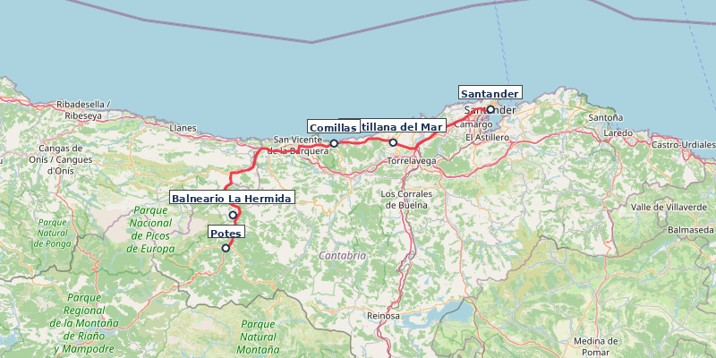
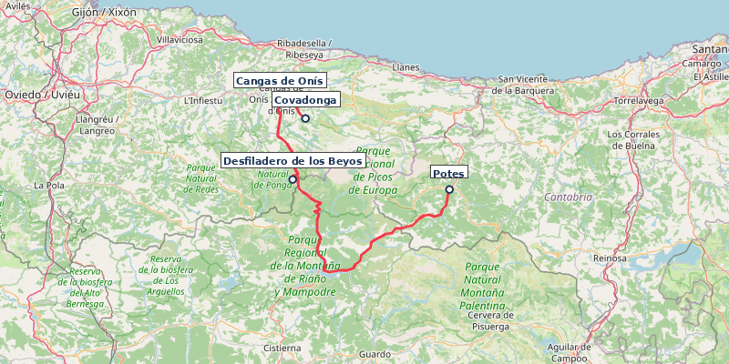
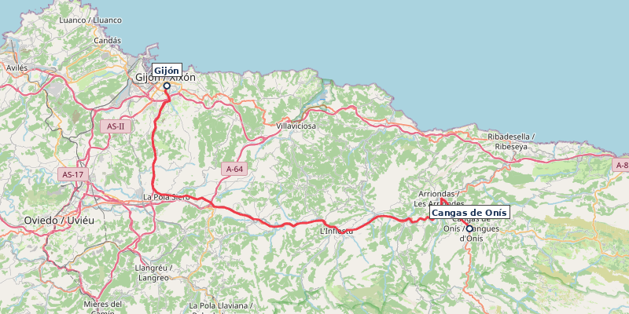
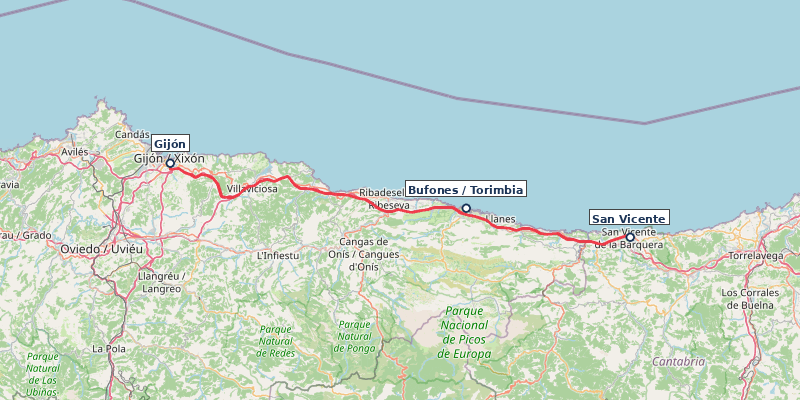
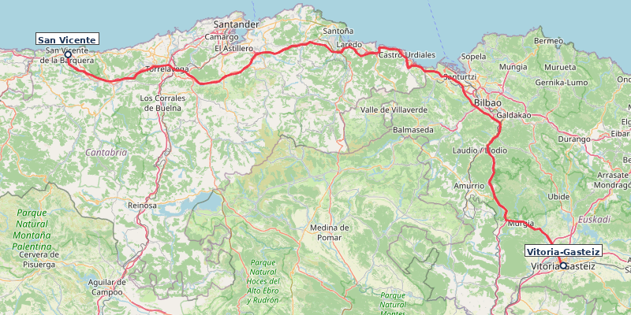
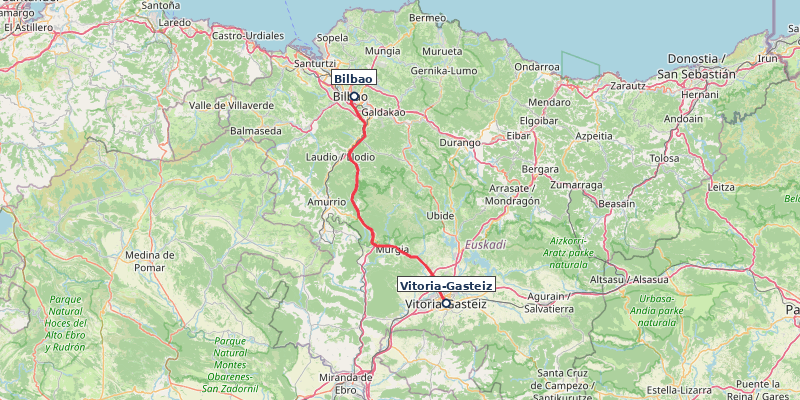

---
---

# Nordspanien

**Reisezeitraum:** Fr 4. September – So 20. September 2026 · 17 Tage · ~1.150 km (inkl.
Tagesausflüge) **Flug:** BER ↔ Bilbao BIO, Direktflug Eurowings (nur Mo/Fr/So,
Abendflüge) **Mietwagen:** Übernahme Sa 5. Sep (Stadtstation Bilbao) / Abgabe Fr 18. Sep
(Flughafen) — 13 Tage

> 🌊 Die spanische Nordküste: grüne Berge, wilde Atlantikküste, Pintxos-Bars,
> Sidra-Häuser und die Picos de Europa direkt hinter dem Strand. Anfang September: warm,
> wenig Touristen, perfekte Wanderbedingungen.

> ☀️ **Wetter:** Küste 14–25°C, Berge 8–20°C, Regen 20–35%. Meer 19–21°C. Regenjacke
> einpacken!

> 🇪🇸 **Länderinfo:** Preisniveau ähnlich DE. Tempolimit: 50 / 90 / 120 km/h. Autovías
> mautfrei. Lichtpflicht bei Regen/Tunnel. Notruf 112. Pintxos: Zahnstocher zählen beim
> Zahlen. Sidra: „escanciar" — aus 1 m Höhe ins Glas.

---

## Übernachtungen im Überblick

| Datum               | Nächte | Ort                     | Unterkunft                                                                                 |
| ------------------- | ------ | ----------------------- | ------------------------------------------------------------------------------------------ |
| Fr 4. – Sa 5. Sep   | 1      | Bakio                   | [Casa Rural Lastoetxe](https://www.booking.com/hotel/es/casa-rural-lastoetxe-vizcaya.html) |
| Sa 5. – Mo 7. Sep   | 2      | San Sebastián           | [A Room in the City](https://www.booking.com/hotel/es/a-room-in-the-city.html)             |
| Mo 7. – Mi 9. Sep   | 2      | Santander               |                                                                                            |
| Mi 9. – Do 10. Sep  | 1      | Potes                   | [Albergue La Cabaña](https://www.booking.com/hotel/es/albergue-la-cabana.html)             |
| Do 10. – So 13. Sep | 3      | Cangas de Onís          | [Hotel Covadonga](https://www.booking.com/hotel/es/covadonga-cangas-de-onis.de.html)       |
| So 13. – Di 15. Sep | 2      | Gijón                   |                                                                                            |
| Di 15. – Do 17. Sep | 2      | San Vicente de Barquera |                                                                                            |
| Do 17. – Sa 19. Sep | 2      | Laguardia (Rioja)       |                                                                                            |
| Sa 19. – Mo 20. Sep | 2      | Bilbao                  |                                                                                            |

**Gesamt:** 17 Nächte (4.–20. Sep 2026)

---

## Reiseverlauf

Bilbao → Bakio (Gaztelugatxe) → San Sebastián → Santander → Potes → Picos de Europa → Gijón/Oviedo → San
Vicente de la Barquera → Vitoria-Gasteiz/Rioja Alavesa → Bilbao

> 💡 **Fahrstrecken:** Durch den Stopp in **San Vicente de la Barquera** sind alle
> Etappen jetzt unter 2,5 Stunden reine Fahrzeit. Die Reise ist somit sehr entspannt.

> 💡 **Flexibilität:** Bei Regen Museumstage vorziehen (Guggenheim, Artium, Centro
> Botín). Bei Hitze: Strandtage priorisieren. Ruta del Cares nur bei trockenem Wetter.

---

### Tag 1 · Fr 4. Sep · Bilbao → Bakio · 35 km, ~35 Min.

**Hinflug:** BER → Bilbao (BIO), Direktflug Eurowings EW8552, ~2,5 Std. Abflug 17:00
Uhr, Ankunft Bilbao ca. 19:35 Uhr Ortszeit (Fr).
[→ Direktflüge BER→BIO, 4. Sep](https://www.skyscanner.de/g/referrals/v1/flights/day-view/?origin=BER&destination=BIO&outboundDate=2026-09-04&adults=2&stops=0&currency=EUR&locale=de-DE&market=DE)

- ℹ️ Kein Morgenflug BER→BIO verfügbar. Eurowings fliegt nur abends (Mo/Fr/So).
- Geschätzte Kosten: ~290 € pro Person (one-way, Stand Jun 2026)

**Mietwagen:** Übernahme am Flughafen Bilbao direkt nach Ankunft. Kompaktwagen,
~400–650 € für 13 Tage (Vollkasko inkl.). Abgabe Tag 15 am Flughafen.

**Fahrt nach Bakio:** ~35 Min. direkt vom Flughafen. Ankunft ca. 20:30 Uhr.

**Unterkunft:**
[Casa Rural Lastoetxe](https://www.booking.com/hotel/es/casa-rural-lastoetxe-vizcaya.html) — Landhaus bei Bakio, 10 Min. zu Gaztelugatxe

**Abendessen:** Hotel-Restaurant (regionale Küche) oder Bakio Ortskern (5 Min. zu Fuß).

---

### Tag 2 · Sa 5. Sep · Bakio → San Sebastián / Donostia · 190 km, ~4,5 Std. Fahrzeit + Stopps (Gesamtdauer 8 Std.)

[Route in Google Maps](https://www.google.com/maps/dir/Bakio/San+Juan+de+Gaztelugatxe/Bermeo/Urdaibai/Playa+de+Laga/Lekeitio/Zumaia/Getaria/San+Sebastián)

> ⚠️ **Gaztelugatxe-Strategie:** Ihr habt ein Backup-Ticket für 13:55 Uhr, aber die **beste Option ist der frühe Morgen**:
>
> - **Vor 10:00 Uhr:** Keine Zugangskontrolle → freier Zugang ohne Ticket (bestätigt durch Erfahrungsberichte)
> - **Vorteile:** Leerer Parkplatz, keine Menschenmassen, beste Lichtverhältnisse, entspannter Tagesverlauf
> - **Timing:** 7:15 Uhr Abfahrt vom Hotel (5 Min. Fahrt) → 7:30–9:00 Uhr Aufstieg → 9:30 Uhr zurück
> - Falls wider Erwarten doch Kontrolle: Ticket für 13:55 Uhr als Backup nutzen
>
> Die Küstenstraße ist spektakulär, aber zeitintensiv. Mit mehreren Stopps ist dies ein voller 8-Stunden-Tag.

**Empfohlene Route (Gaztelugatxe früh morgens — beste Variante!):**

1. 🏛️
   **[San Juan de Gaztelugatxe](https://www.visitbiscay.eus/en/san-juan-gaztelugatxe)**
   (**7:30–9:00 Uhr**, 5 Min. Fahrt vom Hotel) — Felsinsel, 241 Stufen, GoT
   „Dragonstone". **Freier Zugang vor 10:00 Uhr (keine Ticketkontrolle).**
   - ⏰ **Timing:** 7:15 Uhr Abfahrt Hotel → 7:20 Uhr Parkplatz → 7:30–9:00 Uhr
     Aufstieg & Abstieg
   - 💡 **Vorteile:** Leerer Parkplatz, keine Warteschlangen, goldenes Morgenlicht,
     entspannter restlicher Tag
   - 🎫 **Backup:** Ticket für 13:55 Uhr falls wider Erwarten doch Kontrolle (sehr
     unwahrscheinlich vor 10 Uhr)
2. 🏊 **Playa de Bakio** (~9:30 Uhr) — Kaffeepause am Hotelstrand nach der Wanderung.
3. 🏛️ **[Bermeo](https://tourism.euskadi.eus/en/towns/bermeo/webtur00-content/en/)**
   (~10:30 Uhr, 10 Min. Fahrt) — Fischerhafen, Ercilla-Turm (15. Jh.), zweites
   Frühstück im Hafen.
4. 🌿 **[Urdaibai](https://www.visitbiscay.eus/en/urdaibai)** (~11:30 Uhr) —
   UNESCO-Biosphärenreservat, Aussichtspunkt Mundaka (Surfer-Welle).
5. 🏊 **Playa de Laga** (~12:00 Uhr)
   [📍](https://www.google.com/maps/search/?api=1&query=43.3983,-2.6617) — Goldener
   Sandstrand, Badestopp + Mittagspause.
6. 🏛️ **[Lekeitio](https://tourism.euskadi.eus/en/towns/lekeitio/webtur00-content/en/)**
   (~14:00 Uhr) — Fischerdorf, Basilika Santa María, Insel San Nicolás (bei Ebbe zu
   Fuß).
7. 🏛️ **[Zumaia Flysch](https://geoparkea.eus/en/what-see/essential-places)** (~15:30
   Uhr, 1–1,5 Std.) — UNESCO Geopark, 60 Mio. Jahre Erdgeschichte in vertikalen
   Gesteinsschichten. **Game of Thrones "Dragonstone" Kulisse.**
   - **Playa de Itzurun** — Strand zwischen den Flysch-Formationen. ⚠️ Bei Ebbe am
     beeindruckendsten (Nachmittags-Ebbe: ~16:00 Uhr).
   - **Ermita de San Telmo** (1540) — Kapelle auf der Klippe, bester Panoramablick
     (5 Min. Aufstieg vom Strand).
   - **Optional:** Baratzazarrak Aussichtsplattform — dramatischer Blick auf die
     höchsten Klippen (zusätzlich 15 Min. Fahrt + 10 Min. Fußweg).
8. 🎨 **[Cristóbal Balenciaga Museoa](https://www.cristobalbalenciagamuseoa.com/en/)**
   (~16:30 Uhr) — Getaria. Haute Couture als Kunstform.
9. 🍷 **Getaria Hafen** (~17:00 Uhr) — Gegrillter Fisch, Txakoli-Wein.
10. **Ankunft San Sebastián** (~18:00 Uhr)

**Alternative mit Ticket um 13:55 Uhr (falls ihr doch später starten wollt):**

Falls ihr nicht so früh aufstehen wollt (oder das Wetter schlecht ist):

1. 🏊 **Playa de Bakio** (~9:00 Uhr) — Entspannter Morgenstart am Hotelstrand.
2. 🏛️ **[Bermeo](https://tourism.euskadi.eus/en/towns/bermeo/webtur00-content/en/)**
   (~10:00 Uhr, 10 Min. Fahrt) — Fischerhafen, Ercilla-Turm (15. Jh.), Kaffee im Hafen.
3. 🌿 **[Urdaibai](https://www.visitbiscay.eus/en/urdaibai)** (~11:00 Uhr) —
   UNESCO-Biosphärenreservat, Aussichtspunkt Mundaka (Surfer-Welle).
4. 🏊 **Playa de Laga** (~11:30 Uhr)
   [📍](https://www.google.com/maps/search/?api=1&query=43.3983,-2.6617) — Goldener
   Sandstrand, Badestopp + Mittagspause.
5. 🏛️
   **[San Juan de Gaztelugatxe](https://www.visitbiscay.eus/en/san-juan-gaztelugatxe)**
   (**13:55 Uhr**) — Felsinsel mit eurem Ticket.
6. 🏛️ **[Lekeitio](https://tourism.euskadi.eus/en/towns/lekeitio/webtur00-content/en/)**
   (~15:30 Uhr) — Fischerdorf, Basilika Santa María, Insel San Nicolás (bei Ebbe zu
   Fuß).
7. 🏛️ **[Zumaia Flysch](https://geoparkea.eus/en/what-see/essential-places)** (~16:30
   Uhr, 1–1,5 Std.) — UNESCO Geopark, 60 Mio. Jahre Erdgeschichte in vertikalen
   Gesteinsschichten. **Game of Thrones "Dragonstone" Kulisse.**
   - **Playa de Itzurun** — Strand zwischen den Flysch-Formationen. ⚠️ Bei Ebbe am
     beeindruckendsten (Nachmittags-Ebbe: ~16:00 Uhr).
   - **Ermita de San Telmo** (1540) — Kapelle auf der Klippe, bester Panoramablick
     (5 Min. Aufstieg vom Strand).
   - **Optional:** Baratzazarrak Aussichtsplattform — dramatischer Blick auf die
     höchsten Klippen (zusätzlich 15 Min. Fahrt + 10 Min. Fußweg).
8. 🎨 **[Cristóbal Balenciaga Museoa](https://www.cristobalbalenciagamuseoa.com/en/)**
   (~17:00 Uhr) — Getaria. Haute Couture als Kunstform.
9. 🍷 **Getaria Hafen** (~17:30 Uhr) — Gegrillter Fisch auf Holzkohle, Txakoli-Wein.
10. **Ankunft San Sebastián** (~19:00 Uhr)

**Option ohne Gaztelugatxe:**

1. 🏊 **Playa de Bakio** (~9:00 Uhr) — Morgen am Hotelstrand.
2. 🏛️ **[Bermeo](https://tourism.euskadi.eus/en/towns/bermeo/webtur00-content/en/)**
   (~10:00 Uhr) — Fischerhafen, Kaffee.
3. 🌿 **[Urdaibai](https://www.visitbiscay.eus/en/urdaibai)** (~11:00 Uhr) —
   UNESCO-Biosphärenreservat, Mundaka.
4. 🏊 **Playa de Laga** (~11:30–13:00 Uhr)
   [📍](https://www.google.com/maps/search/?api=1&query=43.3983,-2.6617) — Ausgiebige
   Badezeit + Mittagspause.
5. 🏛️ **[Lekeitio](https://tourism.euskadi.eus/en/towns/lekeitio/webtur00-content/en/)**
   (~14:00 Uhr) — Fischerdorf, Insel San Nicolás.
6. 🏛️ **[Zumaia Flysch](https://geoparkea.eus/en/what-see/essential-places)** (~15:30
   Uhr, 1–1,5 Std.) — UNESCO Geopark, 60 Mio. Jahre Erdgeschichte in vertikalen
   Gesteinsschichten. **Game of Thrones "Dragonstone" Kulisse.**
   - **Playa de Itzurun** — Strand zwischen den Flysch-Formationen. ⚠️ Bei Ebbe am
     beeindruckendsten (Vormittags-Ebbe: ~10:30 Uhr).
   - **Ermita de San Telmo** (1540) — Kapelle auf der Klippe, bester Panoramablick
     (5 Min. Aufstieg vom Strand).
   - **Optional:** Baratzazarrak Aussichtsplattform — dramatischer Blick auf die
     höchsten Klippen (zusätzlich 15 Min. Fahrt + 10 Min. Fußweg).
7. 🎨 **[Cristóbal Balenciaga Museoa](https://www.cristobalbalenciagamuseoa.com/en/)**
   (~16:30 Uhr) — Getaria. Haute Couture als Kunstform.
8. 🍷 **Getaria Hafen** (~17:00 Uhr) — Gegrillter Fisch, Txakoli-Wein.
9. **Ankunft San Sebastián** (~18:00 Uhr)

**Unterkunft:**
[A Room in the City](https://www.booking.com/hotel/es/a-room-in-the-city.html) — Hostel in ehemaligem Kloster, zentral, 3 Min. zur Playa de La Concha, 10 Min. zur Altstadt (Location Rating 9.5/10)

💡 **Tipp Option B:** Gaztelugatxe unter der Woche von San Sebastián aus als
Tagesausflug nachholen (~1 Std. Fahrt, flexiblere Tickets, weniger Andrang).

### Tag 3 · So 6. Sep · San Sebastián

- 🚣 **Bandera de La Concha** — Prestigeträchtige Ruderregatta an den ersten beiden
  Sonntagen im September. Die Bucht ist gesäumt von tausenden Zuschauern. **Großes
  Spektakel.** ⚠️ Voll!
- 🎊 **Euskal Jaiak (Baskische Feste)** — Anfang September. Traditioneller Sport, Musik
  und Tanz in der Stadt. Darunter **Harri Jasotzaile** (Steinhebe-Wettkämpfe) —
  baskische Kraftsporttradition, bei der Athleten standardisierte Granitquader in
  möglichst vielen Wiederholungen heben.
- 🥾 **Camino del Norte (Pasaia → San Sebastián)** — 12 km, 4 Std., moderat.
  Jakobsweg-Küstenabschnitt, spektakuläre Küstenblicke. ⚠️ One-way; Hinfahrt Bus E09
  nach Pasaia (~11 Min., alle 15 Min.,
  [Lurraldebus/Avanza](https://gipuzkoa.avanzagrupo.com)). **Barik-Karte wird
  akzeptiert** (Lurraldebus & Dbus).
  [Waymarked Trails](https://hiking.waymarkedtrails.org/#route?id=1116809) ·
- 🍷 **Parte Vieja Pintxos** — Bar Nestor (Tortilla), La Cuchara de San Telmo,
  Gandarias, Bar Zeruko.

**Weitere POIs in San Sebastián:**

- 🥾 **Monte Urgull** — 3 km, 1,5 Std., leicht. Festung, 360°-Panorama.
- 🥾 **Monte Igueldo → Paseo Nuevo** — 8 km, 3 Std., moderat. ⭐ 4,5 (58 Reviews).
  Küstenwanderung.
- 🏊 **Playa de la Concha** — Muschelförmige Bucht, ruhiges Wasser.
- 🏊 **Playa de la Zurriola** — Surfer-Strand, Stadtteil Gros.
- 🎨 **[San Telmo Museoa](https://www.santelmomuseoa.eus)** — Baskische Kultur +
  zeitgenössische Kunst. (~7 €/P.)
- 🎨 **[Tabakalera](https://www.tabakalera.eus/en)** — Zeitgenössische Kultur in
  ehemaliger Tabakfabrik.
- 🎨 **[Chillida-Leku](https://www.museochillidaleku.com/en/)**
  [📍](https://www.google.com/maps/search/?api=1&query=43.2847,-1.9183) —
  Skulpturenpark, monumentale Stahlskulpturen. **Pflichtbesuch.** (~14 €/P., Do–Mo
  geöffnet, Di+Mi geschlossen)
- 🏛️ **Peine del Viento** — Chillida-Skulpturen in den Klippen.

---

### Tag 4 · Mo 7. Sep · San Sebastián → Santander · 198 km, ~2,5 Std.

[Route in Google Maps](https://www.google.com/maps/dir/San+Sebastián/Castro+Urdiales/Santander)

Stopp Castro Urdiales (Kaffee, gotische Kirche). Ankunft Mittag.

- 🏛️ **[Palacio de la Magdalena](https://palaciomagdalena.com/en/)** — Königlicher
  Sommerpalast, Halbinsel-Rundgang.
- 🥾 **Península de la Magdalena** — 4 km, 1,5 Std., leicht. Rundweg um die Halbinsel
  mit Palast, Zoo und Strandblick.
- 🏊 **Playa del Sardinero** — Stadtstrand, Belle-Époque.
- 🍷 **Mercado de la Esperanza** — Markthalle, Fisch, Tapas-Bars.

> Hinweis: Centro Botín montags geschlossen.

### Tag 5 · Di 8. Sep · Santander

- 🥾 **Cabo Mayor → Mataleñas** — 6 km, 2 Std., leicht. Klippenpfad, Leuchtturm. 🏊
  Endet an der Playa de Mataleñas — geschützte Bucht, kristallklares Wasser.
  - 🍷 **Einkehr:** Chiringuito an der Playa de Mataleñas (Sommer, Getränke + Snacks).
- 🎨 **[Centro Botín](https://www.centrobotin.org/en/)** — Renzo Piano, zeitgenössische
  Kunst. **Highlight.** (~9 €/P., Di–So, Mo geschlossen)
- 🏊 **Playa de la Arnía**
  [📍](https://www.google.com/maps/search/?api=1&query=43.4738,-3.8783) — Wilde
  Felsbucht, spektakuläre Felsformationen. 15 Min. Fahrt.
- 🍷 **Bodega del Riojano** — Kantabrische Küche seit 1908.

**Weitere POIs in Santander:**

- 🥾 **Faro del Caballo** (Santoña, 45 Min. östlich) — 700 Stufen zu türkisfarbener
  Bucht. Halbtagesausflug.
- 🍷 **Cañadío** — Moderne Küche, Meeresfrüchte.
- 🌿 **Jardines de Piquío** — Art-Deco-Gärten.

---

### Tag 6 · Mi 9. Sep · Santander → Potes / Liébana-Tal · 106 km, ~1,5 Std. + Stopps

[Route in Google Maps](https://www.google.com/maps/dir/Santander/Santillana+del+Mar/Comillas/Potes)

- 🏛️ **[Santillana del Mar](https://www.spain.info/en/destination/santillana-del-mar/)**
  (Anfahrt) — Mittelalterliches Dorf, Stiftskirche.
- 🏛️ **[Altamira-Museum](https://www.culturaydeporte.gob.es/mnaltamira/en/home.html)**
  (bei Santillana) — UNESCO, prähistorische Malereien (Replik). (~3 €/P., ⚠️ Tickets
  vorab online buchen)
- 🏛️ **[Comillas](https://www.spain.info/en/places-of-interest/capricho-gaudi/)**
  (Anfahrt) — Gaudís El Capricho.
- 🏛️ **Desfiladero de la Hermida** (Anfahrt) — 21 km Schlucht, 600 m Felswände.
- 🏊 **[Balneario La Hermida](https://balneariolahermida.com/)**
  [📍](https://www.google.com/maps/search/?api=1&query=43.2283,-4.6017) — Thermalquelle
  (60°C) mitten in der Schlucht. Thermalhöhle + Außenbecken 38°C. Direkt auf der Route.

- 🍷 **Cocido Lebaniego** — Kichererbsen-Eintopf, Spezialität des Tals. (Die Fuente Dé
  Seilbahn wird aufgrund des straffen Programms auf morgen verschoben).

**Weitere POIs in Potes:**

- 🥾 **Mirador de Santa Catalina** — 4 km, 1,5 Std., leicht. Picos-Panorama & Blick in
  die Hermida-Schlucht.
- 🏛️ **Torre del Infantado** — Wehrturm (15. Jh.), Ausstellungsraum.
- 🏛️ **Monasterio de Santo Toribio** (3 km) — Kloster 6. Jh., Pilgerort.

---

### Tag 7 · Do 10. Sep · Potes → Picos de Europa / Cangas de Onís · ~150 km, ~2,5 Std. Fahrzeit (zzgl. Seilbahn-Ausflug)

[Route in Google Maps](https://www.google.com/maps/dir/Potes/Fuente+Dé/Potes/Desfiladero+de+los+Beyos/Cangas+de+Onís)

Vormittags Ausflug von Potes zur Seilbahn und Wanderung in den Picos de Europa.
Nachmittags spektakuläre Fahrt über den Puerto de San Glorio und das Desfiladero de los
Beyos nach Cangas de Onís.

- 🥾 **Fuente Dé Seilbahn**
  [📍](https://www.google.com/maps/search/?api=1&query=43.1536,-4.8092) (morgens ab
  Potes, ~30 Min. Anfahrt) → Wanderung zu **Horcados Rojos** (hochalpin, 4 Std.) oder
  gemütlich über die Puertos de Áliva zurück. (~21 €/P. hin+zurück).
- 🏛️ **[Puente Romano](https://www.spain.info/en/places-of-interest/puente-rio-sella/)**
  (Cangas) — Römische Brücke, Wahrzeichen Asturiens. Abendlicher Spaziergang.
- 🍷 **Sidrería** — Sidra escanciar (aus Höhe einschenken) lernen. (Die Ruta del Río
  Dobra und die Basílica de Covadonga werden auf Tag 9 verschoben, um diesen Tag zu
  entlasten).

### Tag 8 · Fr 11. Sep · Picos de Europa

- 🥾 **Ruta del Cares** [PR-PNPE 3] — 22 km (hin+zurück), 6–8 Std., moderat. ⭐ 4,5
  (1.880 Reviews). Schlucht-Wanderung durch die „Garganta Divina" — ~70 in den Fels
  gehauene Tunnel, Pfad ursprünglich für einen Wasserkanal zum Kraftwerk Poncebos
  (frühes 20. Jh.) gebaut. **Highlight.** Ganztageswanderung, früh starten (Poncebos).
  ⚠️ Die ersten 2 km ab Poncebos sind steil — danach flach. ⚠️ Route wieder geöffnet,
  aber erhöhtes Steinschlagrisiko nach Waldbrand 2025 — Vegetation fehlt, Boden
  instabil. Bei Regen oder Wind Risiko deutlich höher. Aktuelle Lage vorab prüfen:
  [valledevaldeon.es](https://valledevaldeon.es/disfrutalo/turismo-activo-y-aventura/la-ruta-del-cares/)
  [Waymarked Trails](https://hiking.waymarkedtrails.org/#route?id=2687934)
  - 🍷 **Einkehr:** Bar Garganta del Cares (am Parkplatz Poncebos, vor/nach der
    Wanderung). In Caín (Wendepunkt): Casa Cuevas, La Taberna de Caín — einfache Menüs,
    günstig.
- 🍷 **Quesu Cabrales** — Blauschimmelkäse, in Höhlen gereift. Abend in Arenas de
  Cabrales.

### Tag 9 · Sa 12. Sep · Picos de Europa

- 🚌 **Lagos de Covadonga** [PR-PNPE 2] — 6,4 km, 2,5 Std., leicht. ⭐ 4,2 (520
  Reviews). Gletscherseen auf 1.000 m. ⚠️ **Zufahrt im September für PKW gesperrt.**
  - **Anreise:** Mit dem ALSA-Bus ab Cangas de Onís oder den Parkplätzen P1-P4.
  - **Buchung:** Tickets zwingend vorab online reservieren
    ([ALSA Lagos de Covadonga](<https://www.alsa.es/checkout?p_p_id=com_babel_alsa_espania_purchase_web_PurchasePortlet&p_p_lifecycle=1&p_p_state=normal&p_p_mode=view&_com_babel_alsa_espania_purchase_web_PurchasePortlet_javax.portlet.action=SearchJourneysAction&p_auth=SJnUOwZH&code=&serviceType=&accessible=0&_com_babel_alsa_global_portlet_AlsaGlobalJourneySearchPortlet_INSTANCE_odyl_originStationNameId=Lagos%20Covadonga%20Subida%20(Todas%20las%20paradas)&originStationId=20969&originStationSimplifiedName=Lagos%20Covadonga%20Subida&originStationIsMoveliaStop=false&destinationStationId=8892&destinationStationSimplifiedName=Lagos%20Covadonga&destinationStationIsMoveliaStop=false&departureDate=12%2F09%2F2026&_departureDate=12%2F09%2F2026&returnDate=12%2F09%2F2026&_returnDate=12%2F09%2F2026&originalLocale=es_ES&locationMode=3&passengerType-1=2&passengerType-4=0&passengerType-5=0&passengerType-2=0&passengerType-3=0&numPassengers=2&regionalZone=&travelType=RETURN&youngPromoCode=&promoCode=&jsonAlsaPassPassenger=&jsonVoucherPassenger=>)).
    Kosten ~9 € p.P.
  - 🏛️
    **[Basílica de Covadonga](https://www.turismoasturias.es/en/-/blogs/guia-para-visitar-covadonga-los-lagos-y-alrededores)**
    — Auf dem Weg zu/von den Seen besichtigen (der ALSA-Bus hält hier).
    Reconquista-Stätte (722 n.Chr.) mit der heiligen Grotte (Santa Cueva).
  - 🍷 **Einkehr:** Restaurant am Lago Enol (Buferrera-Besucherzentrum) — asturische
    Küche, Terrasse mit Seeblick.
- 🥾 **Ruta del Río Dobra**
  [📍](https://www.google.com/maps/search/?api=1&query=43.3100,-5.0800) (nachmittags) —
  6 km, 2 Std., leicht. Schöne Flusswanderung mit türkisfarbener Badestelle bei Cangas.
  🏊 Río Dobra — Felstöpfe mit smaragdgrünem Wasser.
- 🏊 **Río Sella** (Arriondas) — Flussbaden, kristallklar.
- 🏊 **Playa de Gulpiyuri**
  [📍](https://www.google.com/maps/search/?api=1&query=43.4378,-4.9117) — Inland-Strand
  (Meerwasser durch Höhlen). ⚠️ Nur bei Flut sehenswert — Gezeitenkalender vorab prüfen.
- 🍷 **El Molín de la Pedrera** — Fabada Asturiana.

**Weitere POIs in den Picos:**

- 🥾 **Mirador del Naranjo de Bulnes** (ab Sotres) — 10 km, 4 Std., moderat. Wanderung
  mit spektakulärem Blick auf den **Pico Urriellu / Naranjo de Bulnes** (2.519 m) — der
  bekannteste und markanteste Berg der Picos de Europa. Er ist ein legendärer,
  monolithischer Kalksteinkoloss, dessen 500 m hohe Westwand im Abendlicht leuchtend
  orange-rötlich strahlt (daher der Name „Naranjo“).

---

### Tag 10 · So 13. Sep · Cangas de Onís → Gijón / Oviedo · 76 km, ~1 Std.

[Route in Google Maps](https://www.google.com/maps/dir/Cangas+de+Onís/Gijón)

Fahrt nach Gijón.

**Unterkunft:**
[La Casona de Jovellanos](https://www.booking.com/hotel/es/la-casona-de-jovellanos.html)
(9,4, ~300 Reviews) — Gijón Altstadt, familiär, Frühstück inkl. (~90–130 €/Nacht)

- 🥾 **Senda del Cervigón** (Gijón) — 8 km, 2,5 Std., leicht. Küstenpfad mit Skulpturen.
  🏊 Endet an der Playa de La Ñora — kleine Bucht zum Abkühlen.
  - 🍷 **Einkehr:** Bar Playa La Ñora (am Endpunkt, Getränke + Bocadillos).
- 🎨 **Elogio del Horizonte** — Monumentale Chillida-Skulptur am Cerro de Santa
  Catalina. Man kann in die Skulptur treten und dem Meer "lauschen".
- 🏊 **Playa de San Lorenzo** (Gijón) — 1,5 km Stadtstrand.
- 🍷 **Sidrería Tierra Astur** (Gijón) — Sidra + asturische Küche.

### Tag 11 · Mo 14. Sep · Oviedo (Tagesausflug, 30 Min.)

- 🎊 **Fiestas de San Mateo** (Oviedo) — Genaue Daten für 2026 bestätigt: **11.–21.
  September**. Größtes Stadtfest in Oviedo mit Live-Musik, "Chiringuitos" in der
  Altstadt und toller Festatmosphäre.
- 🏛️ **Präromanische Kirchen** (UNESCO) — Santa María del Naranco, San Miguel de
  Lillo. 9. Jh. (Mo 09:30–13:00 kostenlos, ohne Guide)
- 🎨 **Street Art Oviedo** — Skulpturen-Rundgang: "Maternidad" (Botero) und "Culis
  Monumentalibus" (Eduardo Úrculo).
- 🍷 **Mercado del Fontán** (Oviedo) — Historische Markthalle.

> Hinweis: Museen montags geschlossen.

**Weitere POIs in Gijón/Oviedo:**

- 🎨 **Museo Barjola** (Gijón) — Zeitgenössische Kunst in einer historischen Kapelle.
- 🥾 **Senda del Oso** (50 Min. ab Gijón, Startpunkt Tuñón) — 18 km, 4 Std., leicht. ⭐
  4,5 (54 Reviews). Ehem. Bergbau-Pfad (Vía Verde Tuñón–Proaza).
  [Vía Verde](https://www.viasverdes.com/itinerarios/itinerario.asp?id=27)
- 🏊 **Playa del Silencio** (40 Min. westlich) — Versteckte Bucht, Klippen.
- 🍷 **Casa Fermín** (Oviedo) — Michelin-empfohlen.
- 🌿 **[Jardín Botánico Atlántico](https://www.spain.info/de/highlights/botanischer-garten-atlantico/)** (Gijón) — 25 ha,
  atlantische Flora.
- 🎨 **[LABoral Centro de Arte](https://www.laboralcentrodearte.org/en)** —
  Zeitgenössische Kunst + Technologie. Gijón. ℹ️ Sommeröffnungszeiten bis 15. Sept.:
  Mi–So 11:00–19:00 Uhr (Mo+Di geschlossen). Daher an Tag 10 (So, 13. Sep.) geöffnet und
  besuchbar! (Außerhalb der Sommersaison: Di–Sa geöffnet, So+Mo geschlossen).
- 🎨 **[Museo de Bellas Artes](https://www.museobbaa.com)** (Oviedo) — El Greco bis
  Dalí. (Di–So, Mo geschlossen)

---

### Tag 12 · Di 15. Sep · Gijón → San Vicente de la Barquera · 119 km, ~1,5 Std.

[Route in Google Maps](https://www.google.com/maps/dir/Gijón/San+Vicente+de+la+Barquera)

> 🎊 **Regionalfeiertag (Kantabrien):** La Bien Aparecida. Banken und einige Geschäfte
> in San Vicente geschlossen. Restaurants und Strände sehr belebt.

Fahrt entlang der Küste nach Kantabrien.

**Unterkunft:**
[Hotel Azul de Galimar](https://www.booking.com/hotel/es/azul-de-galimar.html) (8,6,
~364 Reviews) — Ruhige Lage, modern, Garten, Frühstück inkl. (~80–110 €/Nacht)

- 🏰
  **[Castillo del Rey](https://www.spain.info/en/destination/san-vicente-la-barquera/)**
  — Mittelalterliche Burg mit Panoramablick auf Küste und Picos.
- 🥾 **Senda Costera (Pendueles → Vidiago)**
  [📍](https://www.google.com/maps/search/?api=1&query=43.3950,-4.6700) — 5 km, 2 Std.,
  leicht. Küstenklippen mit Bufones de Pría (Meerwasser-Fontänen). Auf dem Weg nach San
  Vicente.
- 🏊 **Playa de Torimbia**
  [📍](https://www.google.com/maps/search/?api=1&query=43.4417,-4.8483) —
  Halbmondförmige Naturbucht bei Llanes, unverbaut. Auf dem Weg (5 Min. Abstecher).
- 🏛️ **Altstadt** — Puente de la Maza (28 Bögen), Kirche Santa María de los Ángeles.
- 🏊 **Playa de Oyambre** — Naturpark, goldener Sand, wenig bebaut.
- 🏊 **Playa de Merón** — Breiter Strand, Dünenlandschaft.
- 🍷 **Hafen** — Frischer Fisch und Meeresfrüchte direkt vom Boot. Spezialität:
  Sorropotún (Bonito-Eintopf).

---

### Tag 13 · Mi 16. Sep · San Vicente → Vitoria-Gasteiz / Rioja Alavesa · 211 km, ~2,5 Std.

[Route in Google Maps](https://www.google.com/maps/dir/San+Vicente+de+la+Barquera/Vitoria-Gasteiz)

Entspannte Weiterfahrt ins Baskenland. _Logistischer Ablauf:_ Zuerst Zwischenstopp in
Vitoria-Gasteiz für Besichtigungen am Nachmittag, am späten Nachmittag/Abend Weiterfahrt
ins Weindorf Laguardia.

**Unterkunft:**
[Hospedería de los Parajes](https://www.booking.com/hotel/es/hospederia-de-los-parajes.html)
(9,1, ~670 Reviews) — Laguardia, Boutique, Weinkeller, Spa, Frühstück inkl. (~110–150
€/Nacht)

- 🎨 **Itinerario Muralístico (IMVG)** — Europas größte Freiluft-Mural-Galerie in
  Vitoria-Gasteiz. Rundgang ~1,5 Std.
- 🎨 **[Artium Museoa](https://www.artium.eus)** — Zeitgenössische Kunst, 2.700+ Werke,
  1950er bis heute. **Pflichtbesuch.** (~9 €/P., Di–Fr 11–14 + 17–20 Uhr, Sa+So 11–20
  Uhr) ℹ️ Ankunft von San Vicente realistisch ~14:00 Uhr — fällt in die Mittagspause.
  Besuch ab 17:00 Uhr einplanen.
- 🍷 **Pintxos-Wahl:** Entweder Mittagessen in der Calle Cuchillería (Vitoria) ODER
  (empfohlen) Abends in der historischen Altstadt von **Laguardia** — direkt bei der
  Unterkunft, hervorragende Weinkeller und lokale Küche.

### Tag 14 · Do 17. Sep · Rioja Alavesa · ~30 km zzgl. Vitoria-Fahrt bei Bedarf

- 🎊 **Magialdia** — Internationales Zauberfestival in Vitoria-Gasteiz. Genaue Daten für
  2026 bestätigt: **14.–20. September**. Shows und Zauberkunst auf Plätzen und Bühnen.
  Bei Interesse kann abends ein Abstecher nach Vitoria-Gasteiz (~45 Min. Fahrt) gemacht
  werden.
- 🎨 **[Bodegas Ysios](https://bodegasysios.com/en)**
  [📍](https://www.google.com/maps/search/?api=1&query=42.5783,-2.5833) (Laguardia) —
  Calatrava-Bau. **Architektur-Highlight.** (~15 €/P.)
- 🎨 **[Marqués de Riscal](https://www.marquesderiscal.com)**
  [📍](https://www.google.com/maps/search/?api=1&query=42.5100,-2.6117) (Elciego, 10
  Min. Fahrt) — Gehry-Hotel, berühmtes Weingut seit 1858.
- 🏛️ **Laguardia** — Mittelalterliches Weindorf, Rundgang durch die Gassen und
  unterirdischen Weinkeller.
- 🥾 **Lagunas de Laguardia** — Gemütliche Wanderung durch das geschützte Feuchtgebiet
  direkt vor den Toren der Stadt (~5 km). (Die Salinas de Añana wurden auf Tag 15
  verlegt, da sie perfekt auf dem Rückweg nach Bilbao liegen).

**Weitere POIs in Vitoria/Rioja:**

- 🍷 **Lamm al sarmiento** — Auf Rebholz gegrillt, Rioja-Spezialität.
- 🏛️ **[Catedral de Santa María](https://www.catedralvitoria.eus/en)** — Gotisch,
  „offene Baustelle" (Ken Follett-Inspiration).

---

### Tag 15 · Fr 18. Sep · Laguardia → Salinas de Añana → Bilbao · ~100 km, ~1,5 Std. Fahrzeit (reine Fahrt)

[Route in Google Maps](https://www.google.com/maps/dir/Laguardia/Salinas+de+Añana/Bilbao+Airport)

Morgens Fahrt von Laguardia zur historischen Saline. Nach der Tour Weiterfahrt zum
Flughafen Bilbao zur Mietwagen-Rückgabe und Transfer ins Stadtzentrum.

**Unterkunft:** [Hotel Miró](https://www.booking.com/hotel/es/mirohotel.html) (8,8, ~370
Reviews) — Guggenheim-Nähe, Design, Frühstück inkl. (~100–150 €/Nacht)

- 🏛️ **[Salinas de Añana](https://www.vallesalado.com)**
  [📍](https://www.google.com/maps/search/?api=1&query=42.8000,-2.9833) — Älteste aktive
  Saline der Welt (6.500 Jahre). Beeindruckende Holzkonstruktion. **Geführte Tour** (~12
  €/P., 1,5 Std., vorab buchen) + Spaziergang auf dem Salzweg. Liegt perfekt auf der
  Route nach Bilbao.
- 🚗 **Mietwagen-Rückgabe:** Bis 18:00 Uhr am Flughafenschalter Bilbao. Danach mit dem
  Bizkaibus A3247 ins Stadtzentrum (~25 Min.).
- 🎨 **[Guggenheim Bilbao](https://www.guggenheim-bilbao.eus/en)** — Gehry-Ikone,
  zeitgenössische Kunst. **Pflichtbesuch.** (~16 €/P., 3 Std., ⚠️ vorab buchen!) 💡
  Tipp: morgens früh da sein — vor Öffnung reinigen sogenannte „Spidermans" die
  Titanfassade im Abseilverfahren, ein Spektakel für sich.
- 🍷 **Mercado de la Ribera** — Europas größte Markthalle, Tapas-Bars.

### Tag 16 · Sa 19. Sep · Bilbao

- 🏛️ **Casco Viejo** — Siete Calles, mittelalterliche Altstadt, Plaza Nueva.
- 🍷 **Mercado de la Ribera** — Europas größte Markthalle, Tapas-Bars.
- 🏛️ **[Puente Bizkaia](https://puente-colgante.com/en)**
  [📍](https://www.google.com/maps/search/?api=1&query=43.3231,-3.0172) —
  UNESCO-Schwebefähre (1893), 15 Min. Fahrt.
- 🥾 **Artxanda Funicular + Rundweg** — 5 km, 2 Std., leicht. Panorama
  (Sonnenuntergang).
- 🛶 Optional: Kayak auf dem Nervión.
- 🍷 **Plaza Nueva Pintxos** — Gilda, Txuleta, Bacalao al Pil-Pil.
- 🍷 **[Café Iruña](https://www.cafeiruna.com/)**
  [📍](https://www.google.com/maps/search/?api=1&query=43.2634,-2.9253) — Seit 1903,
  neo-maurischer Stil, Bilbaos bekanntestes Traditionslokal. Pintxos an der Theke,
  typische Atmosphäre.

### Tag 17 · So 20. Sep · Bilbao (Abreise)

Ausschlafen, entspanntes Frühstück. Letzter Bummel Siete Calles. ⚠️ **Abfahrt Richtung
Flughafen spätestens 17:30 Uhr** (Check-in bis 18:30 Uhr, Abflug 20:30 Uhr). Bus/Metro
zum Flughafen ~30 Min.

**Rückflug:** Bilbao (BIO) → BER, Direktflug Eurowings EW8553, ~2,5 Std. Abflug 20:30
Uhr (So). ℹ️ Pünktlichkeit laut Airportia gut (4,6/5 Sterne, Stand Jun 2026) — Ankunft
BER ca. 22:55 Uhr.
[→ Direktflüge BIO→BER, 20. Sep](https://www.skyscanner.de/g/referrals/v1/flights/day-view/?origin=BIO&destination=BER&outboundDate=2026-09-20&adults=2&stops=0&currency=EUR&locale=de-DE&market=DE)

**Weitere POIs in Bilbao:**

- 🎨 **[Museo de Bellas Artes](https://bilbaomuseoa.eus)** — Goya bis Chillida.
- 🍷 **Restaurante Mina** — Michelin-Stern, baskische Avantgarde.

---

## Erweiterungsideen

**A: Verlängerung bis Galizien (+4–5 Tage)** — Gijón → Lugo (röm. Stadtmauer) → A Coruña
(Herkulesturm) → Santiago de Compostela. Kein Direktflug SCQ→BER, daher
One-Way-Mietwagen zurück nach Bilbao (~6 Std.) oder Umsteigeflug. 💡 **Padrón** (20 km
SW Santiago): Ursprungsort der Pimientos de Padrón — Besuch bei Anbau-Familien möglich
(Empfehlung BR Radioreisen, Georg Bayerle).

**B: Pamplona als Startpunkt (+1–2 Tage)** — Navarra: Stadtmauern, Stierlauf-Route,
Kathedrale, Weinregion.

**C: Französisches Baskenland (+1–2 Tage)** — Biarritz/Saint-Jean-de-Luz ab San
Sebastián (20–40 Min.). Art Deco, Surfen, französisch-baskische Küche.

---

## Quellen

Markierte Wanderwege ([Waymarked Trails](https://waymarkedtrails.org), OSM-Daten):

| Route                            | Länge  | Link                                                                        |
| -------------------------------- | ------ | --------------------------------------------------------------------------- |
| Ruta del Cares                   | 21 km  | [waymarkedtrails.org](https://hiking.waymarkedtrails.org/#route?id=2687934) |
| Lagos de Covadonga               | 6,4 km | [waymarkedtrails.org](https://hiking.waymarkedtrails.org/#route?id=4664408) |
| Camino del Norte (Euskal Herria) | 228 km | [waymarkedtrails.org](https://hiking.waymarkedtrails.org/#route?id=1116809) |

Routen-Inspiration (recherchiert Mai 2026):

- [The Gap Decaders — 7–10 Days](https://thegapdecaders.com/north-spain-road-trip/) —
  Pamplona → Santiago
- [kimkim — 13 Days](https://www.kimkim.com/c/north-of-spain-ultimate-roadtrip-13-days)
  — Bilbao → Santiago (linear)
- [Along Dusty Roads — 10 Days](https://www.alongdustyroads.com/posts/northern-spain-road-trip-itinerary)
  — Baskenland → Galizien
- [Journaway — 10 Tage](https://rundreisen.urlaubsguru.de/de/angebote/nordspanien-roadtrip-50321)
  — Madrid → Bilbao → Madrid (Rundreise)
- [Andrew Harper — 14 Days](https://andrewharper.com/itinerary/spain-road-trip-galicia/)
  — Santiago → Rioja → Baskenland

Reiseführer (Wikivoyage, CC BY-SA 3.0):
[San Sebastián](https://de.wikivoyage.org/wiki/Donostia-San_Sebastián) ·
[Bilbao](https://de.wikivoyage.org/wiki/Bilbao) ·
[Costa Vasca](https://de.wikivoyage.org/wiki/Costa_Vasca)

Sehempfehlungen zur Vorbereitung (ÖR Mediathek):

| Sender | Titel                                                                     | Link                                                                                                                                                                                                            |
| ------ | ------------------------------------------------------------------------- | --------------------------------------------------------------------------------------------------------------------------------------------------------------------------------------------------------------- |
| WDR    | Wunderschön! — Baskenland (45 Min., UT, bis 2029)                         | [ARD Mediathek](https://www.ardmediathek.de/video/wunderschoen/baskenland-spaniens-norden-zwischen-bilbao-und-san-sebastian/wdr/Y3JpZDovL3dkci5kZS9CZWl0cmFnLTA4ODRkMjMyLWE5MTUtNDg0OC04MjU2LWJlOTNjMTEwYmZiNA) |
| WDR    | Grenzenlos — Baskenland (41 Min.)                                         | [YouTube](https://www.youtube.com/watch?v=1SaTEUXFwsU)                                                                                                                                                          |
| BR     | Bergauf-Bergab — Picos de Europa Wandern (14 Min.)                        | [YouTube](https://www.youtube.com/watch?v=jg6SnZ4H_U8)                                                                                                                                                          |
| BR     | Bergauf-Bergab — Picos de Europa Bergsteigen (25 Min.)                    | [YouTube](https://www.youtube.com/watch?v=vNsiC9IZJFw)                                                                                                                                                          |
| WDR    | Asturien — Green Coast #lookslike (ca. 30 Min.)                           | [YouTube](https://www.youtube.com/watch?v=sqK82GutZOc)                                                                                                                                                          |
| ARD    | Podcast: Asturiens Menschen und Mythen (54 Min.)                          | [ARD Sounds](https://www.ardsounds.de/episode/urn:ard:episode:109674ba1fdec334)                                                                                                                                 |
| BR     | Podcast: Radioreisen — Nordspanien: Picos, Padrón, Bilbao→Porto (54 Min.) | [Apple Podcasts](https://podcasts.apple.com/at/podcast/nordspanien-kalksteingebirge-picos-de-europa-gr%C3%BCnes/id560983615?i=1000770007595)                                                                    |
| Arte   | Unbekanntes Spanien — Von Asturien nach Zamora (43 Min., bis 17.10.2026)  | [Arte Mediathek](https://www.arte.tv/de/videos/RC-027779/unbekanntes-spanien)                                                                                                                                   |

> ℹ️ Kein Direktflug Santiago de Compostela (SCQ) → Berlin (BER). Daher Rundreise ab/bis
> Bilbao.

> ℹ️ Zuletzt geprüft: 2. Juni 2026. Wanderrouten-Bewertungen aus Web-Recherche (Mai
> 2026), Quelle: AllTrails. Nicht per API verifiziert.
