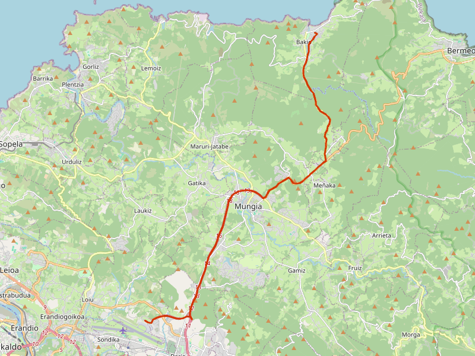
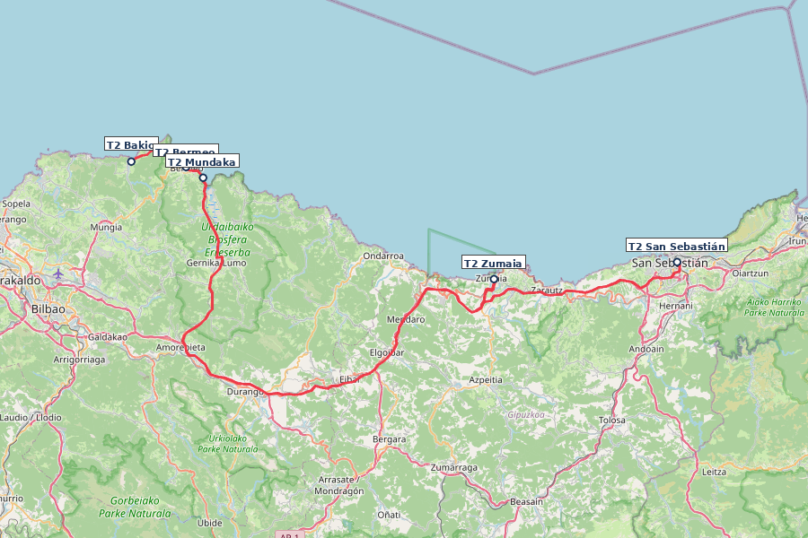
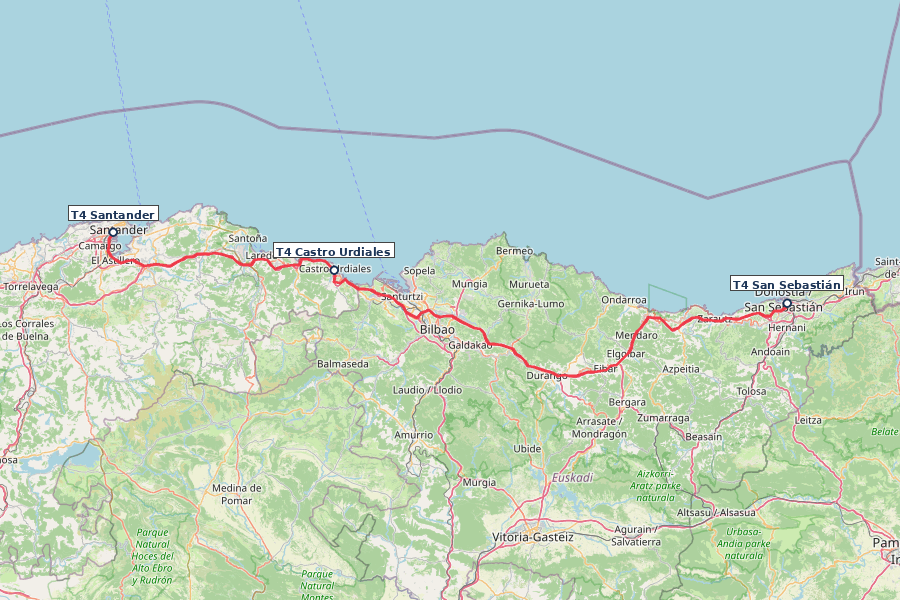
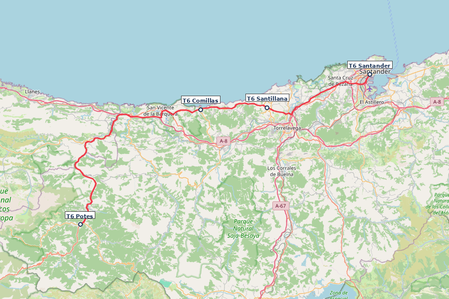
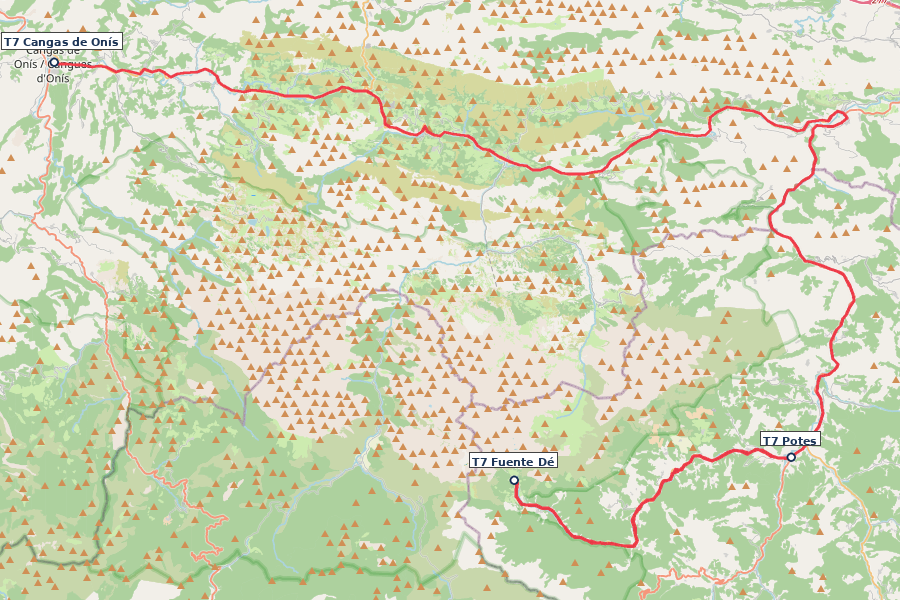
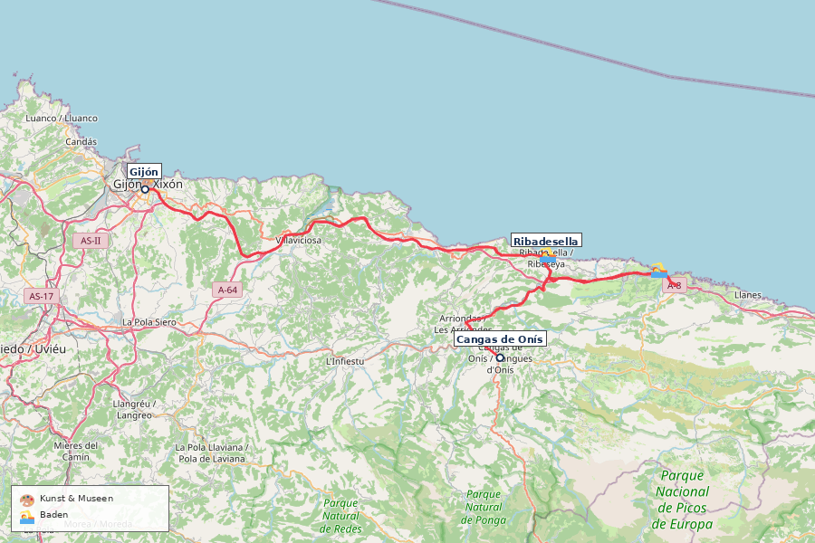
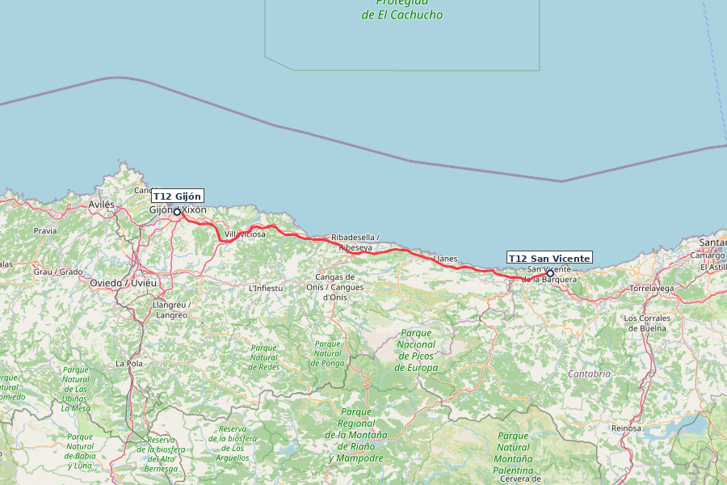
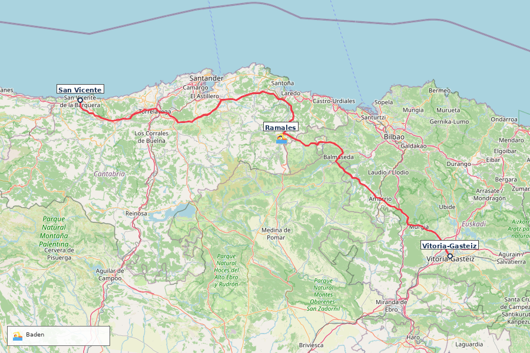
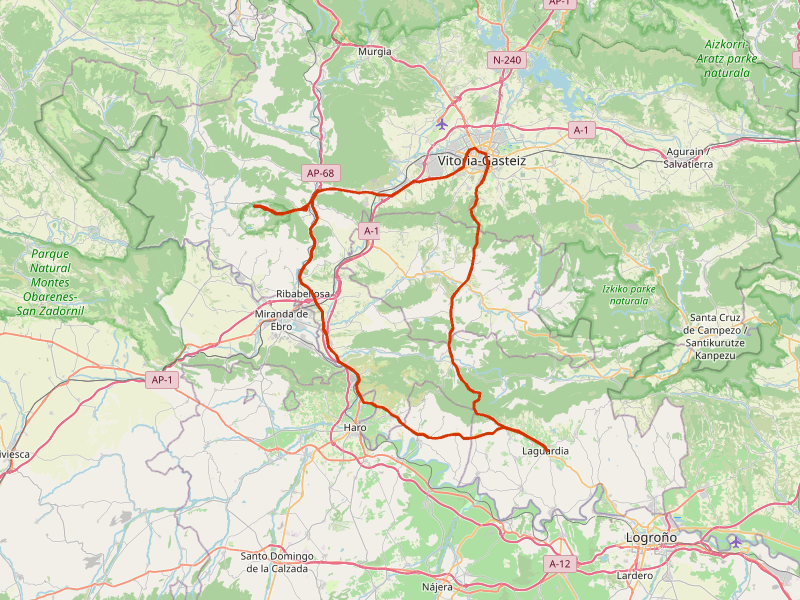
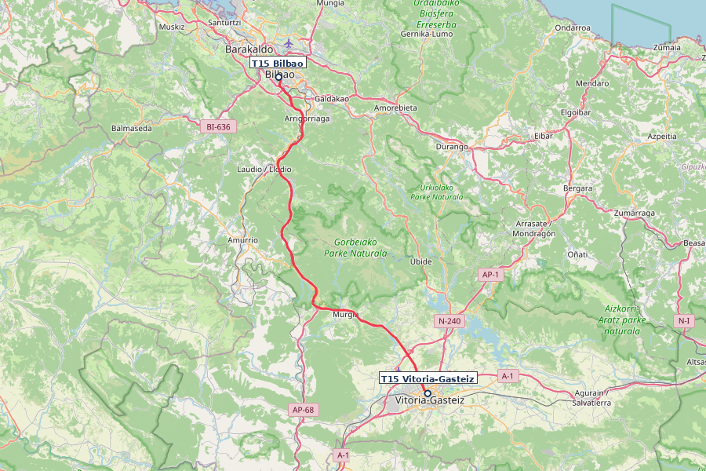

---
---

# Nordspanien Roadtrip

**Reisezeitraum:** Fr 4. September – So 20. September 2026 · 17 Tage · ~1.250 km (inkl.
Tagesausflüge) **Flug:** BER ↔ Bilbao BIO, Direktflug Eurowings (nur Mo/Fr/So,
Abendflüge) **Mietwagen:** Übernahme Fr 4. Sep (Flughafen Bilbao) / Abgabe Fr 18. Sep
(Flughafen) — 14 Tage

**Reiseverlauf:** [Bilbao](#tag-1--fr-4-sep--bilbao--bakio--35-km-35-min) → [Bakio](#tag-1--fr-4-sep--bilbao--bakio--35-km-35-min) → [San Sebastián](#tag-3--so-6-sep--san-sebastián) → [Santander](#tag-4--mo-7-sep--san-sebastián--santander--198-km-25-std) → [Potes](#tag-6--mi-9-sep--santander--potes--liébana-tal--106-km-15-std--stopps) → [Picos de Europa](#tag-8--fr-11-sep--picos-de-europa-ruta-del-cares) → [Gijón](#tag-10--so-13-sep--cangas-de-onís--gijón--oviedo--76-km-1-std) / [Oviedo](#tag-11--mo-14-sep--oviedo-tagesausflug-ab-gijón) → [San Vicente de la Barquera](#tag-12--di-15-sep--gijón--san-vicente-de-la-barquera--119-km-15-std) → [Vitoria-Gasteiz](#tag-13--mi-16-sep--san-vicente--vitoria-gasteiz--210-km-25-std) → [Bilbao](#tag-15--fr-18-sep--vitoria-gasteiz--bilbao--70-km-1-std). Alle Etappen unter 2,5 Std. Fahrzeit.

🌊 Die spanische Nordküste: grüne Berge, wilde Atlantikküste, Pintxos-Bars, Sidra-Häuser und die Picos de Europa direkt hinter dem Strand. Anfang September: warm, wenig Touristen, perfekte Wanderbedingungen.

☀️ **Wetter:** Küste 14–25°C, Berge 8–20°C, Regen 20–35%. Meer 19–21°C. Regenjacke einpacken!

🇪🇸 **Länderinfo:** Preisniveau ähnlich DE. Tempolimit: 50 / 90 / 120 km/h. Autovías mautfrei. Lichtpflicht bei Regen/Tunnel. Notruf 112. Pintxos: Zahnstocher zählen beim Zahlen. Sidra: „escanciar" — aus 1 m Höhe ins Glas.

⛽ **Tanken:** In Potes und vor der Picos-Durchquerung (Tag 6–7) volltanken — zwischen Potes und Cangas de Onís nur wenige Tankstellen auf der Bergstrecke. Auch vor San Vicente de la Barquera (Tag 12) prüfen.

📱 **Nützliche Apps & Ausrüstung:** Gezeiten-App (z. B. _Nautide_) für Flysch (Zumaia) & Playa de Gulpiyuri (Ebbe/Flut-Zeiten!). _Wikiloc_ für lokale Wanderwege. _Barik-Karte_ für ÖPNV im Baskenland. Robuste Regenjacke, Wanderschuhe & Zwiebellook (Küste vs. Gebirge) einpacken!

💡 **Flexibilität:** Bei Regen Museumstage vorziehen (Guggenheim, Artium, Centro Botín). Bei Hitze: Strandtage priorisieren. Ruta del Cares nur bei trockenem Wetter.

---

## Übernachtungen im Überblick

| Datum               | Nächte | Ort                                                                                             | Unterkunft                                                                                 |
| ------------------- | ------ | ----------------------------------------------------------------------------------------------- | ------------------------------------------------------------------------------------------ |
| Fr 4. – Sa 5. Sep   | 1      | [Bakio](#tag-1--fr-4-sep--bilbao--bakio--35-km-35-min)                                          | [Casa Rural Lastoetxe](https://www.booking.com/hotel/es/casa-rural-lastoetxe-vizcaya.html) |
| Sa 5. – Mo 7. Sep   | 2      | [San Sebastián](#tag-3--so-6-sep--san-sebastián)                                                | [A Room in the City](https://www.booking.com/hotel/es/a-room-in-the-city.html)             |
| Mo 7. – Mi 9. Sep   | 2      | [Santander](#tag-4--mo-7-sep--san-sebastián--santander--198-km-25-std)                          |                                                                                            |
| Mi 9. – Do 10. Sep  | 1      | [Potes](#tag-6--mi-9-sep--santander--potes--liébana-tal--106-km-15-std--stopps)                 | [Albergue La Cabaña](https://www.booking.com/hotel/es/albergue-la-cabana.html)             |
| Do 10. – So 13. Sep | 3      | [Cangas de Onís](#tag-8--fr-11-sep--picos-de-europa-ruta-del-cares)                             | [Hotel Covadonga](https://www.booking.com/hotel/es/covadonga-cangas-de-onis.de.html)       |
| So 13. – Di 15. Sep | 2      | [Gijón](#tag-10--so-13-sep--cangas-de-onís--gijón--oviedo--76-km-1-std)                         |                                                                                            |
| Di 15. – Mi 16. Sep | 1      | [San Vicente de Barquera](#tag-12--di-15-sep--gijón--san-vicente-de-la-barquera--119-km-15-std) |                                                                                            |
| Mi 16. – Fr 18. Sep | 2      | [Vitoria-Gasteiz](#tag-13--mi-16-sep--san-vicente--vitoria-gasteiz--210-km-25-std)              |                                                                                            |
| Fr 18. – So 20. Sep | 2      | [Bilbao](#tag-15--fr-18-sep--vitoria-gasteiz--bilbao--70-km-1-std)                              |                                                                                            |

**Gesamt:** 16 Nächte (4.–20. Sep 2026)

---

## Vorab-Reservierungen

Einige Attraktionen und Transporte auf dieser Route erfordern oder empfehlen eine rechtzeitige Online-Buchung vor der Reise, um lange Wartezeiten oder Einlassstopps zu vermeiden:

| Tag / Datum             | Aktivität / Ort                       | Vorlauf     | Details & Buchungs-Link                                                                                                                                   | ✅  |
| :---------------------- | :------------------------------------ | :---------- | :-------------------------------------------------------------------------------------------------------------------------------------------------------- | :-: |
| **Tag 2** (Sa 5. Sep)   | **San Juan de Gaztelugatxe**          | 2–4 Wochen  | Kostenloses Zeitslot-Ticket erforderlich (falls Zugang nach 10:00 Uhr). [visitbiscay.eus](https://www.visitbiscay.eus/en/san-juan-gaztelugatxe)           | ✅  |
| **Tag 3** (So 6. Sep)   | **Bar Nestor** (San Sebastián)        | Am Reisetag | Keine Online-Buchung. Persönliches Eintragen auf die Liste vor Ort um **12:00 Uhr** (mittags) oder **19:00 Uhr** (abends) für Tortilla.                   |     |
| **Tag 6** (Mi 9. Sep)   | **Höhle von Altamira** (Neocueva)     | 2–4 Wochen  | Replika-Museum & Höhle in Santillana del Mar. Tickets vorab sichern. [culturaydeporte.gob.es](https://www.culturaydeporte.gob.es/mnaltamira/en/home.html) |     |
| **Tag 9** (Sa 12. Sep)  | **Lagos de Covadonga Bus**            | 2–3 Wochen  | PKW-Zufahrt im September gesperrt. ALSA-Shuttlebus ab Cangas de Onís reservieren (~9 € p.P.). [alsa.es](https://www.alsa.es)                              |     |
| **Tag 13** (Mi 16. Sep) | **Catedral de Santa María** (Vitoria) | 1–2 Wochen  | Führung „Abierto por obras" mit Schutzhelm. Online-Reservierung. [catedralvitoria.eus](https://www.catedralvitoria.eus/en)                                |     |
| **Tag 16** (Sa 19. Sep) | **Guggenheim Museum** (Bilbao)        | 2–3 Wochen  | Zeitslot-Ticket zwingend empfohlen (morgens bevorzugt). [guggenheim-bilbao.eus](https://www.guggenheim-bilbao.eus/en)                                     |     |

💡 **Tipp für Unterkünfte:** Beliebte Unterkünfte in Potes und Cangas de Onís sind im September durch Wanderer gut gebucht – frühzeitig sichern!

---

### Tag 1 · Fr 4. Sep · Bilbao → Bakio · 22 km, ~30 Min.

🗺️ Karte anzeigen

[📍 Google Maps](https://www.google.com/maps/dir/Bilbao+Airport/Bakio)

**Hinflug:** BER → Bilbao (BIO), Direktflug Eurowings EW8552, ~2,5 Std. Abflug 17:00
Uhr, Ankunft Bilbao ca. 19:35 Uhr Ortszeit (Fr).
[→ Direktflüge BER→BIO, 4. Sep](https://www.skyscanner.de/g/referrals/v1/flights/day-view/?origin=BER&destination=BIO&outboundDate=2026-09-04&adults=2&stops=0&currency=EUR&locale=de-DE&market=DE)

**Mietwagen:** Übernahme am Flughafen Bilbao direkt nach Ankunft. Kompaktwagen,
~400–650 € für 14 Tage (Vollkasko inkl.). Abgabe Tag 15 am Flughafen.

**Fahrt nach Bakio:** ~35 Min. direkt vom Flughafen. Ankunft ca. 20:30 Uhr.

**Abendessen:** Hotel-Restaurant (regionale Küche) oder Bakio Ortskern (5 Min. zu Fuß).

---

### Tag 2 · Sa 5. Sep · Bakio → San Sebastián / Donostia · 137 km, ~2,5 Std. Fahrzeit + Stopps

🗺️ Karte anzeigen

[📍 Google Maps](https://www.google.com/maps/dir/Bakio/San+Juan+de+Gaztelugatxe/Bermeo/Urdaibai/Playa+de+Laga/Zumaia/San+Sebastián)

Gaztelugatxe früh morgens, dann entspannt entlang der Küste nach San Sebastián. Fokus auf die Highlights, ohne Hetze.

1. 🏛️ **[San Juan de Gaztelugatxe](https://www.visitbiscay.eus/en/san-juan-gaztelugatxe)** (**7:30–9:00 Uhr**, 5 Min. Fahrt) — Felsinsel, 241 Stufen, GoT „Dragonstone". **Freier Zugang vor 10:00 Uhr** (keine Ticketkontrolle). Backup-Ticket 13:55 Uhr vorhanden.
2. ☕ **Playa de Bakio** (~9:30 Uhr) — Kaffeepause am Hotelstrand, Koffer ins Auto.
3. 🏛️ **[Bermeo](https://tourism.euskadi.eus/en/towns/bermeo/webtur00-content/en/)** (~10:30 Uhr, 10 Min.) — Fischerhafen, Ercilla-Turm (15. Jh.), zweites Frühstück.
4. 🌿 **[Urdaibai](https://www.visitbiscay.eus/en/urdaibai) / Playa de Laga** (~11:30–13:00 Uhr) [📍](https://www.google.com/maps/search/?api=1&query=43.3983,-2.6617) — UNESCO-Biosphärenreservat, Aussichtspunkt Mundaka. Badestopp + Mittagspause am goldenen Sandstrand.
5. 🏛️ **[Zumaia Flysch](https://geoparkea.eus/en/what-see/essential-places)** (~14:30–16:00 Uhr) — UNESCO Geopark, 60 Mio. Jahre Erdgeschichte. **Playa de Itzurun** zwischen den Flysch-Formationen + **Ermita de San Telmo** (5 Min. Aufstieg, Panoramablick).
6. 🍷 **Getaria Hafen** (~16:30 Uhr) — Gegrillter Fisch auf Holzkohle, Txakoli-Wein.
7. **Ankunft San Sebastián** (~17:30 Uhr)

> 💡 **Backup bei späterem Start:** Mit dem 13:55-Uhr-Ticket für Gaztelugatxe starten, Route umkehren. Oder: Gaztelugatxe an einem Folgetag von San Sebastián aus nachholen (~1 Std. Fahrt, weniger Andrang unter der Woche).

**Ausgelassen (optional an Tag 3 nachholen):** Lekeitio — charmantes Fischerdorf mit Insel San Nicolás (bei Ebbe begehbar). Von San Sebastián ~1 Std. Fahrt.

**Unterkunft:** Hostel in ehemaligem Kloster, zentral, 3 Min. zur Playa de La Concha, 10 Min. zur Altstadt.

---

### Tag 3 · So 6. Sep · San Sebastián

- 🚣 **Bandera de La Concha** — Prestigeträchtige Ruderregatta an den ersten beiden
  Sonntagen im September. Die Bucht ist gesäumt von tausenden Zuschauern. **Großes
  Spektakel.** ⚠️ Voll!
- 🎊 **Euskal Jaiak (Baskische Feste)** — Anfang September. Traditioneller Sport, Musik
  und Tanz in der Stadt. Darunter **Harri Jasotzaile** (Steinhebe-Wettkämpfe) —
  baskische Kraftsporttradition, bei der Athleten standardisierte Granitquader in
  möglichst vielen Wiederholungen heben.
- 🥾 **Camino del Norte (Pasaia → San Sebastián)** — 12 km, 4 Std., moderat.
  Jakobsweg-Küstenabschnitt, spektakuläre Küstenblicke. ⚠️ One-way; Hinfahrt Bus E09
  nach Pasaia (~11 Min., alle 15 Min.,
  [Lurraldebus/Avanza](https://gipuzkoa.avanzagrupo.com)). **Barik-Karte wird
  akzeptiert** (Lurraldebus & Dbus).
  [Waymarked Trails](https://hiking.waymarkedtrails.org/#route?id=1116809) ·
- 🍷 **Parte Vieja** — Pintxos-Gassen mit dutzenden Bars auf engem Raum. **Probieren:** _Gilda_ (Ur-Pintxo mit Sardelle, Peperoni, Olive) + _Txakoli_ (trockener Weißwein) oder _Zurrito_ (kleines Bier).
  - ⚠️ **Bar Nestor** — Berühmt für Tortilla. Keine Reservierung möglich. Persönlich auf Liste eintragen: 12:00 Uhr (mittags) oder 19:00 Uhr (abends).

**Weitere POIs in San Sebastián:**

- 🥾 **Monte Urgull** — 3 km, 1,5 Std., leicht. Festung, 360°-Panorama.
- 🥾 **Monte Igueldo → Paseo Nuevo** — 8 km, 3 Std., moderat. ⭐ 4,5 (58 Reviews).
  Küstenwanderung.
- 🏊 **Playa de la Concha** — Muschelförmige Bucht, ruhiges Wasser.
- 🏊 **Playa de la Zurriola** — Surfer-Strand, Stadtteil Gros.
- 🎨 **[San Telmo Museoa](https://www.santelmomuseoa.eus)** — Baskische Kultur +
  zeitgenössische Kunst. (~7 €/P.)
- 🎨 **[Tabakalera](https://www.tabakalera.eus/en)** — Zeitgenössische Kultur in
  ehemaliger Tabakfabrik.
- 🎨 **[Chillida-Leku](https://www.museochillidaleku.com/en/)**
  [📍](https://www.google.com/maps/search/?api=1&query=43.2847,-1.9183) —
  Skulpturenpark, monumentale Stahlskulpturen. **Pflichtbesuch.** (~14 €/P., Do–Mo
  geöffnet, Di+Mi geschlossen)
- 🏛️ **Peine del Viento** — Chillida-Skulpturen in den Klippen.

---

### Tag 4 · Mo 7. Sep · San Sebastián → Santander · 203 km, ~2,5 Std.

🗺️ Karte anzeigen

[📍 Google Maps](https://www.google.com/maps/dir/San+Sebastián/Castro+Urdiales/Playa+de+Oriñón/Santander)

**Unterwegs:**

- 🏛️ **[Castro Urdiales](https://www.spain.info/en/destination/castro-urdiales/)** (~1 Std. ab San Sebastián) — Gotische Kirche Santa María, Leuchtturm auf römischen Ruinen. Kaffeepause am Hafen.
- 🏊 **Playa de Oriñón** [📍](https://www.google.com/maps/search/?api=1&query=43.4025,-3.3258) (~20 Min. vor Santander) — Goldener Dünenstrand in geschützter Bucht. Perfekter Zwischenstopp zum Erfrischen.

Ankunft Santander ca. 13:00 Uhr.

- 🏛️ **[Palacio de la Magdalena](https://palaciomagdalena.com/en/)** — Königlicher
  Sommerpalast, Halbinsel-Rundgang.
- 🥾 **Península de la Magdalena** — 4 km, 1,5 Std., leicht. Rundweg um die Halbinsel
  mit Palast, Zoo und Strandblick.
- 🏊 **Playa del Sardinero** — Stadtstrand, Belle-Époque.
- 🍷 **[Mercado de la Esperanza](https://www.santander.es/servicios-empresas/areas-tematicas/mercados/mercado-esperanza)** — Markthalle, Fisch, Tapas-Bars.

> Hinweis: Centro Botín montags geschlossen.

### Tag 5 · Di 8. Sep · Santander

- 🥾 **Cabo Mayor → Mataleñas** — 6 km, 2 Std., leicht. Klippenpfad, Leuchtturm. 🏊
  Endet an der Playa de Mataleñas — geschützte Bucht, kristallklares Wasser.
- 🎨 **[Centro Botín](https://www.centrobotin.org/en/)** — Renzo Piano, zeitgenössische
  Kunst. **Highlight.** (~9 €/P., Di–So, Mo geschlossen)
- 🏊 **Playa de la Arnía**
  [📍](https://www.google.com/maps/search/?api=1&query=43.4738,-3.8783) — Wilde
  Felsbucht, spektakuläre Felsformationen. 15 Min. Fahrt.
- 🍷 **[Bodega del Riojano](https://bodegadelriojano.com)** — Historisches Lokal seit 1908, kantabrische Atmosphäre.

**Kulinarisches in Santander:**

- 🍷 **Cañadío-Viertel** — Moderne Pintxos-Szene rund um die Plaza Cañadío. **Probieren:** Rabas (frittierte Tintenfischringe), Anchoas del Cantábrico.
- 🌿 **Jardines de Piquío** — Art-Deco-Gärten.

---

### Tag 6 · Mi 9. Sep · Santander → Potes / Liébana-Tal · 106 km, ~1,5 Std. + Stopps

🗺️ Karte anzeigen

[📍 Google Maps](https://www.google.com/maps/dir/Santander/Santillana+del+Mar/Comillas/Potes)

- 🏛️ **[Santillana del Mar](https://www.spain.info/en/destination/santillana-del-mar/)**
  (Anfahrt) — Mittelalterliches Dorf, Stiftskirche.
- 🏛️ **[Altamira-Museum](https://www.culturaydeporte.gob.es/mnaltamira/en/home.html)**
  (bei Santillana) — UNESCO, prähistorische Malereien (Replik). (~3 €/P., ⚠️ Tickets
  vorab online buchen)
- 🏛️ **[Comillas](https://www.spain.info/en/places-of-interest/capricho-gaudi/)**
  (Anfahrt) — Gaudís El Capricho.
- 🏛️ **Desfiladero de la Hermida** (Anfahrt) — 21 km Schlucht, 600 m Felswände.
- 🏊 **[Balneario La Hermida](https://balneariolahermida.com/)**
  [📍](https://www.google.com/maps/search/?api=1&query=43.2283,-4.6017) — Thermalquelle
  (60°C) mitten in der Schlucht. Thermalhöhle + Außenbecken 38°C. Direkt auf der Route.

- 🍷 **Cocido Lebaniego** — Kichererbsen-Eintopf, Spezialität des Tals. (Die Fuente Dé
  Seilbahn wird aufgrund des straffen Programms auf morgen verschoben).

**Weitere POIs in Potes:**

- 🥾 **Mirador de Santa Catalina** — 4 km, 1,5 Std., leicht. Picos-Panorama & Blick in
  die Hermida-Schlucht.
- 🏛️ **Torre del Infantado** — Wehrturm (15. Jh.), Ausstellungsraum.
- 🏛️ **Monasterio de Santo Toribio** (3 km) — Kloster 6. Jh., Pilgerort.

---

### Tag 7 · Do 10. Sep · Potes → Picos de Europa / Cangas de Onís · ~150 km, ~2,5 Std. Fahrzeit (zzgl. Seilbahn-Ausflug)

🗺️ Karte anzeigen

[📍 Google Maps](https://www.google.com/maps/dir/Potes/Fuente+Dé/Potes/Desfiladero+de+los+Beyos/Cangas+de+Onís)

Vormittags Ausflug von Potes zur Seilbahn und Wanderung in den Picos de Europa.
Nachmittags spektakuläre Fahrt über den Puerto de San Glorio und das Desfiladero de los Beyos nach Cangas de Onís.

- 🥾 **[Fuente Dé Seilbahn](https://telefericodefuentede.com)**
  [📍](https://www.google.com/maps/search/?api=1&query=43.1536,-4.8092) (morgens ab Potes, ~30 Min. Anfahrt) → Wanderung zu **Horcados Rojos** (hochalpin, 4 Std.) oder gemütlich über die Puertos de Áliva zurück. (~21 €/P. hin+zurück).
- 🏛️ **[Puente Romano](https://www.spain.info/en/places-of-interest/puente-rio-sella/)** (Cangas) — Römische Brücke, Wahrzeichen Asturiens. Abendlicher Spaziergang.
- 🍷 **Sidrería** — Sidra escanciar (aus Höhe einschenken) lernen.

> 🌧️ **Plan B bei schlechtem Wetter:** Seilbahn fährt bei starkem Wind/Nebel nicht. Alternative: Direkt über die landschaftlich spektakuläre Route (Puerto de San Glorio) nach Cangas fahren. Unterwegs Stopp am **Mirador del Pozo de Andara** für Bergpanorama (auch bei Wolken beeindruckend). In Cangas früher ankommen → Sidrería-Nachmittag + römische Brücke.

### Tag 8 · Fr 11. Sep · Picos de Europa (Ruta del Cares)

- 🥾 **Ruta del Cares** [PR-PNPE 3] — 22 km (hin+zurück), 6–8 Std., moderat. ⭐ 4,5 (1.880 Reviews). Schlucht-Wanderung durch die „Garganta Divina" — ~70 in den Fels gehauene Tunnel. Ganztageswanderung ab Poncebos. ⚠️ Steinschlagrisiko vorab prüfen. **Nur bei trockenem Wetter!**
  - ⚠️ **Kein Handyempfang** in weiten Teilen der Schlucht — Route vorher offline speichern, Begleitung empfohlen.
- 🍷 **Quesu Cabrales & Gamonéu** — Blauschimmelkäse & Höhlenkäse-Tasting in Arenas de Cabrales.

> 🌧️ **Plan B bei Regen:** Oviedo-Kulturtag vorziehen (Tag 8 ↔ Tag 11 tauschen). Oviedo funktioniert bei jedem Wetter: Kathedrale, präromanische Kirchen, Skulpturen-Tour, Mercado del Fontán. Die Ruta del Cares dann am ehemaligen Tag 11 nachholen, falls das Wetter besser ist.

### Tag 9 · Sa 12. Sep · Picos de Europa (Lagos de Covadonga & Río Dobra)

- 🚌 **Lagos de Covadonga** [PR-PNPE 2] — 6,4 km, 2,5 Std., leicht. Gletscherseen auf 1.000 m. ⚠️ PKW-Zufahrt gesperrt, ALSA-Bus ab Cangas buchen!
  - 🏛️ **[Basílica de Covadonga](https://www.turismoasturias.es/en/-/blogs/guia-para-visitar-visitar-covadonga-los-lagos-y-alrededores)** — Heilige Grotte (Santa Cueva) & Reconquista-Stätte.
- 🥾 **Ruta del Río Dobra** (nachmittags) — 6 km, 2 Std., leicht. Flusswanderung zu türkisfarbenen Felstöpfen bei Cangas.
- 🍷 **Cangas de Onís Sidrerías** — Abends durch die Altstadt schlendern. **Probieren:** Fabada Asturiana, Sidra escanciar (aus 1 m Höhe ins Glas).

> 🌧️ **Plan B bei Regen:** Lagos de Covadonga bei Nebel/Regen meiden (keine Sicht). Stattdessen: Basílica de Covadonga (überdacht) + Museo de Covadonga + Käserei-Besuch in Arenas de Cabrales. Nachmittags entspannt in Cangas — Sidrería-Hopping bei jedem Wetter möglich.

---

### Tag 10 · So 13. Sep · Cangas de Onís → Gijón / Oviedo · 145 km, ~2 Std. (via Llanes)

🗺️ Karte anzeigen

[📍 Google Maps](https://www.google.com/maps/dir/Cangas+de+Onís/Playa+de+Gulpiyuri/Ribadesella/Gijón)

**Unterwegs (Küstenroute via Llanes):**

- 🏊 **[Playa de Gulpiyuri](https://www.turismoasturias.es/en/descubre/costa/playas/playa-de-gulpiyuri)** [📍](https://www.google.com/maps/search/?api=1&query=43.4458,-4.9197) (~35 Min. ab Cangas, bei Llanes) — Einzigartiger Inland-Strand: 40 m vom Meer entfernt, durch unterirdische Höhlen mit Meerwasser gefüllt. **Nur bei Flut sehenswert!** Gezeiten vorab prüfen (Nautide-App).
- 🏛️ **[Ribadesella](https://www.turismoasturias.es/en/descubre/ciudades/villas-marineras/ribadesella)** (~20 Min. weiter) — Malerisches Fischerdorf an der Ría. Altstadt mit bunten Häusern, Sandstrand.
- 🏊 **Playa de Santa Marina** (Ribadesella) — Stadtstrand mit Promenade. Kurzer Badestopp möglich.

Ankunft Gijón ca. 13:00 Uhr. Maritime Hafenstadt mit Atlantik-Flair.

- 🏛️ **Cimadevilla & Cerro de Santa Catalina** — Historisches Fischerviertel auf der Halbinsel. Enge Gassen, bunte Häuser, gemütliche Plätze.
- 🎨 **Elogio del Horizonte** — Chillida-Betonskulptur auf dem Cerro. Stellt man sich in die Mitte, hört man Meeresrauschen wie in einer Muschel.
- 🥾 **Senda del Cervigón** — 8 km Küstenpfad bis Playa de La Ñora.
- 🏊 **Playa de San Lorenzo** — 1,5 km Stadtstrand, Promenade „El Muro".
- 🌿 **[Jardín Botánico Atlántico](http://botanico.gijon.es/)** — Atlantischer Botanischer Garten.
- 🏛️ **[Laboral Ciudad de la Cultura](https://www.laboralciudaddelacultura.com/)** — Größtes Gebäude Spaniens, heute Kulturzentrum. Turmbesteigung mit Panoramablick.
- 🍷 **Cuesta de Cholo** (Cimadevilla) — Sidrerías-Gasse im Hafenviertel. Sidra escanciar + Cachopo oder Fabada.

### Tag 11 · Mo 14. Sep · Oviedo (Tagesausflug ab Gijón)

- 🎊 **Fiestas de San Mateo** (Oviedo) — Größtes Stadtfest (11.–21. Sep.) mit Live-Musik & Chiringuitos.
- 🏛️ **[Catedral de San Salvador](https://catedraldeoviedo.com/)** — Gotisches Meisterwerk. Cámara Santa (UNESCO) mit Heiligem Grabtuch und asturischen Königskreuzen.
- 🏛️ **[Präromanische Kirchen](https://www.turismoasturias.es/en/descubre/cultura/prerromanico/santa-maria-del-naranco)** (UNESCO) — Santa María del Naranco & San Miguel de Lillo am Monte Naranco (9. Jh., Mo Vormittag kostenlos).
- 🎨 **Skulpturen-Freilichtmuseum** — Über 100 Bronzestatuen in der Innenstadt. Fotomotive: Woody Allen, Mafalda auf Parkbank im Campo de San Francisco, Botero.
- 🍷 **[Mercado del Fontán](https://mercadofontan.es)** — Historische Markthalle, frischer Fisch, asturischer Käse.
- 🍷 **Calle Gascona** („Bulevar de la Sidra") — Ganze Straße voller Sidrerías. Dazu: Fabada Asturiana oder Cachopo.

---

### Tag 12 · Di 15. Sep · Gijón → San Vicente de la Barquera · 119 km, ~1,5 Std.

🗺️ Karte anzeigen

[📍 Google Maps](https://www.google.com/maps/dir/Gijón/San+Vicente+de+la+Barquera)

> 🎊 **Regionalfeiertag (Kantabrien):** La Bien Aparecida. Restaurants & Strände belebt.

Fahrt entlang der Küste nach Kantabrien. Malerisches Fischerstädtchen auf einem Hügel zwischen Rías, Stränden und Picos-Panorama.

**Unterwegs (Asturien → Kantabrien):**

- 🥾 **Senda Costera (Pendueles → Vidiago)** — 5 km Küstenklippen mit Bufones de Pría (Meerwasser-Fontänen).
- 🏊 **Playa de Torimbia** — Abgelegener Naturstrand zwischen Klippen (kurzer Abstieg).

**In San Vicente de la Barquera:**

- 🏛️ **Puebla Vieja** — Mittelalterliche Altstadt auf der Felszunge. Kirche Santa María de los Ángeles (13. Jh.) mit Grabdenkmälern und Bucht-Panorama.
- 🏰 **Castillo del Rey** — Burg von 1210, 360°-Panoramablick auf Meer, Ría und Picos de Europa.
- 🏛️ **Puente de la Maza** — Steinbrücke (15. Jh.) mit 28 Bögen über die Ría.
- 🏊 **Playa de Oyambre** (Naturpark Oyambre) — Weitläufiger Dünenstrand. Alternativ: Playa de Merón (Surfer) oder Playa de El Tostadero (ruhig, in der Ría).
- 🍷 **Hafen** — Frischer Bonito-Eintopf (_Sorropotún_), Spezialität des Ortes.

**Optional (Halbtagsausflug):**

- 🏛️ **[Höhle El Soplao](https://www.elsoplao.es/)** (~30 Min. landeinwärts) — Geologisches Wunder: exzentrische Heliktit-Formationen, Kristallstalaktiten. Anfahrt per Minenbahn.

---

### Tag 13 · Mi 16. Sep · San Vicente → Vitoria-Gasteiz · 220 km, ~3 Std.

🗺️ Karte anzeigen

[📍 Google Maps](https://www.google.com/maps/dir/San+Vicente+de+la+Barquera/Ramales+de+la+Victoria/Vitoria-Gasteiz)

**Unterwegs (Kantabrien → Baskenland):**

- 🏊 **Pozas de Ramales** [📍](https://www.google.com/maps/search/?api=1&query=43.2567,-3.4583) (Ramales de la Victoria, ~1,5 Std. ab San Vicente) — Türkisfarbene Felstöpfe im Río Gándara. Erfrischender Badestopp im Landesinneren. Parken am Ortsrand, 10 Min. Fußweg.

Ankunft in Vitoria-Gasteiz am Nachmittag (~15:00 Uhr).

- 🏛️ **Plaza de la Virgen Blanca & Plaza de España** — Lebendiges Stadtzentrum mit grünem Pflanzendenkmal. Neoklassischer Hauptplatz direkt nebenan.
- 🏛️ **Muralla Medieval** — Gut erhaltene mittelalterliche Stadtmauer (11. Jh.), Rundgang durch die mandelförmige Altstadt „La Almendra".
- 🎨 **[Itinerario Muralístico (IMVG)](https://www.muralismopublico.com/p/en/home.php)** — Riesige Wandgemälde an Altstadthäusern, Open-Air-Galerie.
- 🎨 **[Artium Museoa](https://www.artium.eus)** — Zeitgenössische Kunst (Di–Fr 11–14 + 17–20 Uhr).
- 🍷 **Calle Cuchillería** — Authentische Pintxos-Straße. Tipp: _Toloño_ (Design-Pintxos), dazu Txakoli oder Rioja.
- 🌿 **[Parque Salburua](https://www.vitoria-gasteiz.org/wb021/was/contenidoAction.do?idioma=es&uid=u7538efd3_12da74c12a4__7fb1)** — Geschütztes Feuchtgebiet im Grünen Gürtel. Hirsche, Vogelbeobachtung. Perfekt für Abendspaziergang.
- 🏛️ **[Catedral de Santa María](https://www.catedralvitoria.eus/en)** — Gotische Kathedrale „Abierto por obras": Führung mit Schutzhelm durch die Fundamente. Inspirierte Ken Follett. ⚠️ Reservierung empfohlen.

---

### Tag 14 · Do 17. Sep · Vitoria-Gasteiz & Rioja Alavesa (Tagesausflug) · ~140 km Rundfahrt

🗺️ Karte anzeigen

[📍 Google Maps](https://www.google.com/maps/dir/Vitoria-Gasteiz/Valle+Salado+de+A%C3%B1ana/Laguardia/Vitoria-Gasteiz)

Ganztagesausflug in die berühmte Weinregion **Rioja Alavesa** mit Stopp an der historischen Saline.

**Unterwegs:**

- 🏛️ **Valle Salado de Añana** [📍](https://www.google.com/maps/search/?api=1&query=42.7983,-2.9850) — Spektakuläre Saline (~30 Min. westlich), über 1.000 Jahre alt. Holzkanäle, Salzterrassen, Gourmet-Salz. Geführte Tour ~1 Std.

**In Laguardia & Rioja Alavesa:**

- 🥾 **Lagunas de Laguardia** [📍](https://www.google.com/maps/search/?api=1&query=42.5500,-2.5833) — Wanderung durch das geschützte Naturschutzgebiet & Weinterrassen (~5 km, 1,5 Std., leicht).
- 🏛️ **Laguardia Altstadt** — Komplett ummauerte mittelalterliche Weinstadt auf einem Hügel. Unterirdisches Tunnelsystem mit jahrhundertealten Weinkellern unter den Häusern.
- 🍷 **Bodega-Architektur & Weinprobe** — Spektakuläre Weingüter wie _[Bodegas Ysios](https://bodegasysios.com/en)_ (Santiago Calatrava) oder _[Marqués de Riscal](https://www.marquesderiscal.com/en/the-marques-de-riscal-city-of-wine)_ (Frank Gehry) in Elciego.

---

### Tag 15 · Fr 18. Sep · Vitoria-Gasteiz → Bilbao · ~62 km, ~50 Min.

🗺️ Karte anzeigen

[📍 Google Maps](https://www.google.com/maps/dir/Vitoria-Gasteiz/Bilbao)

Vormittags Fahrt nach Bilbao, Mietwagen-Rückgabe am Flughafen. Nachmittags Erkundung per Metro & zu Fuß.

**Unterkunft:** [Hotel Miró](https://www.booking.com/hotel/es/mirohotel.html) (8,8, ~370 Reviews) — Guggenheim-Nähe, Design, Frühstück inkl. (~100–150 €/Nacht)

- 🚗 **Mietwagen-Abgabe:** Abgabe am Flughafen Bilbao (BIO) vormittags (Ende der 14-tägigen Mietdauer). Vom Flughafen per Bus A3247 (alle 15 Min., 20 Min. Fahrt, ~3 €) zurück in die Innenstadt.
- 🏛️ **[Mercado de la Ribera](https://www.mercadodelaribera.biz/)** — Europas größte überdachte Markthalle am Fluss. Erdgeschoss: klassische Marktstände (Fisch, Fleisch, Gemüse). Obergeschoss: moderne Food-Hall mit Pintxos-Bars. Perfekt für Brunch/Mittagessen.
- 🏛️ **[Puente Bizkaia](https://puente-colgante.com/en)** [📍](https://www.google.com/maps/search/?api=1&query=43.3231,-3.0172) — UNESCO-Schwebefähre (1893), älteste der Welt. Gondel-Überfahrt Portugalete ↔ Getxo (~1,50 €) oder Fußgängerbrücke oben (45 m hoch, ~10 €). Erreichbar mit Metro L1 nach Portugalete (~30 Min. ab Casco Viejo).
- 🥾 **Artxanda Funicular + Rundweg** — 6 km, 2 Std., leicht. Panorama zum Sonnenuntergang. [Funicular de Artxanda](https://funicularartxanda.bilbao.eus/) · [Routenbeschreibung Turismo Vasco](https://turismovasco.com/en/bizkaia/what-to-see-in-bizkaia/artxanda-viewpoint-promenade/) · [AllTrails Route (7,4 km)](https://www.alltrails.com/trail/spain/biscay/uribarri-mirador-de-artxanda-etxebarria-parkea)
- 🍷 **Plaza Nueva Pintxos** — Gilda (Ur-Pintxo: Olive, Peperoni, Sardelle), Bacalao al Pil-Pil. Dazu Txakoli (spritziger Weißwein) oder Zurrito (kleines Bier).

---

### Tag 16 · Sa 19. Sep · Bilbao (Kultur & Altstadt)

- 🎨 **[Guggenheim Bilbao](https://www.guggenheim-bilbao.eus/en)** — Gehry-Ikone, zeitgenössische Kunst. **Pflichtbesuch.** (~16 €/P., 3 Std., ⚠️ vorab buchen!) 💡 Tipp: morgens früh da sein — vor Öffnung reinigen sogenannte „Spidermans" die Titanfassade im Abseilverfahren, ein Spektakel für sich. Außenskulpturen: „Puppy" (Jeff Koons Blumenhund) und „Maman" (Louise Bourgeois Riesenspinne).
- 🏛️ **Casco Viejo** — Siete Calles (Die sieben Straßen), mittelalterliche Altstadt. [Santiago-Kathedrale](https://catedralbilbao.com/) und Plaza Nueva.
- 🍷 **Plaza Nueva & Casco Viejo** — Pintxos-Zentrum unter den Arkaden. **Probieren:** Gilda (Ur-Pintxo: Olive, Peperoni, Sardelle), Bacalao al Pil-Pil. Dazu Txakoli oder Zurrito.
- 🏛️ **[Café Iruña](https://www.cafeirunabilbao.net/)** [📍](https://www.google.com/maps/search/?api=1&query=43.2634,-2.9253) — Seit 1903, neo-maurischer Stil, Bilbaos bekanntestes Traditionslokal. Sehenswert für Architektur & Atmosphäre.
- 🎨 **[Museo de Bellas Artes](https://bilbaomuseoa.eus)** — Goya bis Chillida, El Greco bis zeitgenössische Kunst. (~9 €/P.)

**Weitere POIs in Bilbao:**

- 🎨 **[Azkuna Zentroa (Alhóndiga)](https://www.azkunazentroa.eus/az/inicio)** — Ehemaliges Weinlager, von Philippe Starck in futuristisches Kultur- und Freizeitzentrum verwandelt. Highlight: Spektakulärer Glasboden des Dachbades, von der Haupthalle aus von unten sichtbar.
- 🥾 **Casco Viejo → Basilika de Begoña** — 20 Min. zu Fuß, Hügel über der Altstadt mit Panoramablick.
- 🛶 **Kayak auf dem Nervión** — Geführte Touren entlang der Uferpromenade (Sommer).

---

### Tag 17 · So 20. Sep · Bilbao (Abreise)

Ausschlafen, entspanntes Frühstück. Letzter Bummel Siete Calles. ⚠️ **Abfahrt Richtung
Flughafen spätestens 17:30 Uhr** (Check-in bis 18:30 Uhr, Abflug 20:30 Uhr). Bus/Metro
zum Flughafen ~30 Min.

**Rückflug:** Bilbao (BIO) → BER, Direktflug Eurowings EW8553, ~2,5 Std. Abflug 20:30
Uhr (So). ℹ️ Pünktlichkeit laut Airportia gut (4,6/5 Sterne, Stand Jun 2026) — Ankunft
BER ca. 22:55 Uhr.
[→ Direktflüge BIO→BER, 20. Sep](https://www.skyscanner.de/g/referrals/v1/flights/day-view/?origin=BIO&destination=BER&outboundDate=2026-09-20&adults=2&stops=0&currency=EUR&locale=de-DE&market=DE)

**Optionale Ausflüge ab Bilbao (per Metro/Bus):**

- 🏊 **Strände von Sopela & Plentzia** (Metro L1, ~30 Min.) — Sopela: Surfer-Paradies mit Steilklippen. Plentzia: Geschützte Familienbucht mit ruhigem Wasser.
- 🏛️ **Guernica (Gernika)** (~40 Min., Bus Bizkaibus A3515 oder Euskotren) — Historisches Herz der Basken. Casa de Juntas (Parlament), Eiche von Guernica (Freiheitssymbol).

---

## Quellen

Markierte Wanderwege ([Waymarked Trails](https://waymarkedtrails.org), OSM-Daten):

| Route                            | Länge  | Link                                                                        | GPX |
| -------------------------------- | ------ | --------------------------------------------------------------------------- | --- |
| Ruta del Cares                   | 21 km  | [waymarkedtrails.org](https://hiking.waymarkedtrails.org/#route?id=2687934) | —   |
| Lagos de Covadonga               | 6,4 km | [waymarkedtrails.org](https://hiking.waymarkedtrails.org/#route?id=4664408) | —   |
| Camino del Norte (Euskal Herria) | 228 km | [waymarkedtrails.org](https://hiking.waymarkedtrails.org/#route?id=1116809) | —   |

Routen-Inspiration (recherchiert Mai 2026):

- [The Gap Decaders — 7–10 Days](https://thegapdecaders.com/north-spain-road-trip/) —
  Pamplona → Santiago
- [kimkim — 13 Days](https://www.kimkim.com/c/north-of-spain-ultimate-roadtrip-13-days)
  — Bilbao → Santiago (linear)
- [Along Dusty Roads — 10 Days](https://www.alongdustyroads.com/posts/northern-spain-road-trip-itinerary)
  — Baskenland → Galizien
- [Journaway — 10 Tage](https://rundreisen.urlaubsguru.de/de/angebote/nordspanien-roadtrip-50321)
  — Madrid → Bilbao → Madrid (Rundreise)
- [Andrew Harper — 14 Days](https://andrewharper.com/itinerary/spain-road-trip-galicia/)
  — Santiago → Rioja → Baskenland

Reiseführer (Wikivoyage, CC BY-SA 3.0):
[San Sebastián](https://de.wikivoyage.org/wiki/Donostia-San_Sebastián) ·
[Bilbao](https://de.wikivoyage.org/wiki/Bilbao) ·
[Costa Vasca](https://de.wikivoyage.org/wiki/Costa_Vasca)

Sehempfehlungen zur Vorbereitung (ÖR Mediathek):

| Sender | Titel                                                                     | Link                                                                                                                                                                                                            |
| ------ | ------------------------------------------------------------------------- | --------------------------------------------------------------------------------------------------------------------------------------------------------------------------------------------------------------- |
| WDR    | Wunderschön! — Baskenland (45 Min., UT, bis 2029)                         | [ARD Mediathek](https://www.ardmediathek.de/video/wunderschoen/baskenland-spaniens-norden-zwischen-bilbao-und-san-sebastian/wdr/Y3JpZDovL3dkci5kZS9CZWl0cmFnLTA4ODRkMjMyLWE5MTUtNDg0OC04MjU2LWJlOTNjMTEwYmZiNA) |
| WDR    | Grenzenlos — Baskenland (41 Min.)                                         | [YouTube](https://www.youtube.com/watch?v=1SaTEUXFwsU)                                                                                                                                                          |
| BR     | Bergauf-Bergab — Picos de Europa Wandern (14 Min.)                        | [YouTube](https://www.youtube.com/watch?v=jg6SnZ4H_U8)                                                                                                                                                          |
| BR     | Bergauf-Bergab — Picos de Europa Bergsteigen (25 Min.)                    | [YouTube](https://www.youtube.com/watch?v=vNsiC9IZJFw)                                                                                                                                                          |
| WDR    | Asturien — Green Coast #lookslike (ca. 30 Min.)                           | [YouTube](https://www.youtube.com/watch?v=sqK82GutZOc)                                                                                                                                                          |
| ARD    | Podcast: Asturiens Menschen und Mythen (54 Min.)                          | [ARD Sounds](https://www.ardsounds.de/episode/urn:ard:episode:109674ba1fdec334)                                                                                                                                 |
| BR     | Podcast: Radioreisen — Nordspanien: Picos, Padrón, Bilbao→Porto (54 Min.) | [Apple Podcasts](https://podcasts.apple.com/at/podcast/nordspanien-kalksteingebirge-picos-de-europa-gr%C3%BCnes/id560983615?i=1000770007595)                                                                    |
| Arte   | Unbekanntes Spanien — Von Asturien nach Zamora (43 Min., bis 17.10.2026)  | [Arte Mediathek](https://www.arte.tv/de/videos/RC-027779/unbekanntes-spanien)                                                                                                                                   |

> ℹ️ Zuletzt geprüft: 2026-08-08. GPX-Routen und Karten aktualisiert (2026-08-08).
> Wanderrouten-Bewertungen aus Web-Recherche (2026-05), Quelle: AllTrails. Nicht per API verifiziert.
