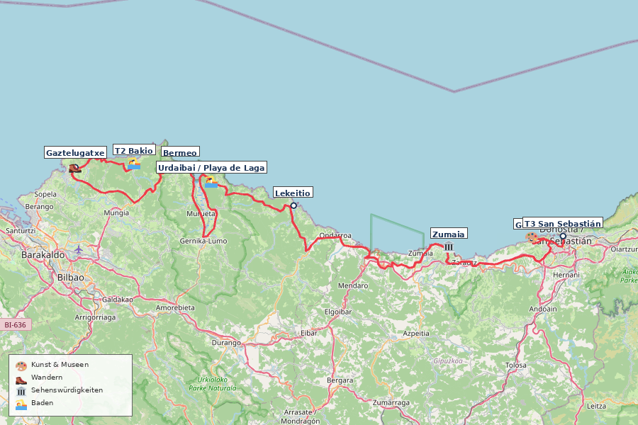
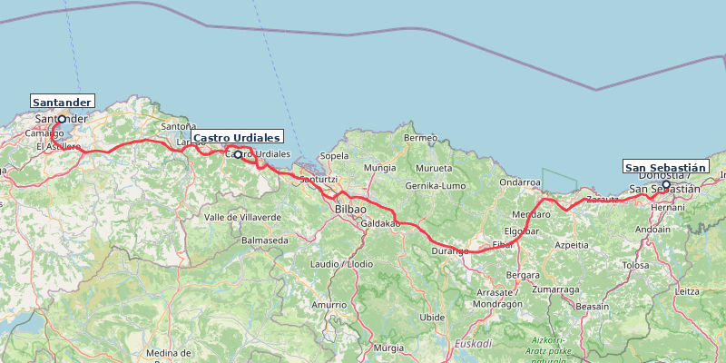

---
---

# Nordspanien Roadtrip

**Reisezeitraum:** Fr 4. September – So 20. September 2026 · 17 Tage · ~1.250 km (inkl.
Tagesausflüge) **Flug:** BER ↔ Bilbao BIO, Direktflug Eurowings (nur Mo/Fr/So,
Abendflüge) **Mietwagen:** Übernahme Fr 4. Sep (Flughafen Bilbao) / Abgabe Fr 18. Sep
(Flughafen) — 14 Tage

> 🌊 Die spanische Nordküste: grüne Berge, wilde Atlantikküste, Pintxos-Bars,
> Sidra-Häuser und die Picos de Europa direkt hinter dem Strand. Anfang September: warm,
> wenig Touristen, perfekte Wanderbedingungen.

> ☀️ **Wetter:** Küste 14–25°C, Berge 8–20°C, Regen 20–35%. Meer 19–21°C. Regenjacke
> einpacken!

> 🇪🇸 **Länderinfo:** Preisniveau ähnlich DE. Tempolimit: 50 / 90 / 120 km/h. Autovías
> mautfrei. Lichtpflicht bei Regen/Tunnel. Notruf 112. Pintxos: Zahnstocher zählen beim
> Zahlen. Sidra: „escanciar" — aus 1 m Höhe ins Glas.

> 📱 **Nützliche Apps & Ausrüstung:** Gezeiten-App (z. B. _Nautide_) für Flysch (Zumaia) & Playa de Gulpiyuri (Ebbe/Flut-Zeiten!). _Wikiloc_ für lokale Wanderwege. _Barik-Karte_ für ÖPNV im Baskenland. Robuste Regenjacke, Wanderschuhe & Zwiebellook (Küste vs. Gebirge) einpacken!

---

## Übernachtungen im Überblick

| Datum               | Nächte | Ort                                                                                             | Unterkunft                                                                                 |
| ------------------- | ------ | ----------------------------------------------------------------------------------------------- | ------------------------------------------------------------------------------------------ |
| Fr 4. – Sa 5. Sep   | 1      | [Bakio](#tag-1--fr-4-sep--bilbao--bakio--35-km-35-min)                                          | [Casa Rural Lastoetxe](https://www.booking.com/hotel/es/casa-rural-lastoetxe-vizcaya.html) |
| Sa 5. – Mo 7. Sep   | 2      | [San Sebastián](#tag-3--so-6-sep--san-sebastián)                                                | [A Room in the City](https://www.booking.com/hotel/es/a-room-in-the-city.html)             |
| Mo 7. – Mi 9. Sep   | 2      | [Santander](#tag-4--mo-7-sep--san-sebastián--santander--198-km-25-std)                          |                                                                                            |
| Mi 9. – Do 10. Sep  | 1      | [Potes](#tag-6--mi-9-sep--santander--potes--liébana-tal--106-km-15-std--stopps)                 | [Albergue La Cabaña](https://www.booking.com/hotel/es/albergue-la-cabana.html)             |
| Do 10. – So 13. Sep | 3      | [Cangas de Onís](#tag-8--fr-11-sep--picos-de-europa-ruta-del-cares)                             | [Hotel Covadonga](https://www.booking.com/hotel/es/covadonga-cangas-de-onis.de.html)       |
| So 13. – Di 15. Sep | 2      | [Gijón](#tag-10--so-13-sep--cangas-de-onís--gijón--oviedo--76-km-1-std)                         |                                                                                            |
| Di 15. – Mi 16. Sep | 1      | [San Vicente de Barquera](#tag-12--di-15-sep--gijón--san-vicente-de-la-barquera--119-km-15-std) |                                                                                            |
| Mi 16. – Fr 18. Sep | 2      | [Vitoria-Gasteiz](#tag-13--mi-16-sep--san-vicente--vitoria-gasteiz--210-km-25-std)              |                                                                                            |
| Fr 18. – So 20. Sep | 2      | [Bilbao](#tag-15--fr-18-sep--vitoria-gasteiz--bilbao--70-km-1-std)                              |                                                                                            |

**Gesamt:** 16 Nächte (4.–20. Sep 2026)

---

## Vorab-Reservierungen

Einige Attraktionen und Transporte auf dieser Route erfordern oder empfehlen eine rechtzeitige Online-Buchung vor der Reise, um lange Wartezeiten oder Einlassstopps zu vermeiden:

| Tag / Datum             | Aktivität / Ort                   | Vorlauf     | Details & Buchungs-Link                                                                                                                                   | ✅  |
| :---------------------- | :-------------------------------- | :---------- | :-------------------------------------------------------------------------------------------------------------------------------------------------------- | :-: |
| **Tag 2** (Sa 5. Sep)   | **San Juan de Gaztelugatxe**      | 2–4 Wochen  | Kostenloses Zeitslot-Ticket erforderlich (falls Zugang nach 10:00 Uhr). [visitbiscay.eus](https://www.visitbiscay.eus/en/san-juan-gaztelugatxe)           | ✅  |
| **Tag 3** (So 6. Sep)   | **Bar Nestor** (San Sebastián)    | Am Reisetag | Keine Online-Buchung. Persönliches Eintragen auf die Liste vor Ort um **12:00 Uhr** (mittags) oder **19:00 Uhr** (abends) für Tortilla.                   | [ ] |
| **Tag 6** (Mi 9. Sep)   | **Höhle von Altamira** (Neocueva) | 2–4 Wochen  | Replika-Museum & Höhle in Santillana del Mar. Tickets vorab sichern. [culturaydeporte.gob.es](https://www.culturaydeporte.gob.es/mnaltamira/en/home.html) | [ ] |
| **Tag 9** (Sa 12. Sep)  | **Lagos de Covadonga Bus**        | 2–3 Wochen  | PKW-Zufahrt im September gesperrt. ALSA-Shuttlebus ab Cangas de Onís reservieren (~9 € p.P.). [alsa.es](https://www.alsa.es)                              | [ ] |
| **Tag 14** (Do 17. Sep) | **Guggenheim Museum** (Bilbao)    | 2–3 Wochen  | Zeitslot-Ticket zwingend empfohlen (morgens bevorzugt). [guggenheim-bilbao.eus](https://www.guggenheim-bilbao.eus/en)                                     | [ ] |

> 💡 **Tipp für Unterkünfte:** Beliebte Unterkünfte in Potes und Cangas de Onís sind im September durch Wanderer gut gebucht – frühzeitig sichern!

---

## Reiseverlauf

Bilbao → Bakio (Gaztelugatxe) → San Sebastián → Santander → Potes → Picos de Europa → Gijón/Oviedo → San Vicente de la Barquera → Vitoria-Gasteiz → Bilbao

> 💡 **Fahrstrecken:** Durch den Stopp in **San Vicente de la Barquera** sind alle
> Etappen jetzt unter 2,5 Stunden reine Fahrzeit. Die Reise ist somit sehr entspannt.

> 💡 **Flexibilität:** Bei Regen Museumstage vorziehen (Guggenheim, Artium, Centro
> Botín). Bei Hitze: Strandtage priorisieren. Ruta del Cares nur bei trockenem Wetter.

---

### Tag 1 · Fr 4. Sep · Bilbao → Bakio · 35 km, ~35 Min.

[Route in Google Maps](https://www.google.com/maps/dir/Bilbao+Airport/Bakio)

**Hinflug:** BER → Bilbao (BIO), Direktflug Eurowings EW8552, ~2,5 Std. Abflug 17:00
Uhr, Ankunft Bilbao ca. 19:35 Uhr Ortszeit (Fr).
[→ Direktflüge BER→BIO, 4. Sep](https://www.skyscanner.de/g/referrals/v1/flights/day-view/?origin=BER&destination=BIO&outboundDate=2026-09-04&adults=2&stops=0&currency=EUR&locale=de-DE&market=DE)

- ℹ️ Kein Morgenflug BER→BIO verfügbar. Eurowings fliegt nur abends (Mo/Fr/So).
- Geschätzte Kosten: ~290 € pro Person (one-way, Stand Jun 2026)

**Mietwagen:** Übernahme am Flughafen Bilbao direkt nach Ankunft. Kompaktwagen,
~400–650 € für 13 Tage (Vollkasko inkl.). Abgabe Tag 15 am Flughafen.

**Fahrt nach Bakio:** ~35 Min. direkt vom Flughafen. Ankunft ca. 20:30 Uhr.

**Abendessen:** Hotel-Restaurant (regionale Küche) oder Bakio Ortskern (5 Min. zu Fuß).

---

### Tag 2 · Sa 5. Sep · Bakio → San Sebastián / Donostia · 190 km, ~4,5 Std. Fahrzeit + Stopps (Gesamtdauer 8 Std.)

[Route in Google Maps](https://www.google.com/maps/dir/Bakio/San+Juan+de+Gaztelugatxe/Bermeo/Urdaibai/Playa+de+Laga/Lekeitio/Zumaia/Getaria/San+Sebastián)

> ⚠️ **Gaztelugatxe-Strategie:** Ihr habt ein Backup-Ticket für 13:55 Uhr, aber die **beste Option ist der frühe Morgen**:
>
> - **Vor 10:00 Uhr:** Keine Zugangskontrolle → freier Zugang ohne Ticket (bestätigt durch Erfahrungsberichte)
> - **Vorteile:** Leerer Parkplatz, keine Menschenmassen, beste Lichtverhältnisse, entspannter Tagesverlauf
> - **Timing:** 7:15 Uhr Abfahrt vom Hotel (5 Min. Fahrt) → 7:30–9:00 Uhr Aufstieg → 9:30 Uhr zurück
> - Falls wider Erwarten doch Kontrolle: Ticket für 13:55 Uhr als Backup nutzen
>
> Die Küstenstraße ist spektakulär, aber zeitintensiv. Mit mehreren Stopps ist dies ein voller 8-Stunden-Tag.

**Empfohlene Route (Gaztelugatxe früh morgens — beste Variante!):**

1. 🏛️
   **[San Juan de Gaztelugatxe](https://www.visitbiscay.eus/en/san-juan-gaztelugatxe)**
   (**7:30–9:00 Uhr**, 5 Min. Fahrt vom Hotel) — Felsinsel, 241 Stufen, GoT
   „Dragonstone". **Freier Zugang vor 10:00 Uhr (keine Ticketkontrolle).**
   - ⏰ **Timing:** 7:15 Uhr Abfahrt Hotel → 7:20 Uhr Parkplatz → 7:30–9:00 Uhr
     Aufstieg & Abstieg
   - 💡 **Vorteile:** Leerer Parkplatz, keine Warteschlangen, goldenes Morgenlicht,
     entspannter restlicher Tag
   - 🎫 **Backup:** Ticket für 13:55 Uhr falls wider Erwarten doch Kontrolle (sehr
     unwahrscheinlich vor 10 Uhr)
2. 🏊 **Playa de Bakio** (~9:30 Uhr) — Kaffeepause am Hotelstrand nach der Wanderung.
3. 🏛️ **[Bermeo](https://tourism.euskadi.eus/en/towns/bermeo/webtur00-content/en/)**
   (~10:30 Uhr, 10 Min. Fahrt) — Fischerhafen, Ercilla-Turm (15. Jh.), zweites
   Frühstück im Hafen.
4. 🌿 **[Urdaibai](https://www.visitbiscay.eus/en/urdaibai)** (~11:30 Uhr) —
   UNESCO-Biosphärenreservat, Aussichtspunkt Mundaka (Surfer-Welle).
5. 🏊 **Playa de Laga** (~12:00 Uhr)
   [📍](https://www.google.com/maps/search/?api=1&query=43.3983,-2.6617) — Goldener
   Sandstrand, Badestopp + Mittagspause.
6. 🏛️ **[Lekeitio](https://tourism.euskadi.eus/en/towns/lekeitio/webtur00-content/en/)**
   (~14:00 Uhr) — Fischerdorf, Basilika Santa María, Insel San Nicolás (bei Ebbe zu
   Fuß).
7. 🏛️ **[Zumaia Flysch](https://geoparkea.eus/en/what-see/essential-places)** (~15:30
   Uhr, 1–1,5 Std.) — UNESCO Geopark, 60 Mio. Jahre Erdgeschichte in vertikalen
   Gesteinsschichten. **Game of Thrones "Dragonstone" Kulisse.**
   - **Playa de Itzurun** — Strand zwischen den Flysch-Formationen. ⚠️ Bei Ebbe am
     beeindruckendsten (Nachmittags-Ebbe: ~16:00 Uhr).
   - **Ermita de San Telmo** (1540) — Kapelle auf der Klippe, bester Panoramablick
     (5 Min. Aufstieg vom Strand).
   - **Optional:** Baratzazarrak Aussichtsplattform — dramatischer Blick auf die
     höchsten Klippen (zusätzlich 15 Min. Fahrt + 10 Min. Fußweg).
8. 🎨 **[Cristóbal Balenciaga Museoa](https://www.cristobalbalenciagamuseoa.com/en/)**
   (~16:30 Uhr) — Getaria. Haute Couture als Kunstform.
9. 🍷 **Getaria Hafen** (~17:00 Uhr) — Gegrillter Fisch, Txakoli-Wein.
10. **Ankunft San Sebastián** (~18:00 Uhr)

**Alternative mit Ticket um 13:55 Uhr (falls ihr doch später starten wollt):**

Falls ihr nicht so früh aufstehen wollt (oder das Wetter schlecht ist):

1. 🏊 **Playa de Bakio** (~9:00 Uhr) — Entspannter Morgenstart am Hotelstrand.
2. 🏛️ **[Bermeo](https://tourism.euskadi.eus/en/towns/bermeo/webtur00-content/en/)**
   (~10:00 Uhr, 10 Min. Fahrt) — Fischerhafen, Ercilla-Turm (15. Jh.), Kaffee im Hafen.
3. 🌿 **[Urdaibai](https://www.visitbiscay.eus/en/urdaibai)** (~11:00 Uhr) —
   UNESCO-Biosphärenreservat, Aussichtspunkt Mundaka (Surfer-Welle).
4. 🏊 **Playa de Laga** (~11:30 Uhr)
   [📍](https://www.google.com/maps/search/?api=1&query=43.3983,-2.6617) — Goldener
   Sandstrand, Badestopp + Mittagspause.
5. 🏛️
   **[San Juan de Gaztelugatxe](https://www.visitbiscay.eus/en/san-juan-gaztelugatxe)**
   (**13:55 Uhr**) — Felsinsel mit eurem Ticket.
6. 🏛️ **[Lekeitio](https://tourism.euskadi.eus/en/towns/lekeitio/webtur00-content/en/)**
   (~15:30 Uhr) — Fischerdorf, Basilika Santa María, Insel San Nicolás (bei Ebbe zu
   Fuß).
7. 🏛️ **[Zumaia Flysch](https://geoparkea.eus/en/what-see/essential-places)** (~16:30
   Uhr, 1–1,5 Std.) — UNESCO Geopark, 60 Mio. Jahre Erdgeschichte in vertikalen
   Gesteinsschichten. **Game of Thrones "Dragonstone" Kulisse.**
   - **Playa de Itzurun** — Strand zwischen den Flysch-Formationen. ⚠️ Bei Ebbe am
     beeindruckendsten (Nachmittags-Ebbe: ~16:00 Uhr).
   - **Ermita de San Telmo** (1540) — Kapelle auf der Klippe, bester Panoramablick
     (5 Min. Aufstieg vom Strand).
   - **Optional:** Baratzazarrak Aussichtsplattform — dramatischer Blick auf die
     höchsten Klippen (zusätzlich 15 Min. Fahrt + 10 Min. Fußweg).
8. 🎨 **[Cristóbal Balenciaga Museoa](https://www.cristobalbalenciagamuseoa.com/en/)**
   (~17:00 Uhr) — Getaria. Haute Couture als Kunstform.
9. 🍷 **Getaria Hafen** (~17:30 Uhr) — Gegrillter Fisch auf Holzkohle, Txakoli-Wein.
10. **Ankunft San Sebastián** (~19:00 Uhr)

**Option ohne Gaztelugatxe:**

1. 🏊 **Playa de Bakio** (~9:00 Uhr) — Morgen am Hotelstrand.
2. 🏛️ **[Bermeo](https://tourism.euskadi.eus/en/towns/bermeo/webtur00-content/en/)**
   (~10:00 Uhr) — Fischerhafen, Kaffee.
3. 🌿 **[Urdaibai](https://www.visitbiscay.eus/en/urdaibai)** (~11:00 Uhr) —
   UNESCO-Biosphärenreservat, Mundaka.
4. 🏊 **Playa de Laga** (~11:30–13:00 Uhr)
   [📍](https://www.google.com/maps/search/?api=1&query=43.3983,-2.6617) — Ausgiebige
   Badezeit + Mittagspause.
5. 🏛️ **[Lekeitio](https://tourism.euskadi.eus/en/towns/lekeitio/webtur00-content/en/)**
   (~14:00 Uhr) — Fischerdorf, Insel San Nicolás.
6. 🏛️ **[Zumaia Flysch](https://geoparkea.eus/en/what-see/essential-places)** (~15:30
   Uhr, 1–1,5 Std.) — UNESCO Geopark, 60 Mio. Jahre Erdgeschichte in vertikalen
   Gesteinsschichten. **Game of Thrones "Dragonstone" Kulisse.**
   - **Playa de Itzurun** — Strand zwischen den Flysch-Formationen. ⚠️ Bei Ebbe am
     beeindruckendsten (Vormittags-Ebbe: ~10:30 Uhr).
   - **Ermita de San Telmo** (1540) — Kapelle auf der Klippe, bester Panoramablick
     (5 Min. Aufstieg vom Strand).
   - **Optional:** Baratzazarrak Aussichtsplattform — dramatischer Blick auf die
     höchsten Klippen (zusätzlich 15 Min. Fahrt + 10 Min. Fußweg).
7. 🎨 **[Cristóbal Balenciaga Museoa](https://www.cristobalbalenciagamuseoa.com/en/)**
   (~16:30 Uhr) — Getaria. Haute Couture als Kunstform.
8. 🍷 **Getaria Hafen** (~17:00 Uhr) — Gegrillter Fisch, Txakoli-Wein.
9. **Ankunft San Sebastián** (~18:00 Uhr)

**Unterkunft:** Hostel in ehemaligem Kloster, zentral, 3 Min. zur Playa de La Concha, 10 Min. zur Altstadt.

💡 **Tipp Option B:** Gaztelugatxe unter der Woche von San Sebastián aus als
Tagesausflug nachholen (~1 Std. Fahrt, flexiblere Tickets, weniger Andrang).

### Tag 3 · So 6. Sep · San Sebastián

- 🚣 **Bandera de La Concha** — Prestigeträchtige Ruderregatta an den ersten beiden
  Sonntagen im September. Die Bucht ist gesäumt von tausenden Zuschauern. **Großes
  Spektakel.** ⚠️ Voll!
- 🎊 **Euskal Jaiak (Baskische Feste)** — Anfang September. Traditioneller Sport, Musik
  und Tanz in der Stadt. Darunter **Harri Jasotzaile** (Steinhebe-Wettkämpfe) —
  baskische Kraftsporttradition, bei der Athleten standardisierte Granitquader in
  möglichst vielen Wiederholungen heben.
- 🥾 **Camino del Norte (Pasaia → San Sebastián)** — 12 km, 4 Std., moderat.
  Jakobsweg-Küstenabschnitt, spektakuläre Küstenblicke. ⚠️ One-way; Hinfahrt Bus E09
  nach Pasaia (~11 Min., alle 15 Min.,
  [Lurraldebus/Avanza](https://gipuzkoa.avanzagrupo.com)). **Barik-Karte wird
  akzeptiert** (Lurraldebus & Dbus).
  [Waymarked Trails](https://hiking.waymarkedtrails.org/#route?id=1116809) ·
- 🍷 **Parte Vieja Pintxos** — Bar Nestor (Tortilla ⚠️ Liste vor Ort um 12:00 / 19:00 Uhr eintragen!), La Cuchara de San Telmo, Gandarias, Bar Zeruko. **Must-try:** _Gilda_ (Ur-Pintxo mit Sardelle, Peperoni, Olive) + _Txakoli_ (trockener Weißwein) oder _Zurrito_ (kleines Bier).

**Weitere POIs in San Sebastián:**

- 🥾 **Monte Urgull** — 3 km, 1,5 Std., leicht. Festung, 360°-Panorama.
- 🥾 **Monte Igueldo → Paseo Nuevo** — 8 km, 3 Std., moderat. ⭐ 4,5 (58 Reviews).
  Küstenwanderung.
- 🏊 **Playa de la Concha** — Muschelförmige Bucht, ruhiges Wasser.
- 🏊 **Playa de la Zurriola** — Surfer-Strand, Stadtteil Gros.
- 🎨 **[San Telmo Museoa](https://www.santelmomuseoa.eus)** — Baskische Kultur +
  zeitgenössische Kunst. (~7 €/P.)
- 🎨 **[Tabakalera](https://www.tabakalera.eus/en)** — Zeitgenössische Kultur in
  ehemaliger Tabakfabrik.
- 🎨 **[Chillida-Leku](https://www.museochillidaleku.com/en/)**
  [📍](https://www.google.com/maps/search/?api=1&query=43.2847,-1.9183) —
  Skulpturenpark, monumentale Stahlskulpturen. **Pflichtbesuch.** (~14 €/P., Do–Mo
  geöffnet, Di+Mi geschlossen)
- 🏛️ **Peine del Viento** — Chillida-Skulpturen in den Klippen.

---

### Tag 4 · Mo 7. Sep · San Sebastián → Santander · 198 km, ~2,5 Std.

[Route in Google Maps](https://www.google.com/maps/dir/San+Sebastián/Castro+Urdiales/Santander)

Stopp Castro Urdiales (Kaffee, gotische Kirche). Ankunft Mittag.

- 🏛️ **[Palacio de la Magdalena](https://palaciomagdalena.com/en/)** — Königlicher
  Sommerpalast, Halbinsel-Rundgang.
- 🥾 **Península de la Magdalena** — 4 km, 1,5 Std., leicht. Rundweg um die Halbinsel
  mit Palast, Zoo und Strandblick.
- 🏊 **Playa del Sardinero** — Stadtstrand, Belle-Époque.
- 🍷 **[Mercado de la Esperanza](https://www.santander.es/servicios-empresas/areas-tematicas/mercados/mercado-esperanza)** — Markthalle, Fisch, Tapas-Bars.

> Hinweis: Centro Botín montags geschlossen.

### Tag 5 · Di 8. Sep · Santander

- 🥾 **Cabo Mayor → Mataleñas** — 6 km, 2 Std., leicht. Klippenpfad, Leuchtturm. 🏊
  Endet an der Playa de Mataleñas — geschützte Bucht, kristallklares Wasser.
  - 🍷 **Einkehr:** Chiringuito an der Playa de Mataleñas (Sommer, Getränke + Snacks).
- 🎨 **[Centro Botín](https://www.centrobotin.org/en/)** — Renzo Piano, zeitgenössische
  Kunst. **Highlight.** (~9 €/P., Di–So, Mo geschlossen)
- 🏊 **Playa de la Arnía**
  [📍](https://www.google.com/maps/search/?api=1&query=43.4738,-3.8783) — Wilde
  Felsbucht, spektakuläre Felsformationen. 15 Min. Fahrt.
- 🍷 **[Bodega del Riojano](https://bodegadelriojano.com)** — Kantabrische Küche seit 1908.

**Weitere POIs in Santander:**

- 🥾 **Faro del Caballo** (Santoña, 45 Min. östlich) — 700 Stufen zu türkisfarbener
  Bucht. Halbtagesausflug.
- 🍷 **Cañadío** — Moderne Küche, Meeresfrüchte.
- 🌿 **Jardines de Piquío** — Art-Deco-Gärten.

---

### Tag 6 · Mi 9. Sep · Santander → Potes / Liébana-Tal · 106 km, ~1,5 Std. + Stopps

[Route in Google Maps](https://www.google.com/maps/dir/Santander/Santillana+del+Mar/Comillas/Potes)

- 🏛️ **[Santillana del Mar](https://www.spain.info/en/destination/santillana-del-mar/)**
  (Anfahrt) — Mittelalterliches Dorf, Stiftskirche.
- 🏛️ **[Altamira-Museum](https://www.culturaydeporte.gob.es/mnaltamira/en/home.html)**
  (bei Santillana) — UNESCO, prähistorische Malereien (Replik). (~3 €/P., ⚠️ Tickets
  vorab online buchen)
- 🏛️ **[Comillas](https://www.spain.info/en/places-of-interest/capricho-gaudi/)**
  (Anfahrt) — Gaudís El Capricho.
- 🏛️ **Desfiladero de la Hermida** (Anfahrt) — 21 km Schlucht, 600 m Felswände.
- 🏊 **[Balneario La Hermida](https://balneariolahermida.com/)**
  [📍](https://www.google.com/maps/search/?api=1&query=43.2283,-4.6017) — Thermalquelle
  (60°C) mitten in der Schlucht. Thermalhöhle + Außenbecken 38°C. Direkt auf der Route.

- 🍷 **Cocido Lebaniego** — Kichererbsen-Eintopf, Spezialität des Tals. (Die Fuente Dé
  Seilbahn wird aufgrund des straffen Programms auf morgen verschoben).

**Weitere POIs in Potes:**

- 🥾 **Mirador de Santa Catalina** — 4 km, 1,5 Std., leicht. Picos-Panorama & Blick in
  die Hermida-Schlucht.
- 🏛️ **Torre del Infantado** — Wehrturm (15. Jh.), Ausstellungsraum.
- 🏛️ **Monasterio de Santo Toribio** (3 km) — Kloster 6. Jh., Pilgerort.

---

### Tag 7 · Do 10. Sep · Potes → Picos de Europa / Cangas de Onís · ~150 km, ~2,5 Std. Fahrzeit (zzgl. Seilbahn-Ausflug)

[Route in Google Maps](https://www.google.com/maps/dir/Potes/Fuente+Dé/Potes/Desfiladero+de+los+Beyos/Cangas+de+Onís)

Vormittags Ausflug von Potes zur Seilbahn und Wanderung in den Picos de Europa.
Nachmittags spektakuläre Fahrt über den Puerto de San Glorio und das Desfiladero de los Beyos nach Cangas de Onís.

- 🥾 **[Fuente Dé Seilbahn](https://telefericodefuentede.com)**
  [📍](https://www.google.com/maps/search/?api=1&query=43.1536,-4.8092) (morgens ab Potes, ~30 Min. Anfahrt) → Wanderung zu **Horcados Rojos** (hochalpin, 4 Std.) oder gemütlich über die Puertos de Áliva zurück. (~21 €/P. hin+zurück).
- 🏛️ **[Puente Romano](https://www.spain.info/en/places-of-interest/puente-rio-sella/)** (Cangas) — Römische Brücke, Wahrzeichen Asturiens. Abendlicher Spaziergang.
- 🍷 **Sidrería** — Sidra escanciar (aus Höhe einschenken) lernen.

### Tag 8 · Fr 11. Sep · Picos de Europa (Ruta del Cares)

- 🥾 **Ruta del Cares** [PR-PNPE 3] — 22 km (hin+zurück), 6–8 Std., moderat. ⭐ 4,5 (1.880 Reviews). Schlucht-Wanderung durch die „Garganta Divina" — ~70 in den Fels gehauene Tunnel. Ganztageswanderung ab Poncebos. ⚠️ Steinschlagrisiko vorab prüfen.
  - 🍷 **Einkehr:** Bar Garganta del Cares (Poncebos). In Caín: Casa Cuevas / La Taberna de Caín.
- 🍷 **Quesu Cabrales & Gamonéu** — Blauschimmelkäse & Höhlenkäse-Tasting in Arenas de Cabrales.

### Tag 9 · Sa 12. Sep · Picos de Europa (Lagos de Covadonga & Río Dobra)

- 🚌 **Lagos de Covadonga** [PR-PNPE 2] — 6,4 km, 2,5 Std., leicht. Gletscherseen auf 1.000 m. ⚠️ PKW-Zufahrt gesperrt, ALSA-Bus ab Cangas buchen!
  - 🏛️ **[Basílica de Covadonga](https://www.turismoasturias.es/en/-/blogs/guia-para-visitar-visitar-covadonga-los-lagos-y-alrededores)** — Heilige Grotte (Santa Cueva) & Reconquista-Stätte.
  - 🍷 **Einkehr:** Restaurant am Lago Enol.
- 🥾 **Ruta del Río Dobra** (nachmittags) — 6 km, 2 Std., leicht. Flusswanderung zu türkisfarbenen Felstöpfen bei Cangas.
- 🏊 **[Playa de Gulpiyuri](https://www.turismoasturias.es/en/descubre/costa/playas/playa-de-gulpiyuri)** — Inland-Strand (nur bei Flut!).
- 🍷 **[El Molín de la Pedrera](https://elmolindelapedrera.com)** — Fabada Asturiana in Cangas de Onís.

---

### Tag 10 · So 13. Sep · Cangas de Onís → Gijón / Oviedo · 76 km, ~1 Std.

[Route in Google Maps](https://www.google.com/maps/dir/Cangas+de+Onís/Gijón)

Fahrt nach Gijón.

- 🥾 **Senda del Cervigón** (Gijón) — 8 km Küstenpfad bis Playa de La Ñora.
- 🎨 **Elogio del Horizonte** — Chillida-Skulptur am Cerro de Santa Catalina.
- 🏊 **Playa de San Lorenzo** (Gijón) — Stadtstrand.
- 🍷 **Sidrería Tierra Astur** (Gijón) — Sidra-Kultur erleben (_escanciar_).

### Tag 11 · Mo 14. Sep · Oviedo (Tagesausflug ab Gijón)

- 🎊 **Fiestas de San Mateo** (Oviedo) — Größtes Stadtfest in Oviedo (11.–21. Sep.) mit Live-Musik & Chiringuitos.
- 🏛️ **[Präromanische Kirchen](https://www.turismoasturias.es/en/descubre/cultura/prerromanico/santa-maria-del-naranco)** (UNESCO) — Santa María del Naranco (Mo Vormittag kostenlos).
- 🎨 **Street Art & Skulpturen** — Botero, Úrculo.
- 🍷 **[Mercado del Fontán](https://mercadofontan.es)** (Oviedo) — Historische Markthalle.

---

### Tag 12 · Di 15. Sep · Gijón → San Vicente de la Barquera · 119 km, ~1,5 Std.

[Route in Google Maps](https://www.google.com/maps/dir/Gijón/San+Vicente+de+la+Barquera)

> 🎊 **Regionalfeiertag (Kantabrien):** La Bien Aparecida. Restaurants & Strände belebt.

Fahrt entlang der Küste nach Kantabrien.

- 🏰 **Castillo del Rey** — Mittelalterliche Burg mit Panoramablick.
- 🥾 **Senda Costera (Pendueles → Vidiago)** — 5 km Küstenklippen mit Bufones de Pría.
- 🏊 **Playa de Torimbia** / **Playa de Oyambre**.
- 🍷 **Hafen** — Frischer Bonito-Eintopf (_Sorropotún_).

---

### Tag 13 · Mi 16. Sep · San Vicente → Vitoria-Gasteiz · 210 km, ~2,5 Std.

[Route in Google Maps](https://www.google.com/maps/dir/San+Vicente+de+la+Barquera/Vitoria-Gasteiz)

Entspannte Weiterfahrt ins Baskenland. Ankunft in Vitoria-Gasteiz am Nachmittag (~15:00 Uhr).

- 🎨 **[Artium Museoa](https://www.artium.eus)** — Zeitgenössische Kunst (Di–Fr 11–14 + 17–20 Uhr).
- 🎨 **[Itinerario Muralístico (IMVG)](https://www.muralismopublico.com/p/en/home.php)** — Europas größte Freiluft-Mural-Galerie.
- 🍷 **Calle Cuchillería** — Authentische Pintxos-Straße.

---

### Tag 14 · Do 17. Sep · Vitoria-Gasteiz & Rioja Alavesa (Tagesausflug) · ~90 km Runden

[Route in Google Maps](https://www.google.com/maps/dir/Vitoria-Gasteiz/Laguardia/Vitoria-Gasteiz)

Ganztagesausflug in die berühmte Weinregion **Rioja Alavesa**.

- 🥾 **Lagunas de Laguardia** [📍](https://www.google.com/maps/search/?api=1&query=42.5500,-2.5833) — Wanderung durch das geschützte Naturschutzgebiet & Weinterrassen (~5 km, 1,5 Std., leicht).
- 🏛️ **Laguardia Altstadt** — Mittelalterliches Weindorf auf einem Hügel mit unterirdischem Tunnelsystem.
- 🍷 **Bodega-Architektur & Weinprobe** — Spektakuläre Weingüter wie _[Bodegas Ysios](https://bodegasysios.com/en)_ (Santiago Calatrava) oder _[Marqués de Riscal](https://www.marquesderiscal.com/en/the-marques-de-riscal-city-of-wine)_ (Frank Gehry) in Elciego.
- 🏛️ **[Catedral de Santa María](https://www.catedralvitoria.eus/en)** (abends in Vitoria) — Gotische Kathedrale („offene Baustelle").

---

### Tag 15 · Fr 18. Sep · Vitoria-Gasteiz → Bilbao · ~70 km, ~1 Std.

[Route in Google Maps](https://www.google.com/maps/dir/Vitoria-Gasteiz/Bilbao)

Entspannte Weiterfahrt nach Bilbao am Vormittag.

- 🚗 **Mietwagen-Abgabe:** Abgabe am Flughafen Bilbao (BIO) oder Stadtfiliale (Ende der 14-tägigen Mietdauer). Vom Flughafen per Bus A3247 (alle 15 Min., 20 Min. Fahrt, ~3 €) zurück in die Innenstadt. Bilbao danach bequem per Metro, Funicular & zu Fuß erkunden!
- 🏛️ **[Puente Bizkaia](https://puente-colgante.com/en)** [📍](https://www.google.com/maps/search/?api=1&query=43.3231,-3.0172) — UNESCO-Schwebefähre (1893), 15 Min. Fahrt nach Getxo.
- 🥾 **[Artxanda Funicular](https://funicularartxanda.bilbao.eus/en/home) + Rundweg** — 5 km, 2 Std., leicht. Panorama (Sonnenuntergang).
- 🍷 **Plaza Nueva Pintxos** — Gilda, Bacalao al Pil-Pil.

---

### Tag 16 · Sa 19. Sep · Bilbao (Kultur & Altstadt)

- 🎨 **[Guggenheim Bilbao](https://www.guggenheim-bilbao.eus/en)** — Gehry-Ikone, zeitgenössische Kunst. **Pflichtbesuch.** (~16 €/P., 3 Std., ⚠️ vorab buchen!)
- 🏛️ **Casco Viejo** — Siete Calles, Plaza Nueva.
- 🍷 **[Café Iruña](https://www.cafeiruna.com/)** — Seit 1903, neo-maurischer Stil, Bilbaos bekanntestes Traditionslokal. Pintxos an der Theke.
- 🎨 **[Museo de Bellas Artes](https://bilbaomuseoa.eus)** — Goya bis Chillida.
- 🍷 **[Restaurante Mina](https://www.restaurantemina.es)** — Michelin-Stern, baskische Avantgarde.

---

### Tag 17 · So 20. Sep · Bilbao (Abreise)

Ausschlafen, entspanntes Frühstück. Letzter Bummel Siete Calles. ⚠️ **Abfahrt Richtung
Flughafen spätestens 17:30 Uhr** (Check-in bis 18:30 Uhr, Abflug 20:30 Uhr). Bus/Metro
zum Flughafen ~30 Min.

**Rückflug:** Bilbao (BIO) → BER, Direktflug Eurowings EW8553, ~2,5 Std. Abflug 20:30
Uhr (So). ℹ️ Pünktlichkeit laut Airportia gut (4,6/5 Sterne, Stand Jun 2026) — Ankunft
BER ca. 22:55 Uhr.
[→ Direktflüge BIO→BER, 20. Sep](https://www.skyscanner.de/g/referrals/v1/flights/day-view/?origin=BIO&destination=BER&outboundDate=2026-09-20&adults=2&stops=0&currency=EUR&locale=de-DE&market=DE)

**Weitere POIs in Bilbao:**

- 🎨 **[Museo de Bellas Artes](https://bilbaomuseoa.eus)** — Goya bis Chillida.
- 🍷 **[Restaurante Mina](https://www.restaurantemina.es)** — Michelin-Stern, baskische Avantgarde.

---

## Quellen

Markierte Wanderwege ([Waymarked Trails](https://waymarkedtrails.org), OSM-Daten):

| Route                            | Länge  | Link                                                                        | GPX |
| -------------------------------- | ------ | --------------------------------------------------------------------------- | --- |
| Ruta del Cares                   | 21 km  | [waymarkedtrails.org](https://hiking.waymarkedtrails.org/#route?id=2687934) | —   |
| Lagos de Covadonga               | 6,4 km | [waymarkedtrails.org](https://hiking.waymarkedtrails.org/#route?id=4664408) | —   |
| Camino del Norte (Euskal Herria) | 228 km | [waymarkedtrails.org](https://hiking.waymarkedtrails.org/#route?id=1116809) | —   |

Routen-Inspiration (recherchiert Mai 2026):

- [The Gap Decaders — 7–10 Days](https://thegapdecaders.com/north-spain-road-trip/) —
  Pamplona → Santiago
- [kimkim — 13 Days](https://www.kimkim.com/c/north-of-spain-ultimate-roadtrip-13-days)
  — Bilbao → Santiago (linear)
- [Along Dusty Roads — 10 Days](https://www.alongdustyroads.com/posts/northern-spain-road-trip-itinerary)
  — Baskenland → Galizien
- [Journaway — 10 Tage](https://rundreisen.urlaubsguru.de/de/angebote/nordspanien-roadtrip-50321)
  — Madrid → Bilbao → Madrid (Rundreise)
- [Andrew Harper — 14 Days](https://andrewharper.com/itinerary/spain-road-trip-galicia/)
  — Santiago → Rioja → Baskenland

Reiseführer (Wikivoyage, CC BY-SA 3.0):
[San Sebastián](https://de.wikivoyage.org/wiki/Donostia-San_Sebastián) ·
[Bilbao](https://de.wikivoyage.org/wiki/Bilbao) ·
[Costa Vasca](https://de.wikivoyage.org/wiki/Costa_Vasca)

Sehempfehlungen zur Vorbereitung (ÖR Mediathek):

| Sender | Titel                                                                     | Link                                                                                                                                                                                                            |
| ------ | ------------------------------------------------------------------------- | --------------------------------------------------------------------------------------------------------------------------------------------------------------------------------------------------------------- |
| WDR    | Wunderschön! — Baskenland (45 Min., UT, bis 2029)                         | [ARD Mediathek](https://www.ardmediathek.de/video/wunderschoen/baskenland-spaniens-norden-zwischen-bilbao-und-san-sebastian/wdr/Y3JpZDovL3dkci5kZS9CZWl0cmFnLTA4ODRkMjMyLWE5MTUtNDg0OC04MjU2LWJlOTNjMTEwYmZiNA) |
| WDR    | Grenzenlos — Baskenland (41 Min.)                                         | [YouTube](https://www.youtube.com/watch?v=1SaTEUXFwsU)                                                                                                                                                          |
| BR     | Bergauf-Bergab — Picos de Europa Wandern (14 Min.)                        | [YouTube](https://www.youtube.com/watch?v=jg6SnZ4H_U8)                                                                                                                                                          |
| BR     | Bergauf-Bergab — Picos de Europa Bergsteigen (25 Min.)                    | [YouTube](https://www.youtube.com/watch?v=vNsiC9IZJFw)                                                                                                                                                          |
| WDR    | Asturien — Green Coast #lookslike (ca. 30 Min.)                           | [YouTube](https://www.youtube.com/watch?v=sqK82GutZOc)                                                                                                                                                          |
| ARD    | Podcast: Asturiens Menschen und Mythen (54 Min.)                          | [ARD Sounds](https://www.ardsounds.de/episode/urn:ard:episode:109674ba1fdec334)                                                                                                                                 |
| BR     | Podcast: Radioreisen — Nordspanien: Picos, Padrón, Bilbao→Porto (54 Min.) | [Apple Podcasts](https://podcasts.apple.com/at/podcast/nordspanien-kalksteingebirge-picos-de-europa-gr%C3%BCnes/id560983615?i=1000770007595)                                                                    |
| Arte   | Unbekanntes Spanien — Von Asturien nach Zamora (43 Min., bis 17.10.2026)  | [Arte Mediathek](https://www.arte.tv/de/videos/RC-027779/unbekanntes-spanien)                                                                                                                                   |

> ℹ️ Kein Direktflug Santiago de Compostela (SCQ) → Berlin (BER). Daher Rundreise ab/bis
> Bilbao.

> ℹ️ Zuletzt geprüft: 2026-06-02. Wanderrouten-Bewertungen aus Web-Recherche (2026-05),
> Quelle: AllTrails. Nicht per API verifiziert.
